# PixelCanvas — Product Architecture Blueprint

> **Version:** 2.0.0-draft  
> **Date:** 2026-07-25  
> **Platform:** Android First → iOS → Web → Desktop  
> **Theme:** Light Only  
> **Backend:** Supabase (Free Tier)  
> **Framework:** Flutter  
> **State Management:** Riverpod  
> **Architecture:** Feature-First, Offline-First  

---

## Table of Contents

1. [Executive Summary](#1-executive-summary)
2. [Complete Feature List](#2-complete-feature-list)
3. [User Personas](#3-user-personas)
4. [User Journeys](#4-user-journeys)
5. [Information Architecture](#5-information-architecture)
6. [Application Modules](#6-application-modules)
7. [Navigation Architecture](#7-navigation-architecture)
8. [Folder Architecture](#8-folder-architecture)
9. [Design System Mapping](#9-design-system-mapping)
10. [State Management Strategy](#10-state-management-strategy)
11. [Offline-First Strategy](#11-offline-first-strategy)
12. [Database Planning](#12-database-planning)
13. [Storage Planning](#13-storage-planning)
14. [API Planning](#14-api-planning)
15. [Permissions](#15-permissions)
16. [Notifications Strategy](#16-notifications-strategy)
17. [Security Planning](#17-security-planning)
18. [Performance Planning](#18-performance-planning)
19. [Accessibility](#19-accessibility)
20. [Testing Strategy](#20-testing-strategy)
21. [Release Planning](#21-release-planning)
22. [Risk Analysis](#22-risk-analysis)
23. [Development Roadmap](#23-development-roadmap)
24. [Coding Standards](#24-coding-standards)
25. [Success Metrics](#25-success-metrics)
26. [PixelCanvas Engineering Principles](#26-pixelcanvas-engineering-principles)
27. [PixelCanvas Project File Format (.pxc)](#27-pixelcanvas-project-file-format-pxc)
28. [Pixel Rendering Engine Architecture](#28-pixel-rendering-engine-architecture)
29. [Performance Budget](#29-performance-budget)
30. [Asset Pipeline](#30-asset-pipeline)
31. [Design Tokens](#31-design-tokens)
32. [Pixel Engine Rules](#32-pixel-engine-rules)
33. [AI Architecture](#33-ai-architecture-future--v2)
34. [Error Management System](#34-error-management-system)
35. [Observability](#35-observability)
36. [Quality Gates](#36-quality-gates)
37. [Final Architect Review](#37-final-architect-review)

---

# 1. Executive Summary

## 1.1 Vision

To become the most loved, accessible, and creative pixel art platform in the world — the "Canva of Pixel Art" — where anyone, regardless of skill level, can create, share, and celebrate pixel art.

## 1.2 Mission

Deliver a beautifully crafted, offline-first, mobile-native pixel art creation experience that feels as intuitive as a coloring book but as powerful as a professional pixel art editor. Every interaction should spark joy and creativity.

## 1.3 Problem Statement

| Problem | Impact |
|---|---|
| Existing pixel art apps are cluttered with Photoshop-style complexity | Beginners abandon within minutes |
| Most creative apps require constant internet connectivity | Unusable during commutes, travel, classrooms |
| Professional pixel art tools ignore mobile-first design principles | Poor touch UX, tiny hit targets, desktop UI ported to mobile |
| No single platform combines creation, templates, community, and export in a simple package | Users juggle 3–4 apps for one workflow |
| Pixel art tools lack modern design language | Apps feel dated, utilitarian, and unengaging |

## 1.4 Solution

PixelCanvas solves these problems by providing:

- **A zero-learning-curve editor** — tap a cell, pick a color, create art. No menus, no panels, no confusion.
- **Offline-first architecture** — every feature works without internet. Sync happens silently in the background.
- **Mobile-native touch UX** — gestures, haptics, and interactions designed specifically for fingers on glass.
- **Curated templates and palettes** — users start creating immediately instead of staring at a blank grid.
- **One-tap export** — PNG, GIF (animated sprites), and share-to-social in a single action.
- **Community gallery** — discover, remix, and celebrate pixel art from other creators.

## 1.5 Unique Selling Proposition (USP)

> **"The simplest way to create pixel art — anywhere, anytime, even offline."**

Key differentiators:
1. **Coloring-book simplicity** — not a stripped-down Photoshop, but a purpose-built pixel art experience.
2. **True offline-first** — create, save, export, and manage projects without any network dependency.
3. **Premium design language** — light, clean, modern Material 3 / Apple HIG-inspired UI that feels expensive.
4. **Template-driven onboarding** — new users complete their first artwork in under 60 seconds.
5. **Sprite animation** — built-in frame-by-frame animation with GIF/sprite-sheet export (V2).

## 1.6 Target Audience

| Segment | Age | Motivation | Technical Skill |
|---|---|---|---|
| Beginners | 8–16 | Fun, creativity, coloring | Very Low |
| Students | 16–24 | Coursework, game dev projects, hobby | Low–Medium |
| Professional Artists | 22–40 | Client work, game assets, NFT art | High |
| Game Developers | 20–35 | Sprite sheets, tilesets, character design | High |
| Teachers & Educators | 28–55 | Classroom activities, digital art lessons | Low |
| Hobbyists | 25–60 | Relaxation, nostalgia, creative outlet | Low–Medium |

## 1.7 Business Goals

| Goal | Metric | Target (Year 1) |
|---|---|---|
| User Acquisition | Monthly Active Users | 50,000 MAU |
| Engagement | Avg. Session Duration | > 8 minutes |
| Retention | D7 Retention | > 35% |
| Content Creation | Artworks Created / Month | > 200,000 |
| Community | Gallery Submissions / Month | > 10,000 |
| Revenue (Future) | Premium Conversion | 3–5% of MAU |

## 1.8 Long-Term Vision

```
Year 1: Android launch, core editor, offline-first, community gallery.
Year 2: iOS launch, animation editor, AI-assisted tools, premium tier.
Year 3: Web app, marketplace for templates/palettes, education partnerships.
Year 4: Desktop app, plugin system, API for game engines, enterprise tier.
Year 5: Platform — PixelCanvas becomes the creative ecosystem for pixel art.
```

---

# 2. Complete Feature List

## 2.1 MVP (Minimum Viable Product)

| # | Feature | Category | Priority |
|---|---|---|---|
| 1 | Splash Screen with branding animation | **Core** | P0 |
| 2 | Onboarding flow (3 screens) | **Core** | P0 |
| 3 | Email + Password Authentication | **Core** | P0 |
| 4 | Google Sign-In | **Core** | P0 |
| 5 | Guest Mode (skip login, full editor access) | **Core** | P0 |
| 6 | Home screen with recent projects | **Core** | P0 |
| 7 | Create new project (select grid size) | **Core** | P0 |
| 8 | Pixel editor — tap-to-color cells | **Core** | P0 |
| 9 | Color picker (palette bar + custom color wheel) | **Core** | P0 |
| 10 | Pencil tool | **Core** | P0 |
| 11 | Eraser tool | **Core** | P0 |
| 12 | Fill tool (bucket / flood fill) | **Core** | P0 |
| 13 | Undo / Redo (min 50 steps) | **Core** | P0 |
| 14 | Grid toggle (show/hide gridlines) | **Core** | P0 |
| 15 | Pinch-to-zoom and pan | **Core** | P0 |
| 16 | Auto-save to local database | **Core** | P0 |
| 17 | Manual save | **Core** | P0 |
| 18 | Export as PNG (1x, 2x, 4x, 8x scale) | **Core** | P0 |
| 19 | Share artwork via share sheet | **Core** | P0 |
| 20 | Project list (grid/list view toggle) | **Core** | P0 |
| 21 | Delete project | **Core** | P0 |
| 22 | Rename project | **Core** | P0 |
| 23 | Basic settings (grid size defaults, haptics toggle) | **Core** | P0 |
| 24 | Profile screen (avatar, username, artwork count) | **Core** | P0 |
| 25 | Offline-first local persistence (Isar) | **Core** | P0 |

## 2.2 Version 1.0

| # | Feature | Category | Priority |
|---|---|---|---|
| 26 | Pre-built color palettes (16 curated palettes) | **Core** | P1 |
| 27 | Custom palette creation and saving | **Core** | P1 |
| 28 | Eyedropper / color picker from canvas | **Core** | P1 |
| 29 | Line tool (straight lines) | **Core** | P1 |
| 30 | Rectangle tool (outline + filled) | **Core** | P1 |
| 31 | Circle tool (outline + filled) | **Core** | P1 |
| 32 | Selection tool (rectangular selection) | **Advanced** | P1 |
| 33 | Copy / Paste selection | **Advanced** | P1 |
| 34 | Move selection | **Advanced** | P1 |
| 35 | Mirror / Symmetry mode (horizontal, vertical) | **Advanced** | P1 |
| 36 | Layer system (up to 8 layers) | **Advanced** | P1 |
| 37 | Layer opacity control | **Advanced** | P1 |
| 38 | Layer visibility toggle | **Advanced** | P1 |
| 39 | Layer reorder (drag to reorder) | **Advanced** | P1 |
| 40 | Starter templates library (30+ templates) | **Core** | P1 |
| 41 | Template categories (Animals, Characters, Food, Landscapes) | **Core** | P1 |
| 42 | Community gallery — browse artwork | **Core** | P1 |
| 43 | Publish artwork to gallery | **Core** | P1 |
| 44 | Like artwork | **Core** | P1 |
| 45 | Cloud sync (Supabase) | **Core** | P1 |
| 46 | Background sync with conflict resolution | **Advanced** | P1 |
| 47 | Push notifications (daily reminder, community) | **Core** | P1 |
| 48 | In-app notification center | **Core** | P1 |
| 49 | Search projects | **Core** | P1 |
| 50 | Sort projects (date, name, size) | **Core** | P1 |

## 2.3 Version 2.0

| # | Feature | Category | Priority |
|---|---|---|---|
| 51 | Animation editor — frame-by-frame | **Advanced** | P2 |
| 52 | Onion skinning (ghost previous frame) | **Advanced** | P2 |
| 53 | Animation preview (play/pause/speed) | **Advanced** | P2 |
| 54 | Export animated GIF | **Advanced** | P2 |
| 55 | Export sprite sheet (PNG atlas) | **Advanced** | P2 |
| 56 | AI color suggestion | **Future** | P2 |
| 57 | AI auto-complete artwork | **Future** | P2 |
| 58 | Daily creative challenges | **Core** | P2 |
| 59 | Achievement / badge system | **Core** | P2 |
| 60 | Comment on gallery artwork | **Core** | P2 |
| 61 | Follow other creators | **Core** | P2 |
| 62 | Creator profile pages | **Core** | P2 |
| 63 | Remix artwork (fork from gallery) | **Advanced** | P2 |
| 64 | Advanced export options (SVG, JPEG, ICO) | **Advanced** | P2 |
| 65 | Tileset mode (seamless tile preview) | **Advanced** | P2 |
| 66 | Custom grid sizes (up to 256×256) | **Advanced** | P2 |
| 67 | Reference image overlay | **Advanced** | P2 |
| 68 | Gradient fill tool | **Advanced** | P2 |
| 69 | Dithering tool | **Advanced** | P2 |
| 70 | Premium tier (subscription) | **Future** | P2 |

## 2.4 Future Roadmap

| # | Feature | Category | Priority |
|---|---|---|---|
| 71 | iOS app | **Future** | P3 |
| 72 | Web app (Flutter Web) | **Future** | P3 |
| 73 | Desktop app (macOS, Windows) | **Future** | P3 |
| 74 | Template marketplace (buy/sell) | **Future** | P3 |
| 75 | Palette marketplace | **Future** | P3 |
| 76 | Real-time collaborative editing | **Future** | P3 |
| 77 | Plugin / extension system | **Future** | P3 |
| 78 | Game engine export (Unity, Godot) | **Future** | P3 |
| 79 | Classroom mode for teachers | **Future** | P3 |
| 80 | Timelapse recording of artwork creation | **Future** | P3 |
| 81 | Tablet-optimized layout | **Future** | P3 |
| 82 | Apple Pencil / Stylus pressure sensitivity | **Future** | P3 |
| 83 | Widget for homescreen (artwork of the day) | **Future** | P3 |
| 84 | Localization (10+ languages) | **Future** | P3 |
| 85 | Accessibility audit + WCAG AA compliance | **Future** | P3 |

---

# 3. User Personas

## 3.1 Persona: Arjun — The Beginner (Age 12)

| Attribute | Detail |
|---|---|
| **Background** | Middle school student, loves gaming, watches pixel art on YouTube |
| **Device** | Budget Android phone (4GB RAM, 720p display) |
| **Tech Comfort** | Uses Instagram, YouTube, simple games |
| **Goals** | Create pixel art characters from his favorite games; share with friends on WhatsApp |
| **Pain Points** | Gets overwhelmed by complex tools; loses work when app crashes; can't use apps that need fast internet (rural area) |
| **Key Need** | Dead-simple editor, auto-save, offline support, templates to start with |
| **Success Metric** | Completes first artwork within 2 minutes of opening the app |

## 3.2 Persona: Priya — The Art Student (Age 20)

| Attribute | Detail |
|---|---|
| **Background** | Visual arts college student, takes a digital art elective, uses Figma and Procreate casually |
| **Device** | Mid-range Android phone, sometimes uses college lab computers |
| **Tech Comfort** | Comfortable with creative software, understands layers and color theory |
| **Goals** | Create pixel art assignments, build a portfolio, experiment with animation |
| **Pain Points** | Existing pixel art apps feel ugly and outdated; no layer support in simple apps; export quality is poor |
| **Key Need** | Layers, custom palettes, high-resolution PNG export, clean modern UI |
| **Success Metric** | Uses PixelCanvas as her primary mobile pixel art tool; submits assignments made in-app |

## 3.3 Persona: Marcus — The Professional Artist (Age 31)

| Attribute | Detail |
|---|---|
| **Background** | Freelance pixel artist, creates game assets and NFT collections, uses Aseprite on desktop |
| **Device** | Flagship Android phone + Samsung tablet |
| **Tech Comfort** | Expert — uses Aseprite, Photoshop, Git, game engines |
| **Goals** | Quick sketches and prototypes on mobile; finalize on desktop; needs animation and sprite sheet export |
| **Pain Points** | No mobile app matches Aseprite's quality; needs precise control (symmetry, dithering, tilesets); poor export options in competitors |
| **Key Need** | Symmetry mode, animation, sprite sheet export, large canvas (128×128+), layer system |
| **Success Metric** | Uses PixelCanvas daily for mobile prototyping; exports directly to game engine workflow |

## 3.4 Persona: Kenji — The Indie Game Developer (Age 27)

| Attribute | Detail |
|---|---|
| **Background** | Solo indie dev building a retro platformer in Godot, needs sprites, tiles, and UI assets |
| **Device** | Android phone + Linux desktop |
| **Tech Comfort** | High — writes code, uses terminal, understands asset pipelines |
| **Goals** | Create character sprites, tilesets, and animated assets on mobile during commute; export as sprite sheets |
| **Pain Points** | Existing mobile tools can't export sprite sheets; no tileset preview mode; has to recreate assets on desktop |
| **Key Need** | Sprite sheet export, tileset mode, animation editor, consistent PNG export at exact pixel dimensions |
| **Success Metric** | Exports assets from PixelCanvas directly into Godot project without post-processing |

## 3.5 Persona: Mrs. Lakshmi — The Teacher (Age 42)

| Attribute | Detail |
|---|---|
| **Background** | Elementary school art teacher, wants to introduce digital art in her classroom |
| **Device** | School-issued Android tablets |
| **Tech Comfort** | Basic — uses WhatsApp, Google Classroom, YouTube |
| **Goals** | Give students a guided creative activity; use templates so students have structure; collect finished artwork |
| **Pain Points** | Most apps have ads, in-app purchases, or inappropriate content; needs something safe and simple; students lose work |
| **Key Need** | Templates, auto-save, no ads, no inappropriate content, easy share/export |
| **Success Metric** | Students independently complete pixel art projects in class without teacher intervention |

---

# 4. User Journeys

## 4.1 First-Time User Journey (Guest)

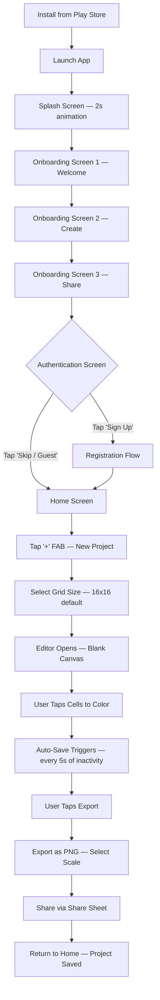

## 4.2 Returning User Journey

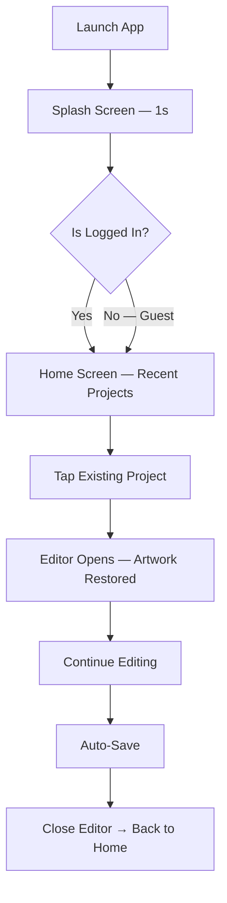

## 4.3 Template-Based Creation Journey

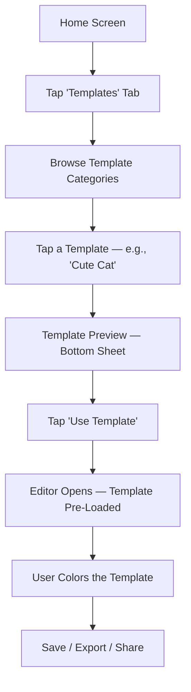

## 4.4 Community Gallery Journey

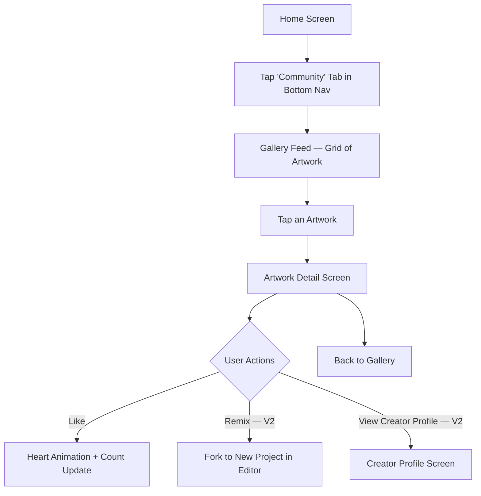

## 4.5 Cloud Sync Journey

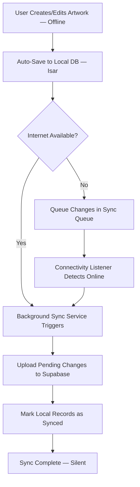

## 4.6 Export Journey

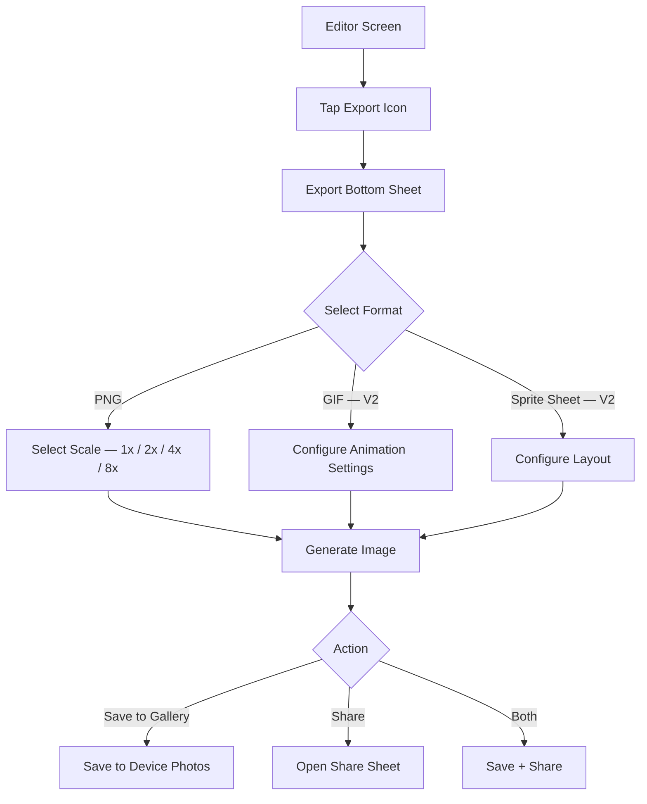

## 4.7 Authentication Journey

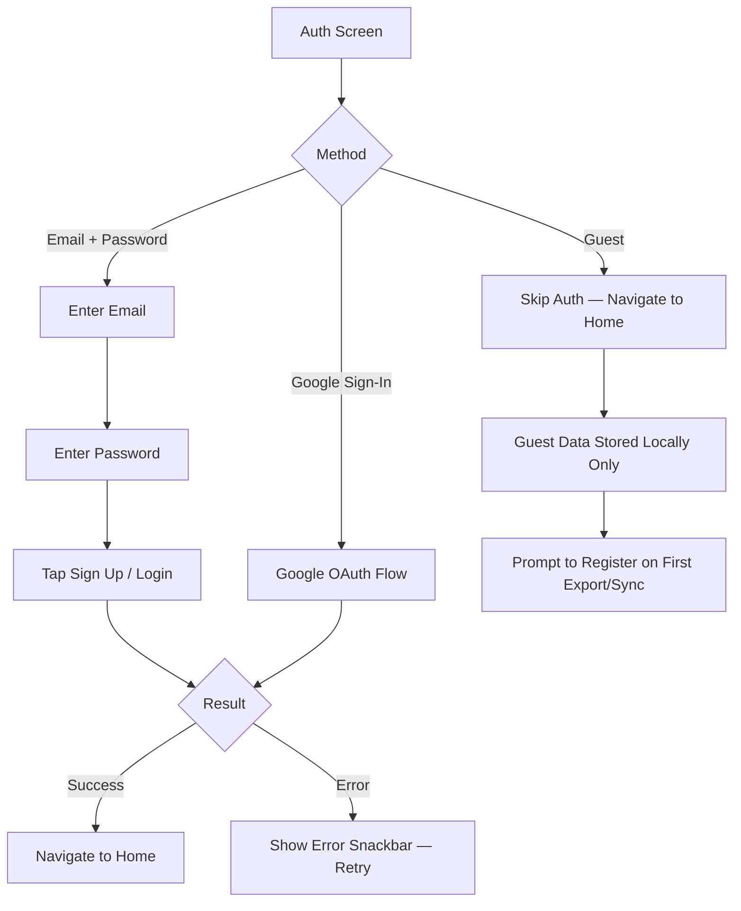

---

# 5. Information Architecture

## 5.1 Screen Inventory

### Splash Screen

| Attribute | Detail |
|---|---|
| **Purpose** | Brand impression, load app state, check auth status |
| **Components** | App logo animation, loading indicator (subtle) |
| **Navigation** | Auto-navigates to Onboarding (first launch) or Home (returning user) |
| **Entry Point** | App cold start |
| **Exit Point** | Onboarding or Home |
| **Dependencies** | Local preferences (isFirstLaunch, authToken) |

### Onboarding (3 Screens)

| Attribute | Detail |
|---|---|
| **Purpose** | Introduce app value proposition, build excitement |
| **Components** | Illustration, headline, sub-text, page indicator dots, Skip button, Next button, Get Started (final screen) |
| **Navigation** | Swipe horizontal or tap Next; Skip jumps to Auth; Get Started navigates to Auth |
| **Entry Point** | Splash (first launch only) |
| **Exit Point** | Authentication screen |
| **Dependencies** | None |

### Authentication Screen

| Attribute | Detail |
|---|---|
| **Purpose** | Register, login, or skip as guest |
| **Components** | Email input, Password input, Sign Up button, Login button, Google Sign-In button, Guest/Skip link, Terms of Service link |
| **Navigation** | Success → Home; Guest → Home (limited sync) |
| **Entry Point** | Onboarding or Settings (login later) |
| **Exit Point** | Home screen |
| **Dependencies** | Supabase Auth, Google Sign-In SDK |

### Home Screen

| Attribute | Detail |
|---|---|
| **Purpose** | Central hub — view recent projects, navigate to all features |
| **Components** | App bar (logo, search, notifications bell), Recent projects grid/list, FAB (new project), Empty state (first-time illustration), Sort/filter chips |
| **Navigation** | Part of Bottom Navigation shell; FAB → New Project dialog; Tap project → Editor; Bell → Notification center |
| **Entry Point** | Auth success, Back from Editor, Bottom Nav tap |
| **Exit Point** | Editor, New Project dialog, Templates, Community, Profile |
| **Dependencies** | Projects repository, local DB |

### New Project Dialog / Bottom Sheet

| Attribute | Detail |
|---|---|
| **Purpose** | Configure new canvas dimensions and name |
| **Components** | Project name input (optional — auto-generated default), Grid size picker (8×8, 16×16, 32×32, 64×64, custom), Background color toggle (transparent or white), Create button |
| **Navigation** | Create → Editor with blank canvas |
| **Entry Point** | FAB on Home |
| **Exit Point** | Editor or Cancel → Home |
| **Dependencies** | None |

### Editor Screen

| Attribute | Detail |
|---|---|
| **Purpose** | Core pixel art creation experience |
| **Components** | Canvas (interactive grid), Tool bar (bottom — pencil, eraser, fill, shape tools), Color palette bar (bottom — current palette, tap to expand), Top bar (undo, redo, layers, grid toggle, zoom reset, export, more menu), Layer panel (slide-out or bottom sheet), Zoom/pan gesture detector |
| **Navigation** | Back → Home (auto-save on exit); Export → Export sheet; Layers → Layer panel; Palette expand → Color picker |
| **Entry Point** | Home (new or existing project), Templates |
| **Exit Point** | Home (back), Export sheet, Share |
| **Dependencies** | Canvas rendering engine, Color palette, Layer system, Project repository, Auto-save service |

### Color Picker (Expanded)

| Attribute | Detail |
|---|---|
| **Purpose** | Select custom color or switch palettes |
| **Components** | Color wheel / HSL picker, HEX input, Recent colors row, Palette selector tabs, Saved palettes list, Eyedropper button |
| **Navigation** | Overlay on Editor; dismiss returns to Editor |
| **Entry Point** | Tap color swatch in palette bar |
| **Exit Point** | Select color → return to Editor |
| **Dependencies** | Palette repository |

### Layer Panel

| Attribute | Detail |
|---|---|
| **Purpose** | Manage canvas layers |
| **Components** | Layer list (thumbnail, name, visibility toggle, opacity slider), Add layer button, Delete layer (swipe or button), Reorder (drag handle), Merge down (long-press menu) |
| **Navigation** | Bottom sheet or side panel in Editor |
| **Entry Point** | Layers button in Editor top bar |
| **Exit Point** | Dismiss → Editor |
| **Dependencies** | Layer state in canvas engine |

### Templates Screen

| Attribute | Detail |
|---|---|
| **Purpose** | Browse and select pre-made templates |
| **Components** | Category chips (All, Animals, Characters, Food, Nature, etc.), Template grid (thumbnail + name), Search bar |
| **Navigation** | Part of Bottom Navigation; Tap template → Preview sheet → Editor |
| **Entry Point** | Bottom Nav tab |
| **Exit Point** | Editor (with template loaded) |
| **Dependencies** | Template repository (bundled assets + remote) |

### Community Gallery Screen

| Attribute | Detail |
|---|---|
| **Purpose** | Discover artwork from other creators |
| **Components** | Gallery grid (artwork thumbnails), Trending / Recent / Popular tabs, Search bar, Pull-to-refresh |
| **Navigation** | Part of Bottom Navigation; Tap artwork → Detail |
| **Entry Point** | Bottom Nav tab |
| **Exit Point** | Artwork detail, Creator profile |
| **Dependencies** | Community API (Supabase), Internet required (cached for offline browsing of previously loaded items) |

### Artwork Detail Screen

| Attribute | Detail |
|---|---|
| **Purpose** | View a single community artwork in detail |
| **Components** | Full artwork display, Title, Creator info (avatar + name), Like button + count, Created date, Remix button (V2), Comment section (V2), Report button |
| **Navigation** | Back → Gallery |
| **Entry Point** | Tap artwork in Gallery |
| **Exit Point** | Gallery, Creator profile, Editor (remix) |
| **Dependencies** | Community API |

### Profile Screen

| Attribute | Detail |
|---|---|
| **Purpose** | View and edit user profile, see personal stats |
| **Components** | Avatar, Username, Email, Artwork count, Total likes received, Published artworks grid, Edit profile button, Settings link, Logout button |
| **Navigation** | Part of Bottom Navigation |
| **Entry Point** | Bottom Nav tab |
| **Exit Point** | Settings, Edit Profile, Artwork detail |
| **Dependencies** | Auth state, User repository |

### Settings Screen

| Attribute | Detail |
|---|---|
| **Purpose** | App preferences and account management |
| **Components** | Default grid size, Haptic feedback toggle, Auto-save interval, Notifications toggle, Export quality default, Account section (change password, delete account), About section (version, licenses, privacy policy), Logout |
| **Navigation** | Push screen from Profile |
| **Entry Point** | Profile → Settings gear icon |
| **Exit Point** | Back → Profile |
| **Dependencies** | Preferences repository (local) |

### Notification Center Screen

| Attribute | Detail |
|---|---|
| **Purpose** | View in-app notifications |
| **Components** | Notification list (icon, title, message, timestamp), Read/unread indicators, Clear all button, Empty state |
| **Navigation** | Push screen from Home app bar bell icon |
| **Entry Point** | Bell icon on Home |
| **Exit Point** | Back → Home, Tap notification → relevant screen |
| **Dependencies** | Notifications repository |

### Export Bottom Sheet

| Attribute | Detail |
|---|---|
| **Purpose** | Configure and execute artwork export |
| **Components** | Format selector (PNG, GIF — V2, Sprite Sheet — V2), Scale selector (1x, 2x, 4x, 8x, 16x), Preview thumbnail, Save to device button, Share button, File size estimate |
| **Navigation** | Bottom sheet over Editor |
| **Entry Point** | Export button in Editor |
| **Exit Point** | Dismiss → Editor |
| **Dependencies** | Export service, image encoding library |

---

# 6. Application Modules

## 6.1 Module Overview

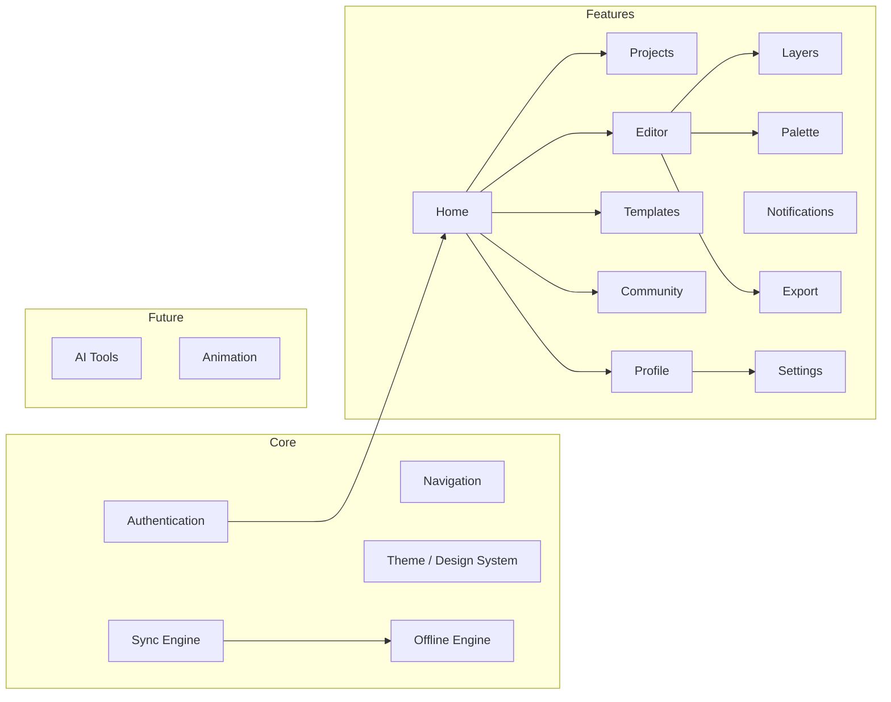

## 6.2 Module Responsibilities

### Authentication Module
- **Responsibility:** User identity lifecycle — registration, login, logout, session management, token refresh, guest mode, account deletion.
- **Owns:** Auth state, user tokens, session expiry logic.
- **Depends on:** Supabase Auth, Google Sign-In SDK, Secure Storage.
- **Exposes:** `AuthNotifier` (Riverpod), `AuthRepository`, `AuthGuard` for route protection.

### Home Module
- **Responsibility:** Central dashboard — displays recent projects, entry point to all features, search, and quick actions.
- **Owns:** Home screen UI, project sorting/filtering, empty states.
- **Depends on:** Projects module, Navigation module.
- **Exposes:** `HomeScreen` widget.

### Projects Module
- **Responsibility:** CRUD operations on user projects — create, read, update, delete, rename, duplicate, list, search, sort.
- **Owns:** Project entity, project list state, project metadata.
- **Depends on:** Local DB (Isar), Sync engine, Storage module.
- **Exposes:** `ProjectRepository`, `ProjectListNotifier`, project models.

### Editor Module
- **Responsibility:** Core pixel art editing experience — canvas rendering, tool management, gesture handling, undo/redo stack, auto-save orchestration.
- **Owns:** Canvas state (2D pixel grid per layer), active tool, zoom/pan transform, undo/redo history.
- **Depends on:** Layers module, Palette module, Projects module (save/load), Export module.
- **Exposes:** `EditorScreen`, `CanvasNotifier`, `ToolNotifier`, `HistoryNotifier`.

### Layers Module
- **Responsibility:** Multi-layer management — add, remove, reorder, toggle visibility, adjust opacity, merge layers.
- **Owns:** Layer stack, per-layer pixel data, active layer state.
- **Depends on:** Editor module (canvas compositing).
- **Exposes:** `LayerNotifier`, `LayerRepository` (persists layer data within project).

### Palette Module
- **Responsibility:** Color management — built-in palettes, custom palettes, color picker UI, recent colors, eyedropper coordination.
- **Owns:** Palette library, active palette, current color state, custom palette CRUD.
- **Depends on:** Local DB (persist custom palettes).
- **Exposes:** `PaletteNotifier`, `ColorPickerWidget`, `PaletteRepository`.

### Templates Module
- **Responsibility:** Browse, search, preview, and instantiate pre-built templates.
- **Owns:** Template library (bundled + remote), template categories, template metadata.
- **Depends on:** Projects module (create project from template), Assets (bundled templates).
- **Exposes:** `TemplatesScreen`, `TemplateRepository`.

### Community Module
- **Responsibility:** Social features — gallery browsing, publishing artwork, likes, (future: comments, follows, remix).
- **Owns:** Gallery feed state, published artwork metadata, like state.
- **Depends on:** Community API (Supabase), Auth module (must be logged in to publish/like).
- **Exposes:** `CommunityScreen`, `ArtworkDetailScreen`, `CommunityRepository`.

### Notifications Module
- **Responsibility:** Push notification handling, in-app notification center, notification preferences.
- **Owns:** Notification list, read/unread state, FCM token management.
- **Depends on:** Firebase Cloud Messaging, Supabase (notification records), Auth module.
- **Exposes:** `NotificationCenterScreen`, `NotificationRepository`, `NotificationService`.

### Profile Module
- **Responsibility:** User profile display and editing — avatar, username, stats, published artworks.
- **Owns:** Profile screen UI, user stats aggregation.
- **Depends on:** Auth module, Projects module (artwork count), Community module (published artworks, total likes).
- **Exposes:** `ProfileScreen`, `EditProfileScreen`.

### Settings Module
- **Responsibility:** App preferences — defaults, toggles, account management.
- **Owns:** Settings state, preferences persistence.
- **Depends on:** SharedPreferences / local config, Auth module (logout, delete account).
- **Exposes:** `SettingsScreen`, `SettingsRepository`.

### Export Module
- **Responsibility:** Render canvas to exportable formats, handle save-to-device and share-sheet integration.
- **Owns:** Image encoding pipeline, scale selection, format handling, file I/O.
- **Depends on:** Editor module (canvas data), Layers module (composited output), platform channels (save to gallery, share sheet).
- **Exposes:** `ExportService`, `ExportBottomSheet`.

### AI Module (Future — V2)
- **Responsibility:** AI-powered features — color suggestions, auto-complete, style transfer.
- **Owns:** AI model integration, prompt handling, result rendering.
- **Depends on:** External AI API (e.g., Vertex AI, Gemini API), Editor module.
- **Exposes:** `AiService`, `AiSuggestionWidget`.

### Offline Sync Module
- **Responsibility:** Orchestrate offline-first data flow — local persistence, sync queue, background sync, conflict resolution.
- **Owns:** Sync queue, sync status per entity, connectivity listener, conflict resolution strategy.
- **Depends on:** Local DB (Isar), Supabase REST, Connectivity Plus package.
- **Exposes:** `SyncService`, `SyncStatusNotifier`, `ConnectivityNotifier`.

---

# 7. Navigation Architecture

## 7.1 Navigation Stack

```
App Entry
├── Splash Screen (auto-route)
├── Onboarding Flow (PageView — 3 pages, first launch only)
├── Authentication Screen
└── App Shell (ScaffoldWithBottomNavBar)
    ├── Tab 0: Home
    │   ├── Project List
    │   ├── → Editor (push)
    │   └── → Notification Center (push)
    ├── Tab 1: Templates
    │   ├── Template Grid
    │   └── → Editor (push, with template data)
    ├── Tab 2: Community
    │   ├── Gallery Feed
    │   └── → Artwork Detail (push)
    │       └── → Creator Profile (push, V2)
    ├── Tab 3: Profile
    │   ├── Profile View
    │   ├── → Settings (push)
    │   └── → Edit Profile (push)
    └── FAB: New Project (Bottom Sheet over any tab)
```

## 7.2 Bottom Navigation

| Index | Label | Icon | Screen | Badge |
|---|---|---|---|---|
| 0 | Home | `Icons.home_rounded` | Home / Projects | — |
| 1 | Templates | `Icons.grid_view_rounded` | Template Library | — |
| 2 | Community | `Icons.explore_rounded` | Gallery Feed | — |
| 3 | Profile | `Icons.person_rounded` | Profile | — |

> **Note:** The FAB (Floating Action Button) for "New Project" floats above the Bottom Navigation bar, centered or docked. It is NOT a tab.

## 7.3 Nested Navigation

Each Bottom Nav tab maintains its own `Navigator` (using `go_router` `StatefulShellRoute`). This ensures:
- Independent back stacks per tab.
- Tab state preservation when switching between tabs.
- Deep link support per tab.

## 7.4 Dialogs

| Dialog | Type | Trigger |
|---|---|---|
| New Project | Bottom Sheet | FAB tap |
| Delete Project Confirmation | Alert Dialog | Long-press project → Delete |
| Rename Project | Alert Dialog with TextField | Long-press project → Rename |
| Discard Changes | Alert Dialog | Back from Editor with unsaved changes (edge case) |
| Logout Confirmation | Alert Dialog | Profile → Settings → Logout |
| Delete Account Confirmation | Alert Dialog (destructive) | Settings → Delete Account |
| Export Options | Bottom Sheet | Editor → Export icon |
| Color Picker | Bottom Sheet (large) | Tap color swatch in palette bar |
| Layer Panel | Bottom Sheet (draggable) | Editor → Layers icon |

## 7.5 Deep Links (Future)

| Deep Link | Target |
|---|---|
| `pixelcanvas://artwork/{id}` | Community → Artwork Detail |
| `pixelcanvas://project/{id}` | Home → Editor (if owned) |
| `pixelcanvas://template/{id}` | Templates → Preview → Editor |
| `pixelcanvas://profile/{userId}` | Community → Creator Profile |
| `pixelcanvas://challenge/{id}` | Daily Challenge (V2) |

## 7.6 Navigation Package

**go_router** (latest stable) — chosen for:
- Declarative routing.
- `StatefulShellRoute` for bottom nav with preserved state.
- Built-in deep link support.
- Redirect guards (auth check).
- Typed route parameters.

---

# 8. Folder Architecture

## 8.1 Feature-First Structure

```
lib/
├── main.dart                          # App entry point
├── app.dart                           # MaterialApp.router configuration
├── bootstrap.dart                     # Dependency initialization
│
├── core/                              # Shared core — NOT feature-specific
│   ├── constants/
│   │   ├── app_constants.dart         # Grid sizes, max layers, undo limit
│   │   ├── api_constants.dart         # Supabase URLs, endpoints
│   │   └── storage_constants.dart     # DB names, bucket names
│   │
│   ├── errors/
│   │   ├── app_exception.dart         # Base exception class
│   │   ├── network_exception.dart
│   │   └── storage_exception.dart
│   │
│   ├── extensions/
│   │   ├── context_extensions.dart    # Theme, MediaQuery shortcuts
│   │   ├── color_extensions.dart      # HEX ↔ Color, brightness
│   │   ├── date_extensions.dart
│   │   └── string_extensions.dart
│   │
│   ├── network/
│   │   ├── connectivity_service.dart  # Online/offline stream
│   │   ├── supabase_client.dart       # Singleton Supabase init
│   │   └── api_interceptor.dart       # Logging, error handling
│   │
│   ├── storage/
│   │   ├── local_database.dart        # Isar DB initialization
│   │   ├── secure_storage.dart        # flutter_secure_storage wrapper
│   │   └── preferences_service.dart   # SharedPreferences wrapper
│   │
│   ├── sync/
│   │   ├── sync_service.dart          # Background sync orchestrator
│   │   ├── sync_queue.dart            # Pending operations queue
│   │   ├── sync_status.dart           # Enum: synced, pending, conflict
│   │   └── conflict_resolver.dart     # LWW conflict resolution
│   │
│   └── utils/
│       ├── image_utils.dart           # PNG encoding, scaling
│       ├── color_utils.dart           # Color math, palette generation
│       ├── debouncer.dart             # Auto-save debounce
│       └── logger.dart                # Structured logging
│
├── shared/                            # Shared UI components — used across features
│   ├── widgets/
│   │   ├── pc_button.dart             # PixelCanvas branded button
│   │   ├── pc_icon_button.dart
│   │   ├── pc_card.dart
│   │   ├── pc_text_field.dart
│   │   ├── pc_bottom_sheet.dart
│   │   ├── pc_dialog.dart
│   │   ├── pc_loading.dart            # Shimmer / skeleton loader
│   │   ├── pc_empty_state.dart
│   │   ├── pc_error_state.dart
│   │   ├── pc_avatar.dart
│   │   ├── pc_snackbar.dart
│   │   └── pc_chip.dart
│   │
│   ├── layout/
│   │   ├── app_scaffold.dart          # Base scaffold with bottom nav
│   │   └── responsive_builder.dart    # Breakpoint-based layout
│   │
│   └── animations/
│       ├── fade_in.dart
│       ├── slide_up.dart
│       └── scale_bounce.dart
│
├── theme/
│   ├── app_theme.dart                 # ThemeData — LIGHT ONLY
│   ├── app_colors.dart                # Color palette constants
│   ├── app_typography.dart            # TextStyles (Google Fonts)
│   ├── app_spacing.dart               # Spacing scale (4, 8, 12, 16, 20, 24, 32, 48)
│   ├── app_radius.dart                # Border radius scale
│   └── app_shadows.dart               # Elevation shadows
│
├── navigation/
│   ├── app_router.dart                # go_router configuration
│   ├── route_names.dart               # Named route constants
│   └── auth_guard.dart                # Redirect logic for auth
│
├── features/
│   ├── splash/
│   │   └── presentation/
│   │       └── splash_screen.dart
│   │
│   ├── onboarding/
│   │   └── presentation/
│   │       ├── onboarding_screen.dart
│   │       └── widgets/
│   │           └── onboarding_page.dart
│   │
│   ├── auth/
│   │   ├── data/
│   │   │   ├── auth_repository_impl.dart
│   │   │   └── models/
│   │   │       └── user_model.dart
│   │   ├── domain/
│   │   │   ├── auth_repository.dart   # Abstract interface
│   │   │   └── entities/
│   │   │       └── app_user.dart
│   │   └── presentation/
│   │       ├── auth_screen.dart
│   │       ├── providers/
│   │       │   └── auth_notifier.dart
│   │       └── widgets/
│   │           ├── login_form.dart
│   │           └── signup_form.dart
│   │
│   ├── home/
│   │   └── presentation/
│   │       ├── home_screen.dart
│   │       ├── providers/
│   │       │   └── home_notifier.dart
│   │       └── widgets/
│   │           ├── project_grid.dart
│   │           ├── project_card.dart
│   │           └── new_project_sheet.dart
│   │
│   ├── projects/
│   │   ├── data/
│   │   │   ├── project_repository_impl.dart
│   │   │   ├── models/
│   │   │   │   └── project_model.dart # Isar schema
│   │   │   └── datasources/
│   │   │       ├── project_local_ds.dart
│   │   │       └── project_remote_ds.dart
│   │   ├── domain/
│   │   │   ├── project_repository.dart
│   │   │   └── entities/
│   │   │       └── project.dart
│   │   └── presentation/
│   │       └── providers/
│   │           └── project_list_notifier.dart
│   │
│   ├── editor/
│   │   ├── data/
│   │   │   └── models/
│   │   │       ├── pixel_data.dart     # Per-cell color data
│   │   │       └── canvas_state.dart
│   │   ├── domain/
│   │   │   ├── canvas_engine.dart      # Core canvas logic
│   │   │   ├── tools/
│   │   │   │   ├── tool.dart           # Abstract tool interface
│   │   │   │   ├── pencil_tool.dart
│   │   │   │   ├── eraser_tool.dart
│   │   │   │   ├── fill_tool.dart
│   │   │   │   ├── line_tool.dart
│   │   │   │   ├── rectangle_tool.dart
│   │   │   │   └── circle_tool.dart
│   │   │   └── history/
│   │   │       ├── history_manager.dart # Undo/Redo stack
│   │   │       └── canvas_action.dart   # Command pattern
│   │   └── presentation/
│   │       ├── editor_screen.dart
│   │       ├── providers/
│   │       │   ├── canvas_notifier.dart
│   │       │   ├── tool_notifier.dart
│   │       │   └── zoom_notifier.dart
│   │       └── widgets/
│   │           ├── canvas_painter.dart  # CustomPainter
│   │           ├── tool_bar.dart
│   │           ├── grid_overlay.dart
│   │           └── canvas_gesture_handler.dart
│   │
│   ├── layers/
│   │   ├── data/
│   │   │   └── models/
│   │   │       └── layer_model.dart
│   │   ├── domain/
│   │   │   └── entities/
│   │   │       └── layer.dart
│   │   └── presentation/
│   │       ├── providers/
│   │       │   └── layer_notifier.dart
│   │       └── widgets/
│   │           ├── layer_panel.dart
│   │           └── layer_tile.dart
│   │
│   ├── palette/
│   │   ├── data/
│   │   │   ├── palette_repository_impl.dart
│   │   │   └── models/
│   │   │       └── palette_model.dart
│   │   ├── domain/
│   │   │   ├── palette_repository.dart
│   │   │   └── entities/
│   │   │       └── color_palette.dart
│   │   └── presentation/
│   │       ├── providers/
│   │       │   └── palette_notifier.dart
│   │       └── widgets/
│   │           ├── palette_bar.dart
│   │           ├── color_picker_sheet.dart
│   │           └── palette_selector.dart
│   │
│   ├── templates/
│   │   ├── data/
│   │   │   ├── template_repository_impl.dart
│   │   │   └── models/
│   │   │       └── template_model.dart
│   │   ├── domain/
│   │   │   ├── template_repository.dart
│   │   │   └── entities/
│   │   │       └── pixel_template.dart
│   │   └── presentation/
│   │       ├── templates_screen.dart
│   │       ├── providers/
│   │       │   └── template_notifier.dart
│   │       └── widgets/
│   │           ├── template_grid.dart
│   │           ├── template_card.dart
│   │           └── template_preview_sheet.dart
│   │
│   ├── community/
│   │   ├── data/
│   │   │   ├── community_repository_impl.dart
│   │   │   └── models/
│   │   │       └── gallery_artwork_model.dart
│   │   ├── domain/
│   │   │   ├── community_repository.dart
│   │   │   └── entities/
│   │   │       └── gallery_artwork.dart
│   │   └── presentation/
│   │       ├── community_screen.dart
│   │       ├── artwork_detail_screen.dart
│   │       ├── providers/
│   │       │   └── community_notifier.dart
│   │       └── widgets/
│   │           ├── gallery_grid.dart
│   │           └── artwork_card.dart
│   │
│   ├── notifications/
│   │   ├── data/
│   │   │   ├── notification_repository_impl.dart
│   │   │   └── models/
│   │   │       └── notification_model.dart
│   │   ├── domain/
│   │   │   ├── notification_repository.dart
│   │   │   ├── notification_service.dart
│   │   │   └── entities/
│   │   │       └── app_notification.dart
│   │   └── presentation/
│   │       ├── notification_center_screen.dart
│   │       └── providers/
│   │           └── notification_notifier.dart
│   │
│   ├── profile/
│   │   └── presentation/
│   │       ├── profile_screen.dart
│   │       ├── edit_profile_screen.dart
│   │       └── providers/
│   │           └── profile_notifier.dart
│   │
│   ├── settings/
│   │   ├── data/
│   │   │   └── settings_repository_impl.dart
│   │   ├── domain/
│   │   │   └── settings_repository.dart
│   │   └── presentation/
│   │       ├── settings_screen.dart
│   │       └── providers/
│   │           └── settings_notifier.dart
│   │
│   └── export/
│       ├── data/
│       │   └── export_service_impl.dart
│       ├── domain/
│       │   └── export_service.dart
│       └── presentation/
│           └── widgets/
│               └── export_bottom_sheet.dart
│
├── l10n/                              # Localization (Future)
│   └── app_en.arb
│
└── gen/                               # Generated files (Isar, Riverpod, etc.)
    └── ...

assets/
├── images/
│   ├── logo/
│   │   ├── logo.png
│   │   └── logo_splash.png
│   ├── onboarding/
│   │   ├── onboarding_1.png
│   │   ├── onboarding_2.png
│   │   └── onboarding_3.png
│   └── empty_states/
│       ├── no_projects.png
│       └── no_community.png
│
├── palettes/                          # Bundled color palettes as JSON
│   ├── default.json
│   ├── gameboy.json
│   ├── pastel.json
│   ├── neon.json
│   └── ...
│
├── templates/                         # Bundled template data (JSON + thumbnail PNGs)
│   ├── animals/
│   ├── characters/
│   ├── food/
│   └── nature/
│
├── fonts/                             # Google Fonts cached locally
│   └── ...
│
└── lottie/                            # Lottie animation files
    ├── splash_animation.json
    └── save_success.json

test/
├── core/
│   ├── sync/
│   │   └── sync_service_test.dart
│   └── utils/
│       └── color_utils_test.dart
├── features/
│   ├── editor/
│   │   ├── domain/
│   │   │   ├── canvas_engine_test.dart
│   │   │   └── tools/
│   │   │       ├── pencil_tool_test.dart
│   │   │       ├── fill_tool_test.dart
│   │   │       └── ...
│   │   └── presentation/
│   │       └── editor_screen_test.dart
│   ├── projects/
│   │   └── data/
│   │       └── project_repository_test.dart
│   └── ...
└── shared/
    └── widgets/
        └── pc_button_test.dart

integration_test/
├── auth_flow_test.dart
├── editor_flow_test.dart
└── export_flow_test.dart
```

## 8.2 Architecture Layers per Feature

Each feature follows a 3-layer architecture:

```
feature/
├── data/            # Implementation layer
│   ├── models/      # DB models, API DTOs (Isar schemas, JSON serializable)
│   ├── datasources/ # Local (Isar) and Remote (Supabase) data sources
│   └── *_repository_impl.dart  # Concrete repository implementation
│
├── domain/          # Business logic layer
│   ├── entities/    # Pure Dart entities (UI-facing, no serialization)
│   ├── *_repository.dart  # Abstract repository interface
│   └── *_service.dart     # Use cases / business logic
│
└── presentation/    # UI layer
    ├── *_screen.dart      # Screen widgets
    ├── providers/         # Riverpod notifiers
    └── widgets/           # Feature-specific reusable widgets
```

**Data flows upward:** `DataSource → Repository → Notifier → Widget`
**Dependencies point inward:** Presentation depends on Domain. Data implements Domain. Domain depends on nothing.

---

# 9. Design System Mapping

> All design tokens are derived from the existing Stitch UI. Light theme only. No dark theme.

## 9.1 Color Palette

| Token | HEX | Usage |
|---|---|---|
| `primary` | `#6C5CE7` | Primary buttons, FAB, active states, links |
| `primaryLight` | `#A29BFE` | Hover states, light backgrounds, selected chips |
| `primaryDark` | `#4A3CB5` | Pressed states, emphasis |
| `secondary` | `#00CEC9` | Accent highlights, badges, progress indicators |
| `surface` | `#FFFFFF` | Cards, sheets, dialogs, inputs |
| `background` | `#F8F9FA` | Screen background, scaffold |
| `onPrimary` | `#FFFFFF` | Text/icons on primary surfaces |
| `onSurface` | `#2D3436` | Primary text, headings |
| `onSurfaceVariant` | `#636E72` | Secondary text, captions, placeholders |
| `outline` | `#DFE6E9` | Borders, dividers, input outlines |
| `outlineFocused` | `#6C5CE7` | Focused input borders |
| `error` | `#FF6B6B` | Error states, destructive actions |
| `errorContainer` | `#FFF0F0` | Error backgrounds |
| `success` | `#00B894` | Success states, sync complete |
| `successContainer` | `#E8F8F5` | Success backgrounds |
| `warning` | `#FDCB6E` | Warning states |
| `gridLine` | `#E0E0E0` | Canvas gridlines (at 50% opacity) |
| `canvasBackground` | `#FFFFFF` | Default canvas background |
| `transparentCheckerLight` | `#EEEEEE` | Transparency checker pattern - light |
| `transparentCheckerDark` | `#CCCCCC` | Transparency checker pattern - dark |

## 9.2 Typography

| Style | Font Family | Weight | Size | Line Height | Usage |
|---|---|---|---|---|---|
| `displayLarge` | Inter | Bold (700) | 32 | 40 | Splash branding |
| `headlineLarge` | Inter | SemiBold (600) | 24 | 32 | Screen titles |
| `headlineMedium` | Inter | SemiBold (600) | 20 | 28 | Section headers |
| `titleLarge` | Inter | Medium (500) | 18 | 24 | Card titles, project names |
| `titleMedium` | Inter | Medium (500) | 16 | 22 | Toolbar labels |
| `bodyLarge` | Inter | Regular (400) | 16 | 24 | Body text |
| `bodyMedium` | Inter | Regular (400) | 14 | 20 | Descriptions, secondary text |
| `bodySmall` | Inter | Regular (400) | 12 | 16 | Captions, timestamps |
| `labelLarge` | Inter | SemiBold (600) | 14 | 20 | Button text |
| `labelMedium` | Inter | Medium (500) | 12 | 16 | Chips, badges |
| `labelSmall` | Inter | Medium (500) | 10 | 14 | Overlines, metadata |

## 9.3 Spacing Scale

| Token | Value | Usage |
|---|---|---|
| `xs` | 4 | Minimum spacing, icon padding |
| `sm` | 8 | Between related elements, chip padding |
| `md` | 12 | Input padding, small gaps |
| `base` | 16 | Standard padding (screen edges, card padding) |
| `lg` | 20 | Between sections |
| `xl` | 24 | Between unrelated groups |
| `xxl` | 32 | Large section separators |
| `xxxl` | 48 | Screen top/bottom padding |

## 9.4 Border Radius

| Token | Value | Usage |
|---|---|---|
| `none` | 0 | Sharp corners (canvas, pixel grid) |
| `sm` | 4 | Chips, tags |
| `md` | 8 | Inputs, small cards |
| `base` | 12 | Cards, dialogs |
| `lg` | 16 | Bottom sheets, large cards |
| `xl` | 20 | Modals, onboarding cards |
| `full` | 999 | FAB, circular avatars, pills |

## 9.5 Shadows / Elevation

| Token | Elevation | Usage |
|---|---|---|
| `none` | 0 | Flat elements |
| `low` | `0 1px 3px rgba(0,0,0,0.08)` | Cards, inputs |
| `medium` | `0 4px 12px rgba(0,0,0,0.10)` | Floating elements, dropdowns |
| `high` | `0 8px 24px rgba(0,0,0,0.12)` | Dialogs, bottom sheets |
| `highest` | `0 16px 48px rgba(0,0,0,0.16)` | Modals, overlays |

## 9.6 Component Mapping

### Buttons

| Variant | Style | Use Case |
|---|---|---|
| `PcButton.primary` | Filled, primary color, rounded-full | Main CTAs (Create, Sign Up, Export) |
| `PcButton.secondary` | Outlined, primary border, transparent fill | Secondary actions (Cancel, Skip) |
| `PcButton.text` | No border, no fill, primary text | Tertiary actions (Links, "Forgot password") |
| `PcButton.destructive` | Filled, error color | Delete, Logout |
| `PcButton.icon` | CircleAvatar-style, icon only | Toolbar icons, action icons |

### Cards

| Variant | Use Case |
|---|---|
| `PcCard.project` | Project thumbnail in Home grid — image, title, date, 3-dot menu |
| `PcCard.template` | Template in library — image, category badge, title |
| `PcCard.artwork` | Gallery artwork — image, creator avatar, like count |
| `PcCard.notification` | Notification item — icon, title, message, timestamp |

### Inputs

| Variant | Use Case |
|---|---|
| `PcTextField.standard` | Email, password, project name |
| `PcTextField.search` | Search bar with leading icon and clear button |
| `PcTextField.hex` | HEX color input with # prefix and color preview |

### Dialogs

| Variant | Use Case |
|---|---|
| `PcDialog.confirm` | Confirmation with title, message, Cancel + Confirm buttons |
| `PcDialog.destructive` | Delete confirmation with red Confirm button |
| `PcDialog.input` | Dialog with text input (Rename project) |

### Bottom Sheets

| Variant | Use Case |
|---|---|
| `PcBottomSheet.standard` | Draggable with handle, title, content area |
| `PcBottomSheet.colorPicker` | Large sheet for color picker with preview |
| `PcBottomSheet.export` | Export options with format/scale selectors |
| `PcBottomSheet.layers` | Scrollable layer list with drag-to-reorder |
| `PcBottomSheet.newProject` | Grid size selection with preview |

### Icons

Use Material Symbols Rounded (filled variant for active state, outlined for inactive).

| Context | Style |
|---|---|
| Bottom Nav (active) | Filled |
| Bottom Nav (inactive) | Outlined |
| Toolbar | Outlined, 24dp |
| Action buttons | Outlined, 20dp |

### Grid System

Canvas grid rendering uses `CustomPainter` with:
- Grid lines drawn at pixel boundaries.
- Line color: `gridLine` at 50% opacity.
- Line width: 0.5 logical pixels at 1x zoom, scale-independent.
- Grid fades out when zoom level < 0.5x (too dense to be useful).
- Grid intensifies when zoom > 2x.

---

# 10. State Management Strategy

## 10.1 Why Riverpod

| Criterion | Riverpod | Provider | BLoC |
|---|---|---|---|
| Compile-time safety | ✅ | ❌ | ✅ |
| No BuildContext needed for DI | ✅ | ❌ | ❌ |
| Code generation support | ✅ | ❌ | ✅ |
| Testing (no widget tree needed) | ✅ | ❌ | ✅ |
| Caching & auto-dispose | ✅ Built-in | ❌ | ❌ Manual |
| Learning curve | Medium | Low | High |
| Community & maintenance | Active | Legacy | Active |

**Decision:** Use **Riverpod 2.x with code generation** (`riverpod_annotation`, `riverpod_generator`).

## 10.2 Provider Hierarchy

```
┌──────────────────────────────────────────────────────────────┐
│                    Infrastructure Providers                   │
│  (Never auto-dispose — live for app lifetime)                │
├──────────────────────────────────────────────────────────────┤
│  supabaseClientProvider          → Supabase.instance         │
│  isarProvider                    → Isar database instance     │
│  secureStorageProvider           → FlutterSecureStorage       │
│  connectivityProvider            → Stream<ConnectivityStatus>  │
│  sharedPreferencesProvider       → SharedPreferences instance  │
└──────────────────────────────────────────────────────────────┘
                              │
                              ▼
┌──────────────────────────────────────────────────────────────┐
│                    Repository Providers                       │
│  (Never auto-dispose — stateless services)                   │
├──────────────────────────────────────────────────────────────┤
│  authRepositoryProvider          → AuthRepository            │
│  projectRepositoryProvider       → ProjectRepository         │
│  paletteRepositoryProvider       → PaletteRepository         │
│  templateRepositoryProvider      → TemplateRepository        │
│  communityRepositoryProvider     → CommunityRepository       │
│  notificationRepositoryProvider  → NotificationRepository    │
│  settingsRepositoryProvider      → SettingsRepository        │
│  syncServiceProvider             → SyncService               │
│  exportServiceProvider           → ExportService             │
└──────────────────────────────────────────────────────────────┘
                              │
                              ▼
┌──────────────────────────────────────────────────────────────┐
│                 Feature State Providers                       │
│  (Auto-dispose when no listeners — screen-scoped)            │
├──────────────────────────────────────────────────────────────┤
│  authNotifierProvider            → AsyncNotifier<AuthState>   │
│  projectListProvider             → AsyncNotifier<List<Proj>>  │
│  canvasNotifierProvider(projId)  → Notifier<CanvasState>      │
│  toolNotifierProvider            → Notifier<ToolState>        │
│  layerNotifierProvider(projId)   → Notifier<LayerState>       │
│  paletteNotifierProvider         → Notifier<PaletteState>     │
│  communityFeedProvider           → AsyncNotifier<GalleryFeed> │
│  notificationListProvider        → AsyncNotifier<List<Notif>> │
│  profileProvider                 → AsyncNotifier<UserProfile> │
│  settingsNotifierProvider        → Notifier<SettingsState>    │
│  zoomNotifierProvider            → Notifier<ZoomState>        │
│  historyNotifierProvider(projId) → Notifier<HistoryState>     │
│  syncStatusProvider              → StreamProvider<SyncStatus>  │
│  exportNotifierProvider          → AsyncNotifier<ExportState>  │
└──────────────────────────────────────────────────────────────┘
```

## 10.3 State Flow — Editor Example

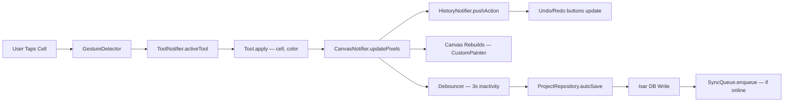

## 10.4 Caching Strategy

| Data | Cache Location | TTL | Invalidation |
|---|---|---|---|
| Auth token | Secure Storage | Until logout | Manual on logout |
| Active project canvas | In-memory (Notifier state) | While editor is open | Auto-dispose on navigate away |
| Project list | Isar (local DB) | Permanent | Re-fetch on pull-to-refresh |
| Community gallery page | In-memory + Isar cache | 5 minutes | Pull-to-refresh, scroll-to-load |
| Templates | Bundled assets + Isar cache | 24 hours for remote | App update or force refresh |
| Color palettes | Isar | Permanent | User edit or app update |
| Settings / Preferences | SharedPreferences | Permanent | User change |
| User profile | Isar + in-memory | 10 minutes | Profile edit, pull-to-refresh |

## 10.5 Repository Pattern

Every data-accessing feature implements:

```
Abstract Repository (Domain layer)
     ↑ implements
Concrete RepositoryImpl (Data layer)
     ├── LocalDataSource (Isar)
     └── RemoteDataSource (Supabase)
```

The repository is responsible for:
1. Checking connectivity.
2. Reading from local first (offline-first).
3. Attempting remote sync in background.
4. Handling errors and returning domain entities.

## 10.6 Dependency Injection

All DI is handled via Riverpod providers. No `get_it`, no `injectable`, no service locators.

- Infrastructure is initialized in `bootstrap.dart` and overridden in `ProviderScope.overrides` for testing.
- Repositories are wired via `ref.watch(isarProvider)` and `ref.watch(supabaseClientProvider)`.
- Feature notifiers receive repositories via constructor injection from Riverpod's `ref`.

---

# 11. Offline-First Strategy

## 11.1 Design Principles

1. **Local is truth.** Every user action writes to the local database first. Network operations are always secondary.
2. **Background sync is invisible.** Users never wait for network. Sync happens silently.
3. **Every feature works offline.** Create, edit, save, export, manage projects — all offline.
4. **Community features degrade gracefully.** Gallery shows cached content with a "You're offline" banner. Publishing queues for later.

## 11.2 Local Database — Isar

**Why Isar:**
- NoSQL — perfect for flexible pixel art data structures.
- Extremely fast — native Dart implementation.
- Built for Flutter — zero overhead, async queries.
- Supports complex objects, lists, embedded objects.
- Full-text search built-in.
- Free and open-source.

**Collections (Tables):**

| Collection | Contents |
|---|---|
| `ProjectCollection` | Project metadata + per-layer pixel data (embedded) |
| `PaletteCollection` | Custom and downloaded palettes |
| `TemplateCollection` | Cached template metadata + data |
| `NotificationCollection` | Cached notifications |
| `GalleryCache` | Cached community artwork for offline browsing |
| `SyncQueueCollection` | Pending sync operations |
| `UserPreferencesCollection` | Local settings and preferences |

## 11.3 Auto-Save Pipeline

```
User action (tap cell, change color, move layer)
         │
         ▼
  Canvas state mutation (in-memory)
         │
         ▼
  Debouncer resets (3 seconds)
         │
    ┌────┴────────────────────┐
    │  3s inactivity elapsed  │
    └────┬────────────────────┘
         │
         ▼
  Serialize canvas state to ProjectModel
         │
         ▼
  Write to Isar (async, non-blocking)
         │
         ▼
  Update project.updatedAt timestamp
         │
         ▼
  Enqueue sync operation (if user is authenticated)
         │
         ▼
  UI shows subtle "Saved" indicator (checkmark, fades after 1s)
```

**Auto-save also triggers on:**
- Editor `dispose()` (navigate away).
- App lifecycle `paused` / `inactive` (user switches app).
- Every 30 seconds unconditionally (safety net).

## 11.4 Sync Queue

The sync queue is a persistent Isar collection that stores operations pending upload.

| Field | Type | Description |
|---|---|---|
| `id` | int (auto) | Local queue ID |
| `entityType` | String | `project`, `palette`, `like`, `profile` |
| `entityId` | String | Local UUID of the entity |
| `operation` | String | `create`, `update`, `delete` |
| `payload` | String (JSON) | Serialized entity data |
| `createdAt` | DateTime | When the operation was queued |
| `retryCount` | int | Number of failed sync attempts |
| `status` | String | `pending`, `in_progress`, `failed`, `completed` |

## 11.5 Background Sync Service

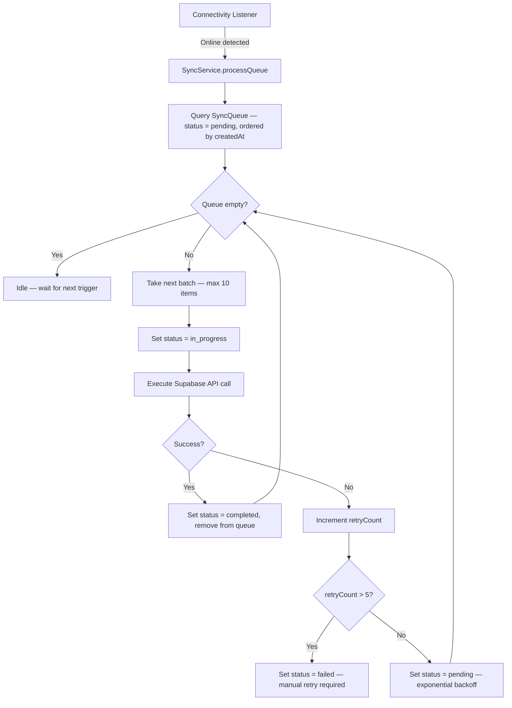

**Sync triggers:**
- Connectivity changes from offline → online.
- App foregrounding after being backgrounded.
- Every 5 minutes via periodic timer (when online).
- Manual pull-to-refresh on project list.

## 11.6 Conflict Resolution — Last-Write-Wins (LWW)

**Strategy:** If the server has a newer `updatedAt` than the local pending change, the server version wins. The local change is discarded and the user is notified via a subtle snackbar.

**Why LWW:** For a single-user creative tool, conflicts are extremely rare (same user, different devices). The simplest conflict strategy that works is LWW. Full CRDTs are over-engineered for this use case.

**Edge case:** If a conflict is detected, the "losing" local version is saved to a `_conflict_archive` Isar collection so the user can recover it from Settings → Sync → Conflicts (V2 feature).

## 11.7 Offline Export

Export works fully offline because:
- Canvas data is in local memory / Isar.
- PNG encoding is done via `dart:ui` / `image` package — no network needed.
- Share sheet uses local file URI.
- Save-to-gallery uses platform channel to write to device storage.

---

# 12. Database Planning

> No SQL generated. Logical planning only.

## 12.1 Entity Relationship Diagram

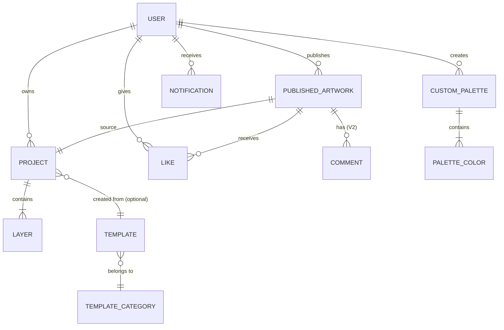

## 12.2 Entities

### User

| Field | Type | Constraints | Notes |
|---|---|---|---|
| `id` | UUID | PK, generated by Supabase Auth | Supabase `auth.users.id` |
| `email` | String | Unique, not null | From auth provider |
| `username` | String | Unique, 3-20 chars, alphanumeric + underscore | User-chosen, editable |
| `displayName` | String | Max 50 chars | Optional, shown in community |
| `avatarUrl` | String | URL | Supabase Storage URL or null |
| `bio` | String | Max 200 chars | Optional |
| `createdAt` | DateTime | Not null, default now | Account creation |
| `updatedAt` | DateTime | Not null, auto-update | Last profile update |
| `isGuest` | Boolean | Default false | True for unauthenticated users (local only) |

### Project

| Field | Type | Constraints | Notes |
|---|---|---|---|
| `id` | UUID | PK, generated locally | Client-generated UUID for offline-first |
| `userId` | UUID | FK → User.id | Owner |
| `name` | String | Max 100 chars, default "Untitled" | User-editable |
| `width` | Int | 8–256 | Grid width in pixels |
| `height` | Int | 8–256 | Grid height in pixels |
| `thumbnailPath` | String | Local file path | Auto-generated on save |
| `templateId` | UUID? | FK → Template.id, nullable | If created from template |
| `createdAt` | DateTime | Not null | |
| `updatedAt` | DateTime | Not null | Auto-save updates this |
| `lastOpenedAt` | DateTime | Not null | For "Recent" sorting |
| `syncStatus` | Enum | `local_only`, `synced`, `pending_sync`, `conflict` | Sync state |
| `isDeleted` | Boolean | Default false | Soft delete for sync |

### Layer

| Field | Type | Constraints | Notes |
|---|---|---|---|
| `id` | UUID | PK | |
| `projectId` | UUID | FK → Project.id | Parent project |
| `name` | String | Default "Layer {n}" | User-editable |
| `order` | Int | Not null | Z-order (0 = bottom) |
| `isVisible` | Boolean | Default true | |
| `opacity` | Double | 0.0–1.0, default 1.0 | |
| `pixelData` | Binary / JSON | Not null | Compressed pixel color data (see Storage section) |
| `createdAt` | DateTime | | |

### Pixel Data (Embedded in Layer)

**Storage format:** Sparse map — only non-transparent cells are stored.

```
{
  "format": "sparse_v1",
  "pixels": {
    "3,5": "#FF6C5CE7",   // row 3, col 5 → color with alpha
    "3,6": "#FF00CEC9",
    ...
  }
}
```

**Why sparse:** A 64×64 canvas has 4,096 cells. Most will be empty. Storing only colored cells saves 80%+ space for typical artwork.

**Compression:** Pixel data is gzipped before storage in Isar and Supabase to further reduce size.

### Custom Palette

| Field | Type | Constraints | Notes |
|---|---|---|---|
| `id` | UUID | PK | |
| `userId` | UUID | FK → User.id | Owner |
| `name` | String | Max 50 chars | |
| `colors` | List<String> | Max 64 colors, HEX format | Ordered list |
| `createdAt` | DateTime | | |
| `updatedAt` | DateTime | | |
| `syncStatus` | Enum | | |

### Template

| Field | Type | Constraints | Notes |
|---|---|---|---|
| `id` | UUID | PK | |
| `name` | String | | |
| `categoryId` | UUID | FK → TemplateCategory.id | |
| `width` | Int | | Grid dimensions |
| `height` | Int | | |
| `thumbnailUrl` | String | | CDN or bundled asset path |
| `pixelData` | Binary / JSON | | Pre-filled pixel data |
| `difficulty` | Enum | `easy`, `medium`, `hard` | For sorting/filtering |
| `isBundled` | Boolean | | True = shipped with app |
| `createdAt` | DateTime | | |

### Template Category

| Field | Type | Constraints | Notes |
|---|---|---|---|
| `id` | UUID | PK | |
| `name` | String | Unique | Animals, Characters, Food, etc. |
| `iconName` | String | | Material icon name |
| `order` | Int | | Display order |

### Published Artwork

| Field | Type | Constraints | Notes |
|---|---|---|---|
| `id` | UUID | PK | |
| `projectId` | UUID | FK → Project.id | Source project |
| `userId` | UUID | FK → User.id | Creator |
| `title` | String | Max 100 chars | |
| `imageUrl` | String | | Supabase Storage URL (rendered PNG) |
| `thumbnailUrl` | String | | Smaller version for gallery grid |
| `width` | Int | | Canvas dimensions (metadata) |
| `height` | Int | | |
| `likeCount` | Int | Default 0 | Denormalized count |
| `commentCount` | Int | Default 0 | V2 |
| `isPublic` | Boolean | Default true | |
| `publishedAt` | DateTime | | |
| `tags` | List<String> | Max 10 tags | For search/discovery |

### Like

| Field | Type | Constraints | Notes |
|---|---|---|---|
| `id` | UUID | PK | |
| `userId` | UUID | FK → User.id | Who liked |
| `artworkId` | UUID | FK → PublishedArtwork.id | What was liked |
| `createdAt` | DateTime | | |
| **Unique constraint** | | `(userId, artworkId)` | One like per user per artwork |

### Notification

| Field | Type | Constraints | Notes |
|---|---|---|---|
| `id` | UUID | PK | |
| `userId` | UUID | FK → User.id | Recipient |
| `type` | Enum | `like`, `comment`, `follow`, `challenge`, `system`, `reminder` | |
| `title` | String | | |
| `message` | String | | |
| `data` | JSON | Nullable | Deep link data (artworkId, etc.) |
| `isRead` | Boolean | Default false | |
| `createdAt` | DateTime | | |

### Comment (V2)

| Field | Type | Constraints | Notes |
|---|---|---|---|
| `id` | UUID | PK | |
| `artworkId` | UUID | FK → PublishedArtwork.id | |
| `userId` | UUID | FK → User.id | Author |
| `text` | String | Max 500 chars | |
| `createdAt` | DateTime | | |
| `isDeleted` | Boolean | Default false | Soft delete |

## 12.3 Indexes

| Entity | Index | Type | Reason |
|---|---|---|---|
| Project | `userId + updatedAt DESC` | Composite | Home screen recent projects |
| Project | `userId + name` | Composite | Search by name |
| Project | `syncStatus` | Single | Find pending sync items |
| Published Artwork | `publishedAt DESC` | Single | Gallery feed sorting |
| Published Artwork | `likeCount DESC` | Single | Popular sorting |
| Published Artwork | `userId` | Single | User's published artworks |
| Like | `userId + artworkId` | Unique Composite | Prevent duplicate likes |
| Like | `artworkId` | Single | Count likes for artwork |
| Notification | `userId + isRead + createdAt DESC` | Composite | Unread notifications |
| Template | `categoryId + difficulty` | Composite | Filter templates |
| SyncQueue | `status + createdAt ASC` | Composite | Process queue in order |

## 12.4 Ownership & Permissions

| Entity | Owner | Read | Write | Delete |
|---|---|---|---|---|
| User | Self | Self + public profile | Self | Self |
| Project | User | Owner only | Owner only | Owner only |
| Layer | Project owner | Owner only | Owner only | Owner only |
| Custom Palette | User | Owner only | Owner only | Owner only |
| Published Artwork | User | Everyone (public) | Owner only | Owner only |
| Like | User | Everyone (count) | Creator only | Creator only |
| Notification | User | Recipient only | System only | Recipient only |

All permissions enforced via Supabase Row Level Security (RLS) policies.

## 12.5 Future Expansion

| Entity | Version | Notes |
|---|---|---|
| Follow | V2 | `follower_id, following_id, created_at` |
| Challenge | V2 | Daily challenges with theme, deadline, entries |
| ChallengeEntry | V2 | Links user artwork to challenge |
| Achievement | V2 | Badge definitions and user-achievement joins |
| AnimationFrame | V2 | Per-frame pixel data, frame order, duration |

---

# 13. Storage Planning

## 13.1 Local Storage

| Data Type | Storage | Format | Size Estimate |
|---|---|---|---|
| Project metadata | Isar DB | Isar objects | ~1 KB per project |
| Layer pixel data | Isar DB | Gzipped JSON (sparse format) | ~2–50 KB per layer (depends on fill density, canvas size) |
| Project thumbnails | App documents directory | PNG, 128×128 | ~5–15 KB each |
| Custom palettes | Isar DB | Isar objects | < 1 KB each |
| Cached templates | Isar DB + files | Isar metadata + PNG thumbnails | ~50 KB per template |
| Cached gallery | Isar DB | Isar objects + cached image files | ~20 KB per artwork entry |
| Sync queue | Isar DB | Isar objects | ~1 KB per entry |
| Preferences | SharedPreferences | Key-value | < 5 KB total |
| Auth tokens | flutter_secure_storage | Encrypted key-value | < 1 KB |
| Exported images | Device gallery / Downloads | PNG/GIF | Varies (10 KB – 2 MB) |

**Total estimated local footprint per user (100 projects):** ~15–30 MB.

## 13.2 Cloud Storage (Supabase Storage)

| Bucket | Contents | Access | Max File Size | Naming |
|---|---|---|---|---|
| `avatars` | User profile pictures | Public read, owner write | 2 MB | `{userId}/avatar.{ext}` |
| `gallery` | Published artwork PNGs | Public read, owner write | 5 MB | `{userId}/{artworkId}.png` |
| `gallery-thumbnails` | Gallery thumbnail PNGs | Public read, owner write | 500 KB | `{userId}/{artworkId}_thumb.png` |
| `templates` | Remote template assets | Public read, admin write | 1 MB | `{categoryId}/{templateId}.json` |

**Supabase free tier storage:** 1 GB total. Sufficient for MVP with ~10K published artworks (avg 50 KB each = ~500 MB).

## 13.3 Project File Format

Each project is stored locally in Isar as a single document containing all layers. For cloud sync, the project is serialized to JSON:

```json
{
  "version": "1.0",
  "id": "uuid",
  "name": "My Pixel Art",
  "width": 32,
  "height": 32,
  "backgroundColor": "#00FFFFFF",
  "layers": [
    {
      "id": "uuid",
      "name": "Background",
      "order": 0,
      "visible": true,
      "opacity": 1.0,
      "pixels": {
        "0,0": "#FF6C5CE7",
        "0,1": "#FFA29BFE"
      }
    }
  ],
  "metadata": {
    "createdAt": "ISO8601",
    "updatedAt": "ISO8601",
    "templateId": null
  }
}
```

This format is:
- Human-readable for debugging.
- Versionable (`version` field for future migrations).
- Compact with sparse pixel representation.
- Further compressed with gzip for storage and transfer.

---

# 14. API Planning

> Backend: Supabase (PostgreSQL + PostgREST + Auth + Storage + Realtime + Edge Functions)

## 14.1 Authentication APIs

| Endpoint | Method | Description | Auth |
|---|---|---|---|
| `supabase.auth.signUp` | POST | Register with email + password | None |
| `supabase.auth.signInWithPassword` | POST | Login with email + password | None |
| `supabase.auth.signInWithOAuth` | POST | Google OAuth sign-in | None |
| `supabase.auth.signOut` | POST | Logout, invalidate session | Authenticated |
| `supabase.auth.resetPasswordForEmail` | POST | Send password reset email | None |
| `supabase.auth.updateUser` | PUT | Update email, password | Authenticated |
| `supabase.auth.admin.deleteUser` | DELETE | Delete account and all data | Authenticated (Edge Function) |
| `supabase.auth.onAuthStateChange` | Stream | Listen for auth state changes | — |

## 14.2 User Profile APIs

| Endpoint | Method | Description | Auth | RLS |
|---|---|---|---|---|
| `GET /rest/v1/profiles?id=eq.{userId}` | GET | Get user profile | Authenticated | Own or public |
| `PATCH /rest/v1/profiles?id=eq.{userId}` | PATCH | Update profile (username, displayName, bio) | Authenticated | Owner only |
| `POST /storage/v1/object/avatars/{userId}` | POST | Upload avatar image | Authenticated | Owner only |

## 14.3 Projects APIs (Cloud Sync)

| Endpoint | Method | Description | Auth | RLS |
|---|---|---|---|---|
| `GET /rest/v1/projects?user_id=eq.{userId}&order=updated_at.desc` | GET | List user's projects | Authenticated | Owner only |
| `POST /rest/v1/projects` | POST | Create / sync project | Authenticated | Owner only |
| `PATCH /rest/v1/projects?id=eq.{projectId}` | PATCH | Update project (metadata + pixel data) | Authenticated | Owner only |
| `DELETE /rest/v1/projects?id=eq.{projectId}` | DELETE | Delete project | Authenticated | Owner only |
| `GET /rest/v1/projects?id=eq.{projectId}` | GET | Get single project (for sync) | Authenticated | Owner only |

## 14.4 Community / Gallery APIs

| Endpoint | Method | Description | Auth | RLS |
|---|---|---|---|---|
| `GET /rest/v1/published_artworks?order=published_at.desc&limit=20&offset={n}` | GET | Gallery feed (paginated) | Optional | Public read |
| `GET /rest/v1/published_artworks?order=like_count.desc` | GET | Popular artworks | Optional | Public read |
| `GET /rest/v1/published_artworks?id=eq.{id}` | GET | Single artwork detail | Optional | Public read |
| `POST /rest/v1/published_artworks` | POST | Publish artwork to gallery | Authenticated | Owner insert |
| `DELETE /rest/v1/published_artworks?id=eq.{id}` | DELETE | Unpublish artwork | Authenticated | Owner only |
| `GET /rest/v1/published_artworks?user_id=eq.{userId}` | GET | User's published artworks | Optional | Public read |

## 14.5 Likes APIs

| Endpoint | Method | Description | Auth | RLS |
|---|---|---|---|---|
| `POST /rest/v1/likes` | POST | Like an artwork | Authenticated | Authenticated insert |
| `DELETE /rest/v1/likes?user_id=eq.{userId}&artwork_id=eq.{artworkId}` | DELETE | Unlike an artwork | Authenticated | Owner only |
| `GET /rest/v1/likes?user_id=eq.{userId}&artwork_id=eq.{artworkId}` | GET | Check if user liked artwork | Authenticated | Owner read |

> **Like count update:** Handled via Supabase Database Function (trigger) that increments/decrements `published_artworks.like_count` on like insert/delete.

## 14.6 Notifications APIs

| Endpoint | Method | Description | Auth | RLS |
|---|---|---|---|---|
| `GET /rest/v1/notifications?user_id=eq.{userId}&order=created_at.desc&limit=50` | GET | Get user's notifications | Authenticated | Owner only |
| `PATCH /rest/v1/notifications?id=eq.{id}` | PATCH | Mark as read | Authenticated | Owner only |
| `PATCH /rest/v1/notifications?user_id=eq.{userId}` | PATCH | Mark all as read | Authenticated | Owner only |
| `DELETE /rest/v1/notifications?user_id=eq.{userId}&is_read=eq.true` | DELETE | Clear read notifications | Authenticated | Owner only |

> **Push notifications:** Sent via Firebase Cloud Messaging. Supabase Edge Function triggers FCM on relevant events (new like, new follower, challenge posted).

## 14.7 Templates APIs

| Endpoint | Method | Description | Auth | RLS |
|---|---|---|---|---|
| `GET /rest/v1/templates?is_bundled=eq.false&order=created_at.desc` | GET | Get remote templates (non-bundled) | Optional | Public read |
| `GET /rest/v1/template_categories?order=order.asc` | GET | Get template categories | Optional | Public read |

> Templates are primarily bundled with the app. Remote templates supplement the library without requiring app updates.

## 14.8 AI APIs (V2)

| Endpoint | Method | Description | Auth |
|---|---|---|---|
| `POST /functions/v1/ai-color-suggest` | POST | Suggest colors based on existing palette | Authenticated |
| `POST /functions/v1/ai-auto-complete` | POST | Auto-fill remaining pixels based on pattern | Authenticated |

> AI features will use Supabase Edge Functions that proxy to Vertex AI / Gemini API. Rate limited to 10 requests/user/hour on free tier.

## 14.9 Rate Limits (Free Tier Planning)

| Resource | Supabase Free Tier Limit | Strategy |
|---|---|---|
| API requests | 500K / month | Client-side caching, debounced sync |
| Database size | 500 MB | Sparse data format, gzip compression |
| Storage | 1 GB | Image optimization, size limits |
| Edge Function invocations | 500K / month | Rate limit AI features, cache results |
| Realtime connections | 200 concurrent | Use polling for non-critical updates |
| Auth users | 50K MAU | Sufficient for Year 1 target |

---

# 15. Permissions

| Permission | Android Manifest | Required/Optional | Purpose | When Requested |
|---|---|---|---|---|
| **Internet** | `INTERNET` | Required | Cloud sync, community gallery, auth, push notifications, template downloads | Always (declared in manifest, no runtime prompt) |
| **Network State** | `ACCESS_NETWORK_STATE` | Required | Connectivity detection for offline/online switching | Always (declared in manifest, no runtime prompt) |
| **Read Media Images** | `READ_MEDIA_IMAGES` (API 33+) / `READ_EXTERNAL_STORAGE` (older) | Optional | Import reference images (V2), pick avatar from gallery | On first avatar upload or reference image import |
| **Camera** | `CAMERA` | Optional | Take photo as avatar, take photo as reference image (V2) | On first camera usage (avatar capture) |
| **Write External Storage** | `WRITE_EXTERNAL_STORAGE` (API < 29) | Optional | Save exported PNG/GIF to device gallery on older Android | On first export (older devices only) |
| **Post Notifications** | `POST_NOTIFICATIONS` (API 33+) | Optional | Push notifications (daily reminder, likes, comments) | After onboarding or on first community interaction |
| **Vibrate** | `VIBRATE` | Required | Haptic feedback on tool use, color selection | Always (declared in manifest, no runtime prompt) |
| **Foreground Service** | `FOREGROUND_SERVICE` | Optional | Background sync when app is minimized (V2) | Always (declared in manifest, no runtime prompt) |

**Permission request flow:**
1. Show contextual explanation before system prompt ("We need access to your photos to save your exported pixel art").
2. Request permission.
3. If denied, show fallback with alternative ("You can still share via the share sheet").
4. If permanently denied, show Settings redirect dialog.

---

# 16. Notifications Strategy

## 16.1 Notification Types

| Type | Channel | Priority | Trigger | Content Example |
|---|---|---|---|---|
| **Daily Reminder** | Push (FCM) | Default | 7:00 PM local time (if inactive > 24h) | "Your canvas misses you! 🎨 Continue your latest artwork." |
| **Daily Challenge** | Push (FCM) | Default | 9:00 AM local time (V2) | "Today's challenge: Create a pixel art sunset 🌅" |
| **Project Reminder** | Local Notification | Default | 48h since last edit on any project | "You left 'Space Cat' unfinished — 3 pixels away from completion!" |
| **New Like** | Push (FCM) | Low | Someone likes published artwork | "❤️ @username liked your 'Dragon' artwork!" |
| **New Comment** | Push (FCM) | Default | Someone comments (V2) | "💬 @username commented on 'Dragon'" |
| **New Follower** | Push (FCM) | Low | Someone follows (V2) | "👋 @username started following you!" |
| **App Update** | Push (FCM) | High | New version available | "PixelCanvas 2.0 is here! Animation editor, new palettes, and more." |
| **System** | Push (FCM) | High | Maintenance, policy changes | "Scheduled maintenance: Gallery will be offline 2-4 AM UTC." |

## 16.2 Notification Channels (Android)

| Channel ID | Name | Importance | Vibration | Sound |
|---|---|---|---|---|
| `reminders` | Reminders | Default | Yes | Default |
| `community` | Community | Low | No | None |
| `challenges` | Challenges | Default | Yes | Default |
| `updates` | App Updates | High | Yes | Default |

## 16.3 In-App Notification Center

- Displays all notifications in a scrollable list.
- Unread count badge on the bell icon in Home app bar.
- Tap notification → deep link to relevant screen.
- Swipe to dismiss.
- "Mark all as read" action.
- Pull-to-refresh to fetch latest.

## 16.4 Notification Preferences (Settings)

Users can individually toggle:
- Daily reminders (on/off)
- Daily challenges (on/off)
- Community notifications (likes, comments, follows — on/off)
- App updates (on/off, recommended: always on)

---

# 17. Security Planning

## 17.1 Authentication Security

| Measure | Implementation |
|---|---|
| **Password hashing** | Handled by Supabase Auth (bcrypt) |
| **Token storage** | `flutter_secure_storage` (Keystore on Android, Keychain on iOS) |
| **Token refresh** | Supabase SDK handles automatic JWT refresh |
| **Session expiry** | 1 hour access token, 7 day refresh token (Supabase defaults) |
| **OAuth security** | PKCE flow for Google Sign-In |
| **Email verification** | Required for full account features (publish to gallery) |
| **Rate limiting (auth)** | Supabase default: 30 requests/hour per IP |

## 17.2 Authorization

| Resource | Mechanism |
|---|---|
| **API access** | JWT bearer token in every Supabase request |
| **Row-level access** | Supabase RLS policies on every table |
| **Storage access** | Supabase Storage policies (bucket-level + path-level) |
| **Edge Functions** | JWT verification before execution |
| **Guest users** | No cloud access — local-only data |

## 17.3 Data Encryption

| Data | At Rest | In Transit |
|---|---|---|
| Auth tokens | AES-256 (flutter_secure_storage → Android Keystore) | TLS 1.3 |
| Project data (local) | Isar DB file (no encryption by default; optional encryption available) | N/A |
| Project data (cloud) | Supabase managed (PostgreSQL disk encryption) | TLS 1.3 |
| User avatars | Supabase Storage (encrypted at rest) | TLS 1.3 |
| API traffic | N/A | TLS 1.3 (Supabase enforces HTTPS) |

## 17.4 Secure Storage Strategy

```
flutter_secure_storage
├── auth_access_token       → JWT access token
├── auth_refresh_token      → JWT refresh token
├── user_id                 → Cached user ID
└── encryption_key          → (Future) Key for local DB encryption

SharedPreferences (non-sensitive)
├── is_first_launch         → Boolean
├── default_grid_size       → Int
├── haptic_enabled          → Boolean
├── auto_save_interval      → Int (seconds)
└── notification_prefs      → JSON string
```

## 17.5 Content Security

| Threat | Mitigation |
|---|---|
| Inappropriate gallery content | Report button on every artwork → admin review queue (V2: automated moderation) |
| Hate speech in comments (V2) | Word filter + manual moderation |
| Spam accounts | Rate limiting on publish (5/day), like (100/day) |
| Large file uploads (DoS) | Max file size enforced in Storage policies |
| SQL injection | Supabase PostgREST uses parameterized queries (inherently safe) |

## 17.6 Privacy

- GDPR-friendly: User can export all data (Settings → Download My Data — V2).
- Account deletion: Cascade delete all user data (projects, artworks, likes, notifications).
- No analytics PII: Analytics events contain anonymous user IDs only.
- Privacy policy link in Settings and Auth screen.
- No third-party tracking SDKs in MVP.

---

# 18. Performance Planning

## 18.1 Canvas Performance

| Concern | Strategy |
|---|---|
| **Large canvas rendering (128×128 = 16,384 cells)** | Use `CustomPainter` with `shouldRepaint` optimization. Only repaint dirty cells. Use `Canvas.drawRect` batching. Never rebuild the entire widget tree on each cell tap. |
| **Even larger canvases (256×256 = 65,536 cells)** | Tile-based rendering — divide canvas into 32×32 tiles. Only render visible tiles based on viewport. Use `RepaintBoundary` per tile. |
| **Zoom performance** | Transform the canvas using `Matrix4` on the `CustomPainter`, not by scaling the widget tree. Pre-calculate cell sizes at discrete zoom levels. |
| **Pan performance** | Use `InteractiveViewer` with `constrained: false` for hardware-accelerated panning. Clip to viewport. |
| **Touch responsiveness** | Convert touch coordinates to grid coordinates using simple math (no hit-testing each cell). Target < 16ms per frame (60 FPS). |
| **Multi-layer compositing** | Pre-composite visible layers into a single `ui.Image` on layer change. Only re-composite when layer data or visibility changes — not on every frame. |

## 18.2 Memory Management

| Concern | Budget | Strategy |
|---|---|---|
| **Canvas in-memory** | Max ~5 MB for 256×256 with 8 layers | Sparse data format (only store non-empty cells). Compress inactive layers. |
| **Undo/Redo history** | Max ~20 MB | Store diffs (changed cells only), not full snapshots. Limit to 50 undo steps. Oldest entries auto-purge. |
| **Thumbnail cache** | Max ~10 MB | LRU cache with max 100 thumbnails. Use `ResizeImage` for memory-efficient loading. |
| **Gallery image cache** | Max ~30 MB | Use `cached_network_image` with memory + disk cache. Max 50 MB disk cache. |
| **Total app memory** | Target < 150 MB | Monitor with `dart:developer` memory profiling. Alert in CI if memory exceeds threshold. |

## 18.3 Image Export Performance

| Canvas Size | Target Export Time | Strategy |
|---|---|---|
| 16×16 at 8x (128×128 px) | < 100ms | Direct `ui.Image` rendering |
| 32×32 at 8x (256×256 px) | < 200ms | Direct rendering |
| 64×64 at 8x (512×512 px) | < 500ms | Direct rendering |
| 128×128 at 4x (512×512 px) | < 500ms | Direct rendering |
| 256×256 at 4x (1024×1024 px) | < 1s | Background isolate for PNG encoding |

Export runs on a separate isolate for canvases > 64×64 to avoid UI jank.

## 18.4 Offline Performance

| Concern | Strategy |
|---|---|
| **Isar reads** | < 5ms for single project load (Isar is compiled native code) |
| **Isar writes (auto-save)** | < 10ms for typical project (write only changed fields) |
| **App startup (cold)** | Target < 2s to interactive (splash → home) |
| **App startup (warm)** | Target < 500ms |
| **Sync queue processing** | Non-blocking, runs on isolate, max 10 items per batch |

## 18.5 Battery Optimization

| Concern | Strategy |
|---|---|
| **Background sync** | Use WorkManager for deferred background sync — respects battery saver mode |
| **Canvas rendering** | Disable continuous rendering — only paint on user interaction or state change |
| **Network polling** | No polling — use push notifications and event-driven sync |
| **Auto-save** | Debounced (3s), not continuous. No unnecessary writes |
| **Image processing** | Offload to isolate to avoid blocking main thread (which burns CPU) |

## 18.6 App Size

| Component | Estimated Size |
|---|---|
| Flutter engine | ~8 MB |
| App code (release, tree-shaken) | ~3 MB |
| Bundled templates (30 templates) | ~2 MB |
| Bundled palettes (16 palettes) | < 50 KB |
| Fonts (Inter) | ~200 KB |
| Lottie animations | ~300 KB |
| Onboarding images | ~500 KB |
| **Total APK (estimated)** | **~15–18 MB** |
| **AAB (Play Store download)** | **~12–14 MB** |

---

# 19. Accessibility

## 19.1 Visual Accessibility

| Requirement | Implementation |
|---|---|
| **Minimum touch target size** | 48×48 dp for all interactive elements (Material guideline) |
| **Color contrast ratio** | Minimum 4.5:1 for normal text, 3:1 for large text (WCAG AA) |
| **Color-blind friendly palettes** | Provide at least 2 color-blind-safe palettes (Deuteranopia, Protanopia friendly). Use shapes/patterns in addition to color for state indicators. |
| **Large font support** | All text uses `sp` (scalable pixels). UI tested at 200% font scale. No text clipping. |
| **Zoom accessibility** | Respect system display size settings. Canvas zoom is independent of accessibility zoom. |

## 19.2 Screen Reader Support

| Requirement | Implementation |
|---|---|
| **Semantic labels** | Every interactive widget has a `Semantics` label. Buttons: action description ("Create new project"). Icons: purpose ("Undo last action"). |
| **Canvas accessibility** | Announce grid position on focus change ("Row 5, Column 3, Color: Purple"). Provide a summary mode ("32 by 32 canvas, 45% filled"). |
| **Navigation order** | Logical focus traversal order matching visual layout. Tab through tools → canvas → palette → actions. |
| **State announcements** | Announce state changes: "Saved", "Exported as PNG", "Layer 2 selected", "Undo: 3 actions remaining". |
| **Image descriptions** | Gallery artworks include alt text (auto-generated from title + metadata). |

## 19.3 Motor Accessibility

| Requirement | Implementation |
|---|---|
| **One-handed mode** | Bottom-anchored toolbar. All primary actions reachable with thumb. No top-of-screen-only interactions. |
| **Long press alternatives** | Every long-press action has a menu/button alternative (3-dot menu on project cards). |
| **Gesture alternatives** | Undo/redo buttons alongside swipe gesture. Zoom +/- buttons alongside pinch gesture. |
| **Haptic feedback** | Configurable (Settings toggle). Provides tactile confirmation for tool actions. |

## 19.4 Cognitive Accessibility

| Requirement | Implementation |
|---|---|
| **Simple language** | All UI text uses plain, direct language. No jargon. |
| **Consistent patterns** | Same gesture = same action across all screens. Back button always goes back. |
| **Undo safety net** | Undo/redo for canvas. Confirmation dialogs for destructive actions (delete project). |
| **Progressive disclosure** | Advanced features (layers, symmetry) are hidden behind expandable panels. Beginners see only essential tools. |

---

# 20. Testing Strategy

## 20.1 Unit Testing

| Scope | Target Coverage | Focus Areas |
|---|---|---|
| **Canvas Engine** | 95% | `apply` for every tool, `undo`/`redo`, `resize`, `merge layers`, `composite layers` |
| **Tools (Pencil, Fill, etc.)** | 95% | Edge cases — fill on empty canvas, fill on full canvas, line at 0° 45° 90°, circle at odd dimensions |
| **Color Utils** | 90% | HEX ↔ Color conversion, brightness calculation, palette generation |
| **Sync Service** | 90% | Queue processing, conflict resolution, retry logic, offline → online transition |
| **Repositories** | 80% | CRUD operations, error handling, data mapping (Model ↔ Entity) |
| **Export Service** | 85% | PNG encoding correctness, scale factors, transparent backgrounds |

**Framework:** `flutter_test` (built-in) + `mocktail` for mocking.

## 20.2 Widget Testing

| Scope | Target Coverage | Focus Areas |
|---|---|---|
| **Shared Widgets** | 90% | `PcButton` variants, `PcTextField` validation, `PcDialog` actions, `PcBottomSheet` dismiss |
| **Editor Toolbar** | 80% | Tool selection state, active tool highlighting, tooltip display |
| **Project Card** | 80% | Thumbnail display, name truncation, 3-dot menu actions |
| **Color Picker** | 80% | Color selection callback, HEX input validation, palette switching |
| **Home Screen** | 70% | Empty state display, project grid rendering, FAB interaction |

**Framework:** `flutter_test` with `WidgetTester`.

## 20.3 Integration Testing

| Test Flow | Priority | Steps |
|---|---|---|
| **Auth → Home** | P0 | Launch → Splash → Onboarding (skip) → Auth (email/password) → Home (verify empty state) |
| **Create → Edit → Save** | P0 | Home → New Project → Select 16×16 → Editor → Tap 5 cells → Verify auto-save → Back → Verify project in list |
| **Edit → Export → Share** | P0 | Open project → Edit → Export → Select PNG 4x → Share (verify intent fires) |
| **Template → Edit → Save** | P1 | Templates → Select template → Editor (verify pre-filled cells) → Edit → Save |
| **Offline → Online Sync** | P1 | Create project (offline) → Go online → Verify sync queue processes → Verify project appears in cloud |
| **Community Browse** | P1 | Community tab → Scroll gallery → Tap artwork → View detail → Like → Verify count |

**Framework:** `integration_test` package + `patrol` for native interactions.

## 20.4 Manual Testing Checklist

| Area | Test Cases |
|---|---|
| **Gestures** | Pinch zoom (all zoom levels), pan (all directions), tap accuracy at edges, long-press menu |
| **Edge cases** | 256×256 canvas with 8 layers filled (memory), rapid undo/redo (50 steps), 100+ projects in list |
| **Device compatibility** | Budget device (4GB RAM), mid-range (8GB), flagship (16GB). Screen sizes: 5", 6.5", tablet 10" |
| **Offline scenarios** | Airplane mode: create, edit, save, export. Toggle connectivity repeatedly during sync |
| **Orientation** | Portrait lock verified. No layout breaks if system forces landscape (split screen) |

## 20.5 Performance Testing

| Metric | Tool | Threshold |
|---|---|---|
| **Frame rate (Editor)** | Flutter DevTools | ≥ 55 FPS during drawing on mid-range device |
| **Startup time** | Firebase Performance | < 2s cold start to interactive |
| **Memory (Editor)** | Flutter DevTools | < 150 MB at 128×128 canvas with 4 layers |
| **APK size** | `flutter build apk --analyze-size` | < 20 MB |
| **Jank frames** | Flutter DevTools | < 1% jank frames during 60-second draw session |
| **Isar read latency** | Custom benchmark | < 5ms for project list load |

---

# 21. Release Planning

## 21.1 Release Stages

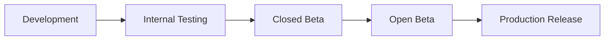

### Stage 1: Development

- Duration: Phase-by-phase (see Roadmap)
- Branch: `develop`
- Build: Debug APK
- Distribution: Local device via `flutter run`

### Stage 2: Internal Testing

- Duration: 1 week per phase
- Branch: `staging`
- Build: Release APK (signed with debug keystore)
- Distribution: Google Play Internal Testing track (up to 100 testers)
- Criteria: All unit tests pass. No P0 bugs. Basic smoke test passes.

### Stage 3: Closed Beta

- Duration: 2 weeks before production
- Branch: `release/x.y.z`
- Build: AAB (signed with upload keystore)
- Distribution: Google Play Closed Testing track (up to 1,000 testers)
- Criteria: All integration tests pass. Performance thresholds met. No P0/P1 bugs.
- Feedback: Google Play beta feedback form + in-app feedback widget.

### Stage 4: Open Beta (Optional)

- Duration: 1–2 weeks
- Distribution: Google Play Open Testing track
- Criteria: Crash-free rate > 99%. All reported P1 bugs fixed.

### Stage 5: Production Release

- Branch: `main`
- Build: AAB (signed with upload keystore)
- Distribution: Google Play Production track (phased rollout: 10% → 25% → 50% → 100%)
- Criteria: Beta crash-free rate > 99.5%. No P0 bugs. Play Store listing complete.

## 21.2 Versioning Strategy

**Semantic Versioning:** `MAJOR.MINOR.PATCH+BUILD`

| Component | Meaning | Example |
|---|---|---|
| MAJOR | Breaking changes, major releases | 1.0.0, 2.0.0 |
| MINOR | New features, non-breaking | 1.1.0, 1.2.0 |
| PATCH | Bug fixes, minor improvements | 1.0.1, 1.0.2 |
| BUILD | Auto-incremented build number | 1.0.0+1, 1.0.0+2 |

**Android:** `versionCode` = build number (monotonically increasing). `versionName` = semantic version.

## 21.3 Play Store Listing

| Field | Content |
|---|---|
| **App Name** | PixelCanvas — Pixel Art Creator |
| **Short Description** | Create beautiful pixel art — simple, fun, and offline-first. |
| **Category** | Art & Design |
| **Content Rating** | Everyone |
| **Target Age** | 8+ |
| **Privacy Policy** | Required — hosted on web |
| **Screenshots** | 5–8 phone screenshots (Editor, Home, Templates, Gallery, Export) |
| **Feature Graphic** | 1024×500 banner |

---

# 22. Risk Analysis

## 22.1 Technical Risks

| Risk | Probability | Impact | Mitigation |
|---|---|---|---|
| **Canvas performance degrades on large grids (128×128+) on low-end devices** | High | High | Tile-based rendering, limit max canvas size per device tier, performance testing on budget hardware |
| **Isar database corruption on crash during write** | Low | Critical | Isar has built-in ACID transactions. Add integrity checks on app startup. Keep sync queue as backup. |
| **Supabase free tier limits exceeded before monetization** | Medium | High | Aggressive client-side caching, compress all data, monitor usage dashboard, have migration plan to paid tier |
| **Memory leaks in canvas editor (long sessions)** | Medium | High | Profile with DevTools in every sprint, strict dispose patterns, LRU caches with hard limits |
| **Platform-specific bugs (Android version fragmentation)** | Medium | Medium | Test on API 26 (min), 31, 33, 34. Use `defaultTargetPlatform` checks. CI matrix with multiple API levels |

## 22.2 UX Risks

| Risk | Probability | Impact | Mitigation |
|---|---|---|---|
| **First-time users don't understand the grid/tools** | Medium | High | Template-first onboarding: first experience is coloring a template, not a blank canvas. Tooltips on first tool use. |
| **Touch target too small for pixel cells on large grids** | High | Medium | Auto-zoom to comfortable cell size. Minimum visible cell size = 16dp. Pinch-to-zoom tutorial on first large canvas. |
| **Users lose work due to unexpected app close** | Low (with auto-save) | Critical | Auto-save every 3s of inactivity + on lifecycle pause. Recovery screen on crash relaunch. |
| **Community gallery overwhelms beginners** | Low | Medium | Default Home tab (not gallery). Gallery is opt-in via bottom nav. Separate "Beginner-Friendly" gallery section. |

## 22.3 Performance Risks

| Risk | Probability | Impact | Mitigation |
|---|---|---|---|
| **60 FPS drops during rapid drawing** | Medium | High | Batch cell updates per frame. Use `ChangeNotifier` with coalesced notifications. Profile and optimize `CustomPainter`. |
| **Export takes too long for large canvases** | Medium | Medium | Show progress indicator. Use isolate for encoding. Pre-composite layers. |
| **App startup > 3s on cold start** | Low | Medium | Lazy-load features. Pre-warm Isar in splash. Defer non-critical initializations. |

## 22.4 Scalability Risks

| Risk | Probability | Impact | Mitigation |
|---|---|---|---|
| **Gallery grows beyond Supabase free tier storage** | High (if successful) | High | Plan migration to Supabase Pro or S3. Image compression and size limits from day 1. Thumbnail-first loading. |
| **Sync queue backlog on returning user** | Medium | Medium | Limit sync queue to 100 items. FIFO processing. Batch API calls. Show sync progress for large backlogs. |
| **Database performance with 100K+ users** | Medium | Medium | Proper indexes from day 1. Pagination on all list queries. Supabase connection pooling. |

## 22.5 Security Risks

| Risk | Probability | Impact | Mitigation |
|---|---|---|---|
| **Unauthorized access to other users' projects** | Low | Critical | RLS policies on every table. No client-side-only authorization. Penetration testing before launch. |
| **Inappropriate content in gallery** | Medium | Medium | Report button → moderation queue. Content policy. Community guidelines. |
| **API abuse (spam, DDoS)** | Low | High | Supabase rate limiting. Client-side debouncing. Publish rate limits. |

---

# 23. Development Roadmap

## Phase 0: Project Setup (Complexity: Low)

| Item | Detail |
|---|---|
| **Objective** | Initialize Flutter project, configure tooling, set up CI/CD foundations |
| **Deliverables** | Flutter project scaffold, folder structure, design system (theme), navigation shell, linting/formatting config, Git repo with branch strategy |
| **Dependencies** | None |
| **Estimated Effort** | 3–5 days |
| **Testable?** | Yes — app launches, theme renders, navigation between empty tab screens works |

## Phase 1: Core Editor — MVP (Complexity: High)

| Item | Detail |
|---|---|
| **Objective** | Build the pixel art editor — canvas rendering, basic tools, color picking, undo/redo |
| **Deliverables** | `EditorScreen`, `CanvasNotifier`, `CustomPainter`, Pencil/Eraser/Fill tools, basic color palette bar, undo/redo (50 steps), pinch-to-zoom, pan, grid toggle |
| **Dependencies** | Phase 0 (project setup, theme, navigation) |
| **Estimated Effort** | 10–15 days |
| **Testable?** | Yes — user can create pixel art on a blank canvas, zoom, pan, undo, and switch tools |

## Phase 2: Local Persistence & Projects (Complexity: Medium)

| Item | Detail |
|---|---|
| **Objective** | Persist projects locally, auto-save, project list with CRUD |
| **Deliverables** | Isar integration, `ProjectRepository`, `ProjectModel`, auto-save service, `HomeScreen` with project grid, create/rename/delete project, project thumbnails |
| **Dependencies** | Phase 1 (editor produces saveable canvas state) |
| **Estimated Effort** | 7–10 days |
| **Testable?** | Yes — create project, edit, close, reopen (data persisted), see project list, delete project |

## Phase 3: Splash, Onboarding & Auth (Complexity: Medium)

| Item | Detail |
|---|---|
| **Objective** | First-launch experience, user authentication, guest mode |
| **Deliverables** | `SplashScreen`, `OnboardingScreen` (3 pages), `AuthScreen` (email/password, Google Sign-In, guest skip), Supabase Auth integration, `AuthNotifier`, `AuthGuard`, secure token storage |
| **Dependencies** | Phase 0 (navigation guards), Supabase project setup |
| **Estimated Effort** | 5–7 days |
| **Testable?** | Yes — full first-launch flow from install to home. Login, register, guest mode all functional. |

## Phase 4: Color Palettes & Picker (Complexity: Medium)

| Item | Detail |
|---|---|
| **Objective** | Full color management — curated palettes, custom palettes, color picker, eyedropper |
| **Deliverables** | 16 bundled palettes, `ColorPickerSheet` (HSL wheel + HEX input), custom palette CRUD, palette persistence (Isar), eyedropper tool, recent colors |
| **Dependencies** | Phase 1 (editor integration), Phase 2 (persistence) |
| **Estimated Effort** | 5–7 days |
| **Testable?** | Yes — switch palettes, create custom palette, pick custom color, eyedropper on canvas |

## Phase 5: Export & Share (Complexity: Medium)

| Item | Detail |
|---|---|
| **Objective** | Export artwork as PNG at configurable scale, share via system share sheet, save to device gallery |
| **Deliverables** | `ExportService`, `ExportBottomSheet`, PNG rendering at 1x/2x/4x/8x/16x, save to device gallery (MediaStore), share sheet integration, transparent background support |
| **Dependencies** | Phase 1 (canvas compositing), Phase 2 (project data) |
| **Estimated Effort** | 4–5 days |
| **Testable?** | Yes — export PNG, verify pixel-perfect output, share to another app |

## Phase 6: Layer System (Complexity: High)

| Item | Detail |
|---|---|
| **Objective** | Multi-layer support (up to 8 layers) with visibility, opacity, reorder |
| **Deliverables** | `LayerNotifier`, `LayerPanel` bottom sheet, add/delete/reorder layers, visibility toggle, opacity slider, layer compositing in `CustomPainter`, per-layer undo/redo |
| **Dependencies** | Phase 1 (canvas engine), Phase 2 (persistence — layers stored within project) |
| **Estimated Effort** | 7–10 days |
| **Testable?** | Yes — create layers, draw on different layers, toggle visibility, adjust opacity, reorder, verify composited output |

## Phase 7: Shape Tools & Symmetry (Complexity: Medium)

| Item | Detail |
|---|---|
| **Objective** | Line, rectangle, circle tools. Mirror/symmetry mode. |
| **Deliverables** | `LineTool`, `RectangleTool`, `CircleTool` (outline + filled variants), `SymmetryMode` (horizontal, vertical, both), tool preview (ghost line while dragging) |
| **Dependencies** | Phase 1 (tool system architecture) |
| **Estimated Effort** | 5–7 days |
| **Testable?** | Yes — draw lines, rectangles, circles. Enable symmetry and verify mirrored output. |

## Phase 8: Templates (Complexity: Medium)

| Item | Detail |
|---|---|
| **Objective** | Browsable template library with categories, preview, and one-tap creation |
| **Deliverables** | 30+ bundled templates (JSON data + thumbnails), `TemplatesScreen`, category chips, template preview bottom sheet, "Use Template" → Editor with pre-filled canvas |
| **Dependencies** | Phase 1 (editor), Phase 2 (project creation from template) |
| **Estimated Effort** | 5–7 days |
| **Testable?** | Yes — browse templates, select one, verify editor opens with pre-filled artwork |

## Phase 9: Cloud Sync (Complexity: High)

| Item | Detail |
|---|---|
| **Objective** | Sync projects and palettes to Supabase, background sync, conflict resolution |
| **Deliverables** | `SyncService`, `SyncQueue`, connectivity listener, background sync with exponential backoff, LWW conflict resolution, sync status indicators, Supabase table setup (projects, palettes), RLS policies |
| **Dependencies** | Phase 2 (local persistence), Phase 3 (auth — user ID for cloud data) |
| **Estimated Effort** | 8–12 days |
| **Testable?** | Yes — create offline, go online, verify sync. Edit on two devices (if auth'd), verify LWW. |

## Phase 10: Community Gallery (Complexity: Medium)

| Item | Detail |
|---|---|
| **Objective** | Browse community artwork, publish own artwork, like artwork |
| **Deliverables** | `CommunityScreen`, `ArtworkDetailScreen`, publish workflow (render + upload), like/unlike, gallery feed (paginated), Supabase tables (published_artworks, likes), Supabase Storage buckets |
| **Dependencies** | Phase 3 (auth required to publish/like), Phase 5 (render artwork for upload), Phase 9 (Supabase setup) |
| **Estimated Effort** | 7–10 days |
| **Testable?** | Yes — publish artwork, view in gallery, like, verify counts |

## Phase 11: Notifications (Complexity: Medium)

| Item | Detail |
|---|---|
| **Objective** | Push notifications (FCM), local notifications, in-app notification center |
| **Deliverables** | FCM integration, notification channels, `NotificationCenterScreen`, notification preferences, daily reminder (local), community notifications (push), Supabase Edge Function for notification triggers |
| **Dependencies** | Phase 3 (auth for FCM token), Phase 10 (community events trigger notifications) |
| **Estimated Effort** | 5–7 days |
| **Testable?** | Yes — receive push notification on like, view in notification center, mark as read |

## Phase 12: Profile & Settings (Complexity: Low)

| Item | Detail |
|---|---|
| **Objective** | Profile screen, edit profile, settings screen, about screen |
| **Deliverables** | `ProfileScreen` (stats, published artworks), `EditProfileScreen` (avatar upload, username), `SettingsScreen` (all preferences), logout, account deletion |
| **Dependencies** | Phase 3 (auth), Phase 10 (published artworks list) |
| **Estimated Effort** | 4–5 days |
| **Testable?** | Yes — view profile, edit username/avatar, change settings, logout, verify persistence |

## Phase 13: Selection Tools (Complexity: Medium)

| Item | Detail |
|---|---|
| **Objective** | Rectangular selection, copy/paste, move selection |
| **Deliverables** | `SelectionTool`, selection rendering (marching ants or highlight), copy/paste within canvas, move selection (drag), clear selection, selection + layer interaction |
| **Dependencies** | Phase 1 (tool architecture), Phase 6 (layer awareness) |
| **Estimated Effort** | 5–7 days |
| **Testable?** | Yes — select region, copy, paste at different position, move selection |

## Phase 14: Polish, Accessibility & Release Prep (Complexity: Medium)

| Item | Detail |
|---|---|
| **Objective** | Bug fixes, performance optimization, accessibility pass, Play Store preparation |
| **Deliverables** | Accessibility audit + fixes, performance profiling + optimization, edge case bug fixes, Play Store listing assets (screenshots, descriptions), signed release build, internal testing deployment |
| **Dependencies** | All previous phases |
| **Estimated Effort** | 7–10 days |
| **Testable?** | Yes — full regression test suite, accessibility scanner, performance benchmarks |

### Total Estimated Effort: ~90–120 days (single developer)

---

# 24. Coding Standards

## 24.1 Flutter Best Practices

| Rule | Detail |
|---|---|
| **Minimum SDK** | Flutter ≥ 3.22, Dart ≥ 3.4 |
| **Null Safety** | 100% sound null safety. No `!` operator unless genuinely impossible to be null (with comment explaining why). |
| **Immutable State** | All state classes are immutable (`@immutable` or `freezed` / `copyWith`). Never mutate state directly. |
| **Widget Decomposition** | No widget build methods > 80 lines. Extract sub-widgets. Prefer `StatelessWidget` over functions returning `Widget`. |
| **Const Constructors** | Use `const` constructors wherever possible. Mark static widgets as `const`. |
| **Keys** | Use `ValueKey` or `ObjectKey` for widgets in lists/grids that reorder. Never use `UniqueKey()` unless intentional rebuild. |
| **Dispose** | Always dispose controllers (`TextEditingController`, `AnimationController`, `ScrollController`). Use `ref.onDispose` in Riverpod. |

## 24.2 Naming Conventions

| Element | Convention | Example |
|---|---|---|
| **Files** | snake_case | `canvas_notifier.dart`, `project_model.dart` |
| **Classes** | PascalCase | `CanvasNotifier`, `ProjectModel` |
| **Variables / Parameters** | camelCase | `gridSize`, `currentColor`, `layerOpacity` |
| **Constants** | camelCase (top-level `const`) | `const maxUndoSteps = 50;` |
| **Enums** | PascalCase (type), camelCase (values) | `enum ToolType { pencil, eraser, fill }` |
| **Providers** | camelCase + `Provider` suffix | `canvasNotifierProvider`, `projectListProvider` |
| **Private members** | `_` prefix | `_currentTool`, `_syncQueue` |
| **Boolean variables** | `is` / `has` / `should` prefix | `isVisible`, `hasUnsavedChanges`, `shouldAutoSave` |
| **Callbacks** | `on` prefix | `onColorSelected`, `onToolChanged` |

## 24.3 Folder Naming

| Rule | Example |
|---|---|
| All lowercase, snake_case | `features/`, `color_picker/`, `sync_service/` |
| Feature folders match module name | `features/editor/`, `features/community/` |
| Avoid abbreviations | `presentation/` not `pres/`, `repositories/` not `repos/` |

## 24.4 File Naming

| Rule | Example |
|---|---|
| One public class per file | `canvas_notifier.dart` contains `CanvasNotifier` |
| Suffix matches role | `*_screen.dart`, `*_notifier.dart`, `*_repository.dart`, `*_service.dart`, `*_model.dart`, `*_widget.dart` |
| Test files mirror source | `canvas_notifier.dart` → `canvas_notifier_test.dart` |

## 24.5 Widget Rules

| Rule | Detail |
|---|---|
| **Prefix reusable widgets** | All shared widgets prefixed with `Pc` → `PcButton`, `PcCard`, `PcTextField` |
| **Feature widgets** | Feature-specific widgets are NOT prefixed. → `ToolBar`, `LayerTile`, `GalleryGrid` |
| **No logic in build** | Build methods only compose widgets. Business logic lives in notifiers/providers. |
| **Prefer composition over inheritance** | Use composition (`child`, `builder`) instead of extending `StatefulWidget`. |
| **Avoid `setState` where possible** | Use `ConsumerWidget` / `ConsumerStatefulWidget` with `ref.watch`. Only use `setState` for purely local UI state (animation, text field focus). |

## 24.6 Architecture Rules

| Rule | Detail |
|---|---|
| **No cross-feature imports in presentation** | `features/editor/presentation/` must NOT import from `features/community/presentation/`. Shared logic goes in `core/` or `shared/`. |
| **Domain layer has zero dependencies** | Entities and repository interfaces import nothing from `data/` or `presentation/`. |
| **Repository pattern is mandatory** | All data access goes through a repository interface. No direct Isar/Supabase calls in notifiers or widgets. |
| **One notifier per concern** | Don't combine canvas state + tool state + zoom state in one notifier. Separate concerns. |
| **Error handling** | All repository methods return `Result<T, AppException>` or throw typed exceptions caught by notifiers. Never silently swallow errors. |

## 24.7 Documentation Rules

| Rule | Detail |
|---|---|
| **Public API docs** | Every public class, method, and property has a `///` doc comment. |
| **Complex logic** | Inline comments for non-obvious algorithms (flood fill, circle drawing, layer compositing). |
| **TODO format** | `// TODO(username): Description [#issue-number]` |
| **File headers** | No file-level comments (file name is self-documenting with naming conventions). |

## 24.8 Git Rules

| Rule | Detail |
|---|---|
| **Branch strategy** | `main` (production), `develop` (integration), `feature/*` (per-feature), `bugfix/*`, `release/*` |
| **Commit messages** | Conventional Commits: `feat: add flood fill tool`, `fix: canvas crash on 128x128`, `docs: update README` |
| **Commit size** | Small, atomic commits. One logical change per commit. |
| **Pull Requests** | Require 1 approval (if team > 1). PR description includes: what, why, how, screenshots (if UI). |
| **No force push on shared branches** | Never force push `main` or `develop`. |
| **`.gitignore`** | Include all generated files, build output, IDE config, `.env`, `*.g.dart`, `*.freezed.dart`, `*.isar`, secrets. |

## 24.9 Linting & Formatting

| Tool | Config |
|---|---|
| **Linter** | `flutter_lints` (official) + custom rules in `analysis_options.yaml` |
| **Formatter** | `dart format` — enforced in CI (line length: 80) |
| **Key lint rules** | `prefer_const_constructors`, `avoid_print` (use logger), `prefer_final_locals`, `always_declare_return_types`, `unawaited_futures` |

---

# 25. Success Metrics

## 25.1 Product KPIs

| Metric | Target (MVP Launch) | Target (6 Months) | Measurement |
|---|---|---|---|
| **Monthly Active Users (MAU)** | 1,000 | 20,000 | Supabase Auth analytics |
| **Daily Active Users (DAU)** | 200 | 5,000 | Supabase Auth analytics |
| **DAU/MAU Ratio** | > 20% | > 25% | Calculated |
| **D1 Retention** | > 40% | > 50% | Firebase Analytics |
| **D7 Retention** | > 25% | > 35% | Firebase Analytics |
| **D30 Retention** | > 10% | > 15% | Firebase Analytics |
| **Artworks Created / Month** | 5,000 | 100,000 | Project creation events |
| **Artworks Published / Month** | 500 | 10,000 | Gallery submissions |
| **Avg. Session Duration** | > 5 min | > 8 min | Firebase Analytics |
| **Sessions per User per Week** | > 2 | > 3 | Firebase Analytics |

## 25.2 Technical KPIs

| Metric | Target | Measurement | Alert Threshold |
|---|---|---|---|
| **Crash-Free Rate** | > 99.5% | Firebase Crashlytics | < 99% triggers P0 |
| **App Startup Time (Cold)** | < 2s | Firebase Performance | > 3s triggers investigation |
| **App Startup Time (Warm)** | < 500ms | Firebase Performance | > 1s triggers investigation |
| **Frame Rate (Editor)** | ≥ 55 FPS | Flutter DevTools / CI perf test | < 45 FPS triggers P1 |
| **Jank Frames** | < 1% of total frames | Flutter DevTools | > 3% triggers P1 |
| **APK Size** | < 20 MB | CI build pipeline | > 25 MB triggers review |
| **Memory Usage (Editor)** | < 150 MB | Flutter DevTools | > 200 MB triggers investigation |
| **Auto-Save Latency** | < 50ms (Isar write) | Custom profiling | > 200ms triggers optimization |
| **Sync Queue Processing** | < 5s per item | Custom logging | > 15s triggers investigation |
| **Export Time (32×32 @ 8x)** | < 200ms | Custom profiling | > 1s triggers optimization |

## 25.3 Quality KPIs

| Metric | Target | Measurement |
|---|---|---|
| **Play Store Rating** | > 4.5 stars | Play Console |
| **Negative Review Rate** | < 5% of total reviews | Play Console |
| **Bug Escape Rate** | < 2 P1 bugs per release | Issue tracker |
| **Unit Test Coverage** | > 80% overall, > 95% for core engine | CI coverage report |
| **Widget Test Coverage** | > 70% for shared widgets | CI coverage report |

## 25.4 Business KPIs (Post-MVP)

| Metric | Target (Year 1) | Measurement |
|---|---|---|
| **Organic Install Rate** | > 70% of total installs | Play Console |
| **User Acquisition Cost (if paid)** | < $0.50 per install | Ad platform analytics |
| **Premium Conversion (when launched)** | 3–5% of MAU | Payment provider |
| **Community Content Growth** | 20% month-over-month | Database queries |
| **Template Usage Rate** | > 40% of new projects start from template | Analytics events |

---

# Appendix A: Package Dependencies (Planned)

| Package | Purpose | Version Strategy |
|---|---|---|
| `flutter_riverpod` | State management | Latest stable |
| `riverpod_annotation` + `riverpod_generator` | Code generation for providers | Latest stable |
| `go_router` | Navigation & routing | Latest stable |
| `isar` + `isar_flutter_libs` | Local NoSQL database | Latest stable |
| `supabase_flutter` | Backend (Auth, DB, Storage, Functions) | Latest stable |
| `google_sign_in` | Google OAuth | Latest stable |
| `flutter_secure_storage` | Secure credential storage | Latest stable |
| `shared_preferences` | Simple key-value preferences | Latest stable |
| `connectivity_plus` | Network connectivity detection | Latest stable |
| `image` | Image encoding/decoding (PNG) | Latest stable |
| `share_plus` | System share sheet | Latest stable |
| `path_provider` | Device file system paths | Latest stable |
| `cached_network_image` | Image caching for gallery | Latest stable |
| `firebase_core` + `firebase_messaging` | Push notifications | Latest stable |
| `firebase_analytics` | Analytics events | Latest stable |
| `firebase_crashlytics` | Crash reporting | Latest stable |
| `firebase_performance` | Performance monitoring | Latest stable |
| `google_fonts` | Inter font family | Latest stable |
| `lottie` | Splash and micro-animations | Latest stable |
| `uuid` | Client-side UUID generation | Latest stable |
| `freezed` + `freezed_annotation` | Immutable data classes | Latest stable |
| `json_annotation` + `json_serializable` | JSON serialization | Latest stable |
| `build_runner` | Code generation runner | Latest stable |
| `mocktail` | Testing — mocks | Latest stable |
| `flutter_lints` | Lint rules | Latest stable |

---

# Appendix B: Supabase Free Tier Checklist

| Resource | Free Tier Limit | MVP Usage Estimate | Headroom |
|---|---|---|---|
| Database | 500 MB | ~50 MB (10K users, avg 5 projects) | ✅ Large |
| Storage | 1 GB | ~300 MB (5K gallery images) | ✅ Moderate |
| Auth | 50K MAU | ~5K MAU at launch | ✅ Large |
| Edge Functions | 500K invocations/month | ~10K (notifications, AI) | ✅ Large |
| API Requests | 500K/month | ~200K (with caching) | ✅ Moderate |
| Realtime | 200 concurrent | Not used in MVP | ✅ N/A |
| Bandwidth | 5 GB/month | ~2 GB (gallery images, sync) | ⚠️ Monitor |

---

# 26. PixelCanvas Engineering Principles

> Every engineer, designer, and contributor working on PixelCanvas must internalize and follow these principles. They are non-negotiable. Every pull request, every design decision, and every architecture choice is evaluated against this list.

## 26.1 Beginner First

The primary user is someone who has **never** used a pixel art tool. Every screen, every interaction, and every label must be understandable by a 10-year-old opening the app for the first time. If a feature requires a tutorial to explain, the feature is too complex. Simplify the feature — never add a tutorial.

**In practice:**
- Default to the simplest tool (Pencil) on editor open.
- Show only essential tools (Pencil, Eraser, Fill) by default; advanced tools are behind an expandable tray.
- Use universally understood icons (pencil icon for draw, trash icon for delete).
- Never use technical jargon in UI copy ("Layer opacity" → "Layer see-through").

## 26.2 One Tap Philosophy

Every primary action should be achievable in **one tap**. If a core workflow requires more than 3 taps, it must be redesigned. The ideal interaction count for common tasks:

| Task | Max Taps |
|---|---|
| Color a pixel | 1 (tap the cell) |
| Switch color | 1 (tap palette swatch) |
| Undo | 1 (tap undo button) |
| Save | 0 (auto-save) |
| Export | 2 (tap export → tap "Save as PNG") |
| Create new project | 2 (tap FAB → tap "Create") |
| Switch tool | 1 (tap tool icon) |

## 26.3 Offline First

The app **must** function identically whether the device has internet or not. Network is a luxury, not a requirement. The only features that degrade offline are Community Gallery (cached content shown) and Cloud Sync (queued for later). Everything else — creation, editing, saving, exporting, managing projects, managing palettes — works fully offline.

**In practice:**
- Every write operation goes to Isar first, Supabase second.
- Never show a loading spinner that depends on network for a local operation.
- Never block the user with "No internet connection" for any creative workflow.
- Sync failures are silent to the user; retried in background.

## 26.4 Everything Autosaves

The user should **never** lose work. Period. There is no "Save" button in the traditional sense. The application continuously persists state.

**In practice:**
- Auto-save triggers on: 3 seconds of inactivity, editor `dispose()`, app lifecycle `paused`/`inactive`, every 30 seconds unconditionally.
- Unsaved data buffer is < 3 seconds old at any given moment.
- If the app crashes, the user resumes exactly where they left off.
- If the OS kills the app, all data up to the last auto-save checkpoint is intact.
- The user sees a subtle "✓ Saved" indicator — never a disruptive dialog.

## 26.5 Performance Before Animation

A smooth, responsive canvas at 60 FPS is **always** more important than a pretty animation. If adding a micro-animation causes frame drops, remove the animation. If a transition adds > 2ms to the render pipeline, simplify it.

**In practice:**
- Canvas `CustomPainter` renders in < 8ms per frame (leaving 8ms headroom for the framework).
- Animations use `Curves.easeOutCubic` (fast settle) — never `Curves.bounceOut` (expensive).
- All animations are < 300ms duration.
- Animations are disabled automatically when the device is in battery saver mode or `SchedulerBinding.disableAnimations` is set.

## 26.6 Pixel Perfect Rendering

Every pixel on the canvas is rendered at exact integer boundaries. No anti-aliasing, no sub-pixel rendering, no blurring. The exported image must be mathematically identical to the canvas display at 1:1 zoom.

**In practice:**
- Canvas rendering uses `Paint()..isAntiAlias = false`.
- Grid coordinates are always integers — no floating-point pixel positions.
- Zoom levels snap to powers of 2 (1x, 2x, 4x, 8x, 16x) for pixel-perfect display at all zoom levels.
- Export uses nearest-neighbor scaling (no bilinear interpolation).

## 26.7 Simple Before Powerful

When choosing between a simple feature and a powerful one, always ship the simple version first. Power is added incrementally, never at the cost of simplicity.

**In practice:**
- MVP ships with 3 tools (Pencil, Eraser, Fill). Shape tools come in V1.0.
- MVP supports 1 layer. Multi-layer comes in V1.0.
- MVP exports PNG only. GIF and Sprite Sheet come in V2.0.
- Every new feature must pass the "Arjun test" (would a 12-year-old understand it without instructions?).

## 26.8 Mobile First

Every interaction is designed for a thumb on a 6-inch screen. Desktop/web adaptations come later and wrap the mobile-first experience — never the other way around.

**In practice:**
- All primary actions are in the bottom 60% of the screen (thumb zone).
- Minimum touch target: 48×48 dp.
- Gesture-first interaction (tap, pinch, pan, long-press) with button alternatives for accessibility.
- No hover-dependent interactions.
- No right-click menus.

## 26.9 Battery Friendly

A creative app that drains battery will be uninstalled. PixelCanvas must be among the least battery-intensive creative apps on the device.

**In practice:**
- No continuous rendering — canvas repaints only on state change.
- No background polling — use push notifications and event-driven sync.
- Auto-save writes are debounced and batched.
- Background sync respects `BatterySaverMode` and uses `WorkManager` with idle constraints.
- No wake locks unless actively exporting an animation (V2).

## 26.10 Accessible By Default

Accessibility is not a feature — it is a baseline requirement. Every screen, every widget, and every interaction must be usable by people with visual, motor, auditory, or cognitive disabilities.

**In practice:**
- Every interactive widget has a `Semantics` label.
- Color is never the only indicator of state (always pair with icon/shape/text).
- All text meets WCAG AA contrast ratio (4.5:1 normal, 3:1 large).
- Haptic feedback is configurable (toggle in settings).
- Font sizes respect system accessibility settings.

## 26.11 Scalable Architecture

Every architectural decision is made with 100x growth in mind. Code that works for 100 users must structurally work for 100,000 users. Refactoring should improve implementation, never require rearchitecting.

**In practice:**
- Feature-first folder structure scales horizontally — adding a feature never touches other feature folders.
- Repository pattern abstracts data sources — swapping Isar for another DB or Supabase for Firebase requires changing only the `data/` layer.
- Provider hierarchy has clear scoping — infrastructure (app-lifetime), repository (app-lifetime), feature (screen-lifetime).
- API pagination is baked in from day one — no "fetch all" endpoints.

## 26.12 Clean Code

Code is read 10x more than it is written. Favor readability over cleverness. Favor explicitness over magic.

**In practice:**
- No abbreviations in identifiers (`projectRepository` not `projRepo`).
- No nested ternaries.
- No function bodies > 30 lines (extract sub-functions).
- No widget `build` methods > 80 lines (extract sub-widgets).
- Every public API has a `///` doc comment.
- Every non-obvious algorithm has inline comments explaining "why" (not "what").

## 26.13 Reusable Components

Build once, use everywhere. Every shared UI element lives in `shared/widgets/` and is prefixed `Pc`. Feature-specific widgets live in their feature's `widgets/` directory and are never imported by other features.

**In practice:**
- Before creating a new widget, check if `shared/widgets/` already has one.
- All design tokens (colors, spacing, typography) are consumed from the theme — never hardcoded.
- Common patterns (loading states, error states, empty states) have standard wrapper widgets.
- If a feature-specific widget is used in 2+ features, it is promoted to `shared/`.

## 26.14 Zero Data Loss

Under no circumstance should user artwork be permanently lost. Data loss is a P0 — sev-critical incident.

**In practice:**
- Auto-save provides continuous persistence.
- Soft deletes with 30-day recovery window (local trash).
- Cloud sync provides off-device backup for authenticated users.
- Sync queue is persistent (survives app restart, device reboot).
- Crash recovery restores last auto-save state on next launch.
- Conflict resolution preserves "losing" version in an archive.

## 26.15 Future Ready

Every architecture decision must accommodate known future features without requiring fundamental redesign. The system must be extensible.

**In practice:**
- Project file format has a `version` field for forward-compatible migrations.
- Canvas engine supports multiple layers from the data model (even if MVP exposes only one).
- Tool system uses the Strategy pattern — adding a new tool never modifies existing tools.
- AI module is architected as an isolated service behind an interface — swappable models.
- Navigation uses named routes with typed parameters — deep linking is structurally supported from day one.

---

# 27. PixelCanvas Project File Format (.pxc)

## 27.1 Overview

Every PixelCanvas project is persisted as a `.pxc` file — a self-contained, versioned, compressed archive that holds the complete state of a pixel art project. The format is designed for offline-first persistence, cloud sync compatibility, crash recovery, and forward compatibility with future features (animation, AI metadata, collaboration).

**Extension:** `.pxc` (PixelCanvas)
**MIME type:** `application/x-pixelcanvas`
**Internal format:** Gzip-compressed JSON envelope with embedded binary thumbnail

## 27.2 File Structure

```
┌────────────────────────────────────────────────────┐
│                   .pxc File                        │
│                (gzip compressed)                   │
├────────────────────────────────────────────────────┤
│                                                    │
│  {                                                 │
│    "pxc_version": "1.0",                          │
│    "generator": "PixelCanvas/1.0.0+1",            │
│    "metadata": { ... },                           │
│    "project": { ... },                            │
│    "canvas": { ... },                             │
│    "layers": [ ... ],                             │
│    "palette": { ... },                            │
│    "thumbnail": "base64:...",                     │
│    "history": { ... },                            │
│    "settings": { ... },                           │
│    "extensions": { ... }                          │
│  }                                                 │
│                                                    │
└────────────────────────────────────────────────────┘
```

## 27.3 Versioning Strategy

| Field | Purpose |
|---|---|
| `pxc_version` | The file format version. Follows semver: `MAJOR.MINOR`. Major increments indicate breaking changes (old readers cannot open). Minor increments indicate additive changes (old readers can open, ignoring unknown fields). |
| `generator` | The app version that created/last modified this file. Format: `PixelCanvas/{semver}+{buildNumber}`. Used for debugging compatibility issues. |

**Migration rules:**
- The app always writes the latest `pxc_version`.
- The app reads any `pxc_version` where `MAJOR` matches the current reader's supported major version.
- If `MAJOR` is higher than supported, show error: "This project was created with a newer version of PixelCanvas. Please update the app."
- If `MINOR` is higher than supported, open the file but ignore unknown fields. Show info: "Some features in this project may not display correctly. Update recommended."

## 27.4 Section: `metadata`

```
"metadata": {
  "id": "uuid-v4",
  "created_at": "ISO-8601",
  "updated_at": "ISO-8601",
  "last_opened_at": "ISO-8601",
  "save_count": 42,
  "total_edit_time_seconds": 3600,
  "device_id": "anonymous-device-hash",
  "checksum": "sha256:abcdef..."
}
```

| Field | Purpose |
|---|---|
| `id` | Globally unique project identifier. Client-generated UUID v4. Used for sync deduplication. |
| `created_at` | Immutable creation timestamp. |
| `updated_at` | Last modification timestamp. Updated on every save. Used for sync conflict resolution (LWW). |
| `last_opened_at` | Last time the user opened this project. Used for "Recent" sorting. |
| `save_count` | Monotonically increasing save counter. Useful for debugging and analytics. |
| `total_edit_time_seconds` | Cumulative active editing time. Tracked for analytics and future "time spent" stats. |
| `device_id` | Anonymous hash of device identifier. Used to detect cross-device conflicts during sync. |
| `checksum` | SHA-256 hash of the entire file content (excluding the `checksum` field itself). Used for corruption detection. |

## 27.5 Section: `project`

```
"project": {
  "name": "Space Cat",
  "description": "",
  "tags": ["cat", "space", "character"],
  "template_id": null,
  "is_published": false,
  "published_artwork_id": null
}
```

| Field | Purpose |
|---|---|
| `name` | User-visible project name. Max 100 characters. Default: "Untitled". |
| `description` | Optional description. Max 500 characters. Used when publishing to gallery. |
| `tags` | Optional tags. Max 10. Used for gallery search. |
| `template_id` | UUID of the template this project was created from, or `null`. |
| `is_published` | Whether this project has been published to the community gallery. |
| `published_artwork_id` | UUID of the corresponding `PublishedArtwork` record, if published. |

## 27.6 Section: `canvas`

```
"canvas": {
  "width": 32,
  "height": 32,
  "background_color": "#00FFFFFF",
  "background_type": "transparent",
  "grid_visible": true,
  "active_layer_id": "uuid"
}
```

| Field | Purpose |
|---|---|
| `width` / `height` | Canvas dimensions in pixels. Immutable after creation (resize is a future feature). |
| `background_color` | Default background. `#00FFFFFF` = transparent. `#FFFFFFFF` = white. |
| `background_type` | Enum: `transparent`, `solid`. Determines how the canvas background renders (checkerboard pattern vs. solid color). |
| `grid_visible` | Whether grid lines are shown. Persisted so the user's preference is restored. |
| `active_layer_id` | The currently selected layer. Restored when the project is reopened. |

## 27.7 Section: `layers`

```
"layers": [
  {
    "id": "uuid",
    "name": "Background",
    "order": 0,
    "visible": true,
    "opacity": 1.0,
    "locked": false,
    "blend_mode": "normal",
    "pixel_data": {
      "format": "sparse_v1",
      "encoding": "hex_argb",
      "pixels": {
        "3,5": "FF6C5CE7",
        "3,6": "FFA29BFE",
        "10,12": "FF00CEC9"
      }
    }
  }
]
```

| Field | Purpose |
|---|---|
| `id` | Layer UUID. |
| `name` | User-editable layer name. Default: "Layer {n}". |
| `order` | Z-order. 0 = bottom-most layer. |
| `visible` | Layer visibility toggle. |
| `opacity` | Layer opacity (0.0–1.0). |
| `locked` | If true, the layer cannot be edited (future feature, stored from V1). |
| `blend_mode` | Compositing blend mode. MVP: `normal` only. Future: `multiply`, `screen`, `overlay`. |
| `pixel_data.format` | Data format identifier. `sparse_v1` = only non-empty cells stored as key-value pairs. |
| `pixel_data.encoding` | Color encoding. `hex_argb` = 8-character hex (AARRGGBB). |
| `pixel_data.pixels` | Map of `"row,col"` → `"AARRGGBB"`. Only non-transparent pixels are stored. |

**Why sparse format:** A 64×64 canvas has 4,096 cells. Typical fill density is 20–40%. Sparse storage reduces payload by 60–80% compared to a full matrix.

**Future format: `rle_v1`** — Run-length encoding for densely filled canvases (> 70% fill). The reader will switch decoding strategy based on `format`.

## 27.8 Section: `palette`

```
"palette": {
  "active_palette_id": "uuid-or-builtin-name",
  "current_color": "FF6C5CE7",
  "recent_colors": ["FF6C5CE7", "FFA29BFE", "FF00CEC9"],
  "custom_palettes": [
    {
      "id": "uuid",
      "name": "My Sunset",
      "colors": ["FFFF6B6B", "FFFECA57", "FF48DBFB", "FF1DD1A1"]
    }
  ]
}
```

| Field | Purpose |
|---|---|
| `active_palette_id` | The palette the user was using when the project was last saved. Can reference a built-in palette name (e.g., `"gameboy"`) or a custom palette UUID. |
| `current_color` | The color the user had selected. Restored on reopen. |
| `recent_colors` | Last 16 used colors. Displayed in the quick-access row. |
| `custom_palettes` | Palettes created by the user within this project context. Also synced globally via `PaletteRepository`. |

## 27.9 Section: `thumbnail`

```
"thumbnail": {
  "format": "png",
  "encoding": "base64",
  "width": 128,
  "height": 128,
  "data": "iVBORw0KGgo..."
}
```

The thumbnail is a pre-rendered 128×128 PNG of the composited canvas, base64-encoded directly into the file. This allows the project list to display thumbnails without opening and re-rendering every project.

**Update frequency:** Re-generated on every auto-save.
**Size budget:** < 20 KB per thumbnail (128×128 pixel art PNG with limited colors compresses extremely well).

## 27.10 Section: `history` (Optional — not saved to cloud)

```
"history": {
  "undo_stack_size": 23,
  "can_undo": true,
  "can_redo": false,
  "last_action": "pencil_draw",
  "checkpoint_pixel_data": { ... }
}
```

| Field | Purpose |
|---|---|
| `undo_stack_size` | Number of undo steps available. Informational. |
| `can_undo` / `can_redo` | Quick flags for UI state restoration. |
| `last_action` | The type of the last action performed. For analytics. |
| `checkpoint_pixel_data` | A full snapshot of all layers at the last explicit save. Used for crash recovery — if the incremental undo stack is corrupted, fall back to this checkpoint. |

> [!NOTE]
> The full undo/redo stack is held in memory only and is not persisted to the `.pxc` file due to size constraints. When the project is reopened, the undo history starts fresh. The `checkpoint_pixel_data` serves as a recovery fallback only.

## 27.11 Section: `settings`

```
"settings": {
  "symmetry_mode": "none",
  "active_tool": "pencil",
  "zoom_level": 4.0,
  "pan_offset": { "x": 0.0, "y": 0.0 },
  "tool_size": 1
}
```

Per-project editor settings that restore the exact editor state when reopening.

## 27.12 Section: `extensions` (Future Compatibility)

```
"extensions": {
  "animation_v1": {
    "frames": [ ... ],
    "fps": 12,
    "loop": true
  },
  "ai_metadata_v1": {
    "generated_by": "gemini-2.0",
    "prompt": "pixel art cat in space",
    "confidence": 0.92
  }
}
```

The `extensions` object is a namespace for future features that do not exist in the current format version. Readers that do not understand an extension key silently ignore it. This allows forward compatibility without incrementing `pxc_version` major.

## 27.13 Compression Strategy

| Stage | Method | Ratio | Purpose |
|---|---|---|---|
| Pixel data | Sparse encoding | ~70% reduction vs. full matrix | Eliminate empty cells |
| Full JSON | Gzip (level 6) | ~80% reduction on text JSON | Minimize file size on disk and for sync transfer |
| Thumbnail | PNG compression | Inherent | Lossless image compression |

**Typical file sizes:**

| Canvas Size | Layers | Fill % | Uncompressed JSON | Gzipped .pxc |
|---|---|---|---|---|
| 16×16 | 1 | 30% | ~3 KB | ~800 bytes |
| 32×32 | 2 | 50% | ~15 KB | ~3 KB |
| 64×64 | 4 | 40% | ~60 KB | ~12 KB |
| 128×128 | 8 | 60% | ~400 KB | ~60 KB |
| 256×256 | 8 | 50% | ~1.2 MB | ~180 KB |

## 27.14 Import Flow

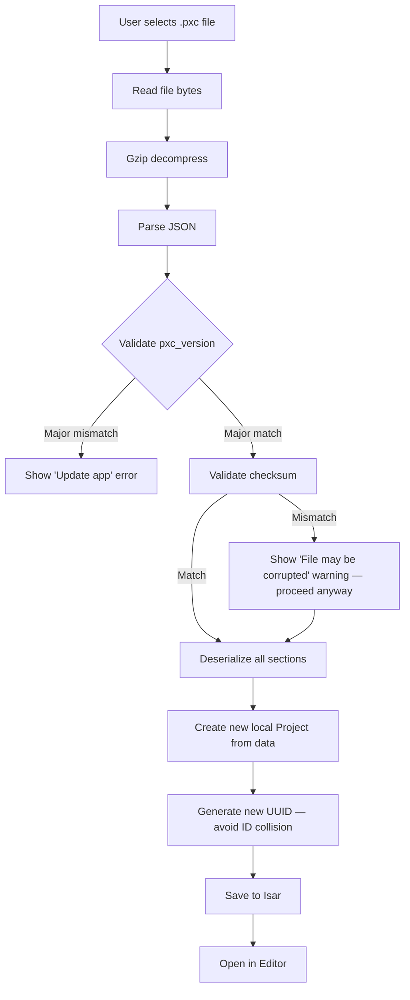

## 27.15 Export Flow (Save to file)

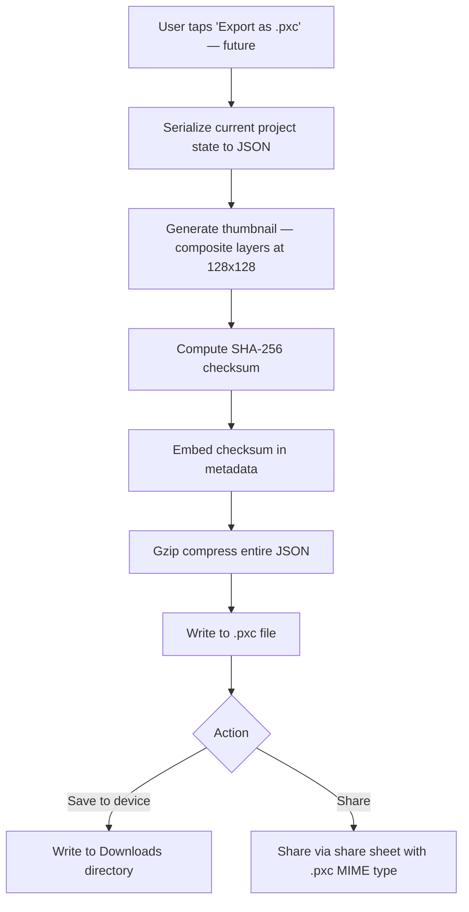

## 27.16 Project Recovery

| Scenario | Recovery Strategy |
|---|---|
| **App crash during editing** | On next launch, detect `is_dirty` flag in Isar. Load last auto-saved state (< 3 seconds old). Show "Recovered" banner. |
| **Corrupted .pxc file** | Detect via checksum mismatch. Attempt partial parse — recover whatever sections are valid. Fall back to `checkpoint_pixel_data` if layer data is corrupted. Show warning with recovery details. |
| **Isar DB corruption** | Isar uses ACID transactions — corruption is extremely rare. If detected on startup, delete and rebuild from `.pxc` backup files (if export-to-file was used) or from cloud sync (if authenticated). |
| **Deleted project recovery** | Soft delete with 30-day retention in a local "Trash" collection. "Recently Deleted" screen in Settings (V2). |
| **Cross-device conflict** | LWW resolves automatically. "Losing" version archived in `_conflict_archive` Isar collection. User can access from Settings → Sync → Conflicts (V2). |

## 27.17 Backup Strategy

| Tier | Mechanism | Frequency | Retention |
|---|---|---|---|
| **Tier 0: In-memory** | Canvas state in Riverpod notifier | Real-time | Until editor closes |
| **Tier 1: Auto-save** | Isar write (debounced) | Every 3s of inactivity + lifecycle events | Permanent (until project deleted) |
| **Tier 2: Cloud sync** | Supabase project table | On connectivity + periodic | Permanent (until user deletes account) |
| **Tier 3: Local file export** | `.pxc` file in Downloads | Manual (user-initiated) | Device-dependent |
| **Tier 4: Automatic local backup** | Rotating `.pxc.bak` in app internal storage | Every 10 saves | Last 3 versions per project |

## 27.18 Corruption Handling

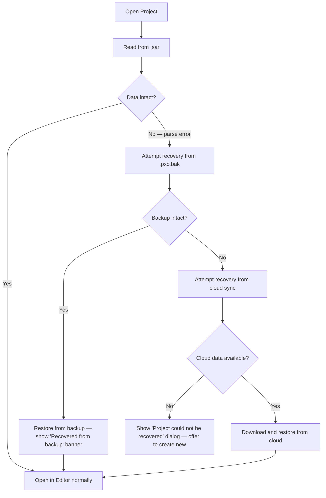

## 27.19 Cloud Sync Compatibility

The `.pxc` JSON structure is the **canonical sync format**. When syncing to Supabase:

1. **Upload:** The project is serialized to `.pxc` JSON, gzipped, and stored as a `bytea` column in the `projects` table (or uploaded to Supabase Storage as a file, depending on size).
2. **Download:** The gzipped JSON is downloaded, decompressed, and deserialized into Isar models.
3. **Delta sync (future):** For large projects, only the changed layers' `pixel_data` diffs are synced, using `updated_at` timestamps per layer.

**Size threshold:**
- Projects < 256 KB (gzipped): Stored inline in the `projects` table `data` column.
- Projects ≥ 256 KB (gzipped): Stored in Supabase Storage bucket `project-files`, with a reference URL in the table.

---

# 28. Pixel Rendering Engine Architecture

## 28.1 Engine Overview

The Pixel Rendering Engine is the heart of PixelCanvas. It is a self-contained, framework-independent module that manages the entire lifecycle of pixel art creation — from touch input to screen output to persistent storage.

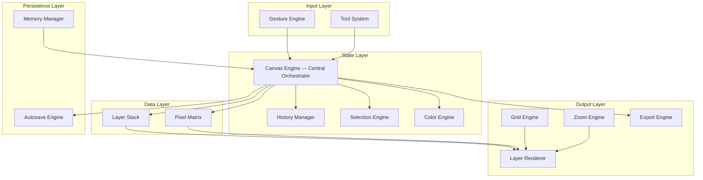

## 28.2 Canvas Engine (Central Orchestrator)

The Canvas Engine is the **single entry point** for all canvas mutations. No component directly modifies pixel data. Every mutation flows through the Canvas Engine, which:

1. Validates the operation (within bounds, layer not locked, undo limit not exceeded).
2. Records the action for undo/redo (via History Manager).
3. Applies the mutation to the Pixel Matrix on the active layer.
4. Notifies the Renderer to repaint (only dirty region).
5. Signals the Autosave Engine that state is dirty.

**Responsibilities:**
- Coordinate all sub-engines.
- Maintain the single source of truth for canvas state.
- Expose a clean API: `applyTool(tool, position)`, `undo()`, `redo()`, `setActiveLayer(id)`, `setActiveTool(tool)`, `setColor(color)`.
- Emit state change events consumed by Riverpod notifiers.

**Communication pattern:** Event bus (internal `StreamController`). Sub-engines subscribe to specific event types.

## 28.3 Rendering Pipeline

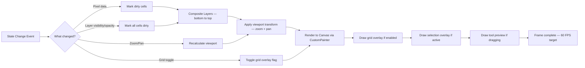

**Rendering order (back to front):**
1. Canvas background (solid color or checkerboard transparency pattern).
2. Layers (bottom to top, respecting visibility and opacity).
3. Grid lines (if enabled).
4. Selection rectangle (marching ants or highlight).
5. Tool preview (ghost line/rectangle while user is dragging).
6. UI overlays (tool cursor, zoom indicator).

**Dirty region optimization:**
- When a single pixel changes, only the tile containing that pixel is re-composited.
- The canvas is divided into 32×32 tiles. Each tile is an independent `RepaintBoundary`.
- Tile-level dirty flags prevent full-canvas re-render on each stroke.

## 28.4 Gesture Engine

The Gesture Engine translates raw Flutter gestures into canvas-semantic events.

| Raw Gesture | Canvas Event | Details |
|---|---|---|
| `onTapDown` | `CellTap(row, col)` | Single pixel action (draw, erase, fill) |
| `onPanStart` + `onPanUpdate` | `CellDrag(fromCell, toCell)` | Continuous stroke (Bresenham line between cells) |
| `onPanEnd` | `StrokeEnd()` | Finalize stroke — commit to history as one undo step |
| `onScaleStart` + `onScaleUpdate` | `ZoomPan(scale, offset)` | Pinch-to-zoom + pan (handled by Zoom Engine) |
| `onLongPress` | `Eyedropper(row, col)` | Pick color from canvas |

**Coordinate conversion:**
```
canvasRow = ((touchY - panOffsetY) / (cellSize * zoomLevel)).floor()
canvasCol = ((touchX - panOffsetX) / (cellSize * zoomLevel)).floor()
```

**Bresenham line interpolation:** When the user drags quickly, finger positions may skip cells. The engine interpolates between the previous and current cell using Bresenham's line algorithm to ensure no gaps in the stroke.

## 28.5 Pixel Matrix

The Pixel Matrix is the raw data structure holding pixel color values for a single layer.

**Data structure:** `Map<int, Map<int, int>>` — row → column → ARGB color integer.

**Why Map (sparse) over List (dense):**
- Typical canvas fill density: 20–50%. A sparse map uses 50–80% less memory.
- Insertion/deletion: O(1) for Map vs. O(1) for List — equivalent.
- Iteration over filled cells: O(n) where n = filled cells (not total cells).
- For high-density canvases (> 70%), an automatic compaction to `Uint32List` (dense array) is triggered.

**Density threshold:** If `filledCells / totalCells > 0.7`, the engine automatically switches to a dense `Uint32List` representation for that layer. This is transparent to the rest of the engine.

## 28.6 History Manager

The History Manager implements the **Command Pattern** for undo/redo.

**Action types:**
- `PencilAction(layer, cells: Map<CellPos, OldColor>)` — records only changed cells and their previous colors.
- `FillAction(layer, cells: Map<CellPos, OldColor>)` — same structure, but typically more cells.
- `EraseAction(layer, cells: Map<CellPos, OldColor>)` — records erased cells' previous colors.
- `LayerAction(type: add|delete|reorder|merge, layerSnapshot)` — records the full layer state for complex operations.
- `SelectionAction(type: move|paste, sourceRegion, targetRegion, pixelData)` — records selection mutations.

**Storage strategy:** Diffs only — never full canvas snapshots. A pencil stroke that colors 5 cells stores only those 5 cells' previous values (~40 bytes), not the entire 32×32 canvas (~4 KB).

**Undo stack:** Max 50 entries. Oldest entries are pruned when the limit is reached (FIFO eviction).
**Redo stack:** Cleared when a new action is performed after undo.
**Memory budget:** Max 20 MB for the history stack. If exceeded (rare — would require ~500,000 individual cell changes), oldest entries are pruned.

**Stroke coalescing:** A continuous drag stroke (many `onPanUpdate` events) is coalesced into a single undo action. The `StrokeEnd` event triggers the commit.

## 28.7 Layer Renderer

The Layer Renderer composites multiple layers into a single visual output.

**Compositing algorithm:**
1. Start with a transparent buffer (`Uint32List` of `width × height`).
2. For each layer (bottom to top):
   a. Skip if `visible == false`.
   b. For each filled pixel in the layer's Pixel Matrix:
      - Apply layer `opacity` to the pixel's alpha channel.
      - Blend the pixel onto the buffer using the layer's `blend_mode`.
3. Output the composited buffer as a `ui.Image` for the `CustomPainter`.

**Caching:** The composited `ui.Image` is cached and only regenerated when:
- A pixel changes on any visible layer.
- Layer visibility or opacity changes.
- Layer order changes.

**Blend modes (MVP: `normal` only):**
- `normal`: Standard alpha compositing (Porter-Duff "source over").
- Future: `multiply`, `screen`, `overlay`, `darken`, `lighten`.

## 28.8 Selection Engine

The Selection Engine manages rectangular selections on the canvas.

**State:**
- `isActive`: Whether a selection exists.
- `bounds`: `Rect(startRow, startCol, endRow, endCol)`.
- `floatingPixels`: When the user moves a selection, the selected pixels are "lifted" into a floating buffer and no longer part of the layer's Pixel Matrix.
- `sourceLayerId`: The layer the selection was made from.

**Operations:**
- `select(startCell, endCell)` — define selection rectangle.
- `copy()` — copy selected pixels to clipboard buffer.
- `cut()` — copy + clear selected pixels from layer.
- `paste()` — place clipboard buffer at current position.
- `move(deltaRow, deltaCol)` — move floating selection.
- `deselect()` — commit floating pixels back to the layer and clear selection.

**Selection rendering:** Marching ants (animated dashed border) around the selection bounds, drawn in the overlay layer of the rendering pipeline.

## 28.9 Color Engine

The Color Engine manages the active color, palette state, and color operations.

**Responsibilities:**
- Track current foreground color.
- Track current palette (active palette ID + color list).
- Maintain recent colors list (last 16 unique colors, LRU eviction).
- Provide color operations: HSL ↔ RGB conversion, brightness calculation, complementary color, analogous colors.
- Eyedropper integration: read color from any cell on any visible layer.

**Eyedropper behavior:** When eyedropper is activated (long-press on canvas), the Color Engine reads the composited color at the target cell (accounting for all visible layers and opacity), not just the active layer.

## 28.10 Zoom Engine

The Zoom Engine manages viewport transformation — zoom level and pan offset.

| Parameter | Range | Default |
|---|---|---|
| `zoomLevel` | 0.25 – 32.0 | Auto-fit to screen on project open |
| `panOffset` | Unbounded (clamped to canvas bounds + margin) | Centered |
| `minCellDisplaySize` | 4 dp | Below this, cells are too small to tap accurately |
| `maxCellDisplaySize` | 64 dp | Above this, the canvas is too zoomed in to be useful |

**Zoom behavior:**
- Pinch gesture scales around the pinch centroid.
- Double-tap toggles between fit-to-screen and 4x zoom.
- Zoom buttons (+/−) increment by 2x.
- Zoom snaps to nearest power of 2 for pixel-perfect rendering (optional — can be toggled in settings).

**Grid visibility rule:** Grid lines are visible when `cellDisplaySize >= 8dp`. Below 8dp, grid lines are too dense and are hidden.

**Pan bounds:** The user can pan the canvas so that up to 50% of the canvas exits the viewport, but never more. This prevents "losing" the canvas off-screen.

## 28.11 Grid Engine

The Grid Engine renders grid lines over the canvas.

**Rendering strategy:**
- Grid lines are drawn in the `CustomPainter` overlay pass, after layers are composited.
- Line color: `#E0E0E0` at 50% opacity (light theme only — no dark theme).
- Line width: `0.5 / zoomLevel` (constant apparent width regardless of zoom).
- Lines snap to pixel boundaries to avoid anti-aliasing artifacts.
- Major grid lines every 8 cells at 25% darker, for spatial reference on large canvases.

**Performance:** Grid lines are generated as a single `Path` and cached. The path is regenerated only when the viewport changes (zoom or pan).

## 28.12 Export Engine

The Export Engine renders the canvas to exportable image formats.

**Export pipeline:**
```
Canvas State → Composite Layers → Create ui.Image → Encode to format → Write to file / share
```

**Supported formats:**

| Format | Version | Details |
|---|---|---|
| PNG | MVP | Lossless, transparency support, nearest-neighbor scaling |
| GIF (animated) | V2 | Frame-by-frame from animation data, configurable FPS |
| Sprite Sheet | V2 | All frames arranged in a grid on a single PNG |
| SVG | V2 | Vector representation — each pixel becomes a `<rect>` |
| ICO | V2 | Favicon/app icon format |

**Scaling:**
- Scale factors: 1x, 2x, 4x, 8x, 16x.
- All scaling uses nearest-neighbor interpolation (no blurring).
- Output dimensions: `canvasWidth × scaleFactor` by `canvasHeight × scaleFactor`.
- Example: 32×32 at 8x → 256×256 PNG.

**Transparency handling:**
- If `background_type == transparent`, the PNG has an alpha channel.
- If `background_type == solid`, the background color is rendered as the bottom layer.

**Isolate offloading:** For canvases > 64×64, PNG encoding runs on a separate Dart isolate to avoid blocking the UI thread.

## 28.13 Autosave Engine

The Autosave Engine guarantees zero data loss through continuous, non-intrusive persistence.

**Triggers:**
| Trigger | Debounce | Notes |
|---|---|---|
| Cell colored / erased / filled | 3 seconds of inactivity | Debounced — resets on each action |
| Unconditional timer | Every 30 seconds | Safety net regardless of user activity |
| Editor `dispose()` | Immediate | User navigated away from editor |
| App lifecycle → `paused` | Immediate | User switched app or locked screen |
| App lifecycle → `inactive` | Immediate | Incoming call, notification shade pulled |
| Layer added / deleted / reordered | Immediate | Structural change — save immediately |

**Save operation:**
1. Serialize canvas state to `ProjectModel` (Isar schema).
2. Generate updated thumbnail (128×128 composited PNG).
3. Write to Isar in a single transaction (atomic — all-or-nothing).
4. Update `updatedAt` timestamp.
5. Set `syncStatus = pending_sync` (if user is authenticated).
6. Enqueue sync operation in `SyncQueue`.
7. Show subtle "✓" indicator (fades after 1 second).

**Performance target:** Full auto-save (serialize + thumbnail + Isar write) completes in < 50ms for a 64×64 canvas with 4 layers.

## 28.14 Memory Manager

The Memory Manager monitors and controls the engine's memory footprint.

**Memory budget:**

| Component | Budget | Strategy |
|---|---|---|
| Active canvas (all layers) | 10 MB | Sparse maps, auto-compact to dense at > 70% fill |
| Undo/redo history | 20 MB | Diff-based storage, FIFO eviction at limit |
| Composited cache (`ui.Image`) | 5 MB | Single cached image, regenerated on change |
| Thumbnail cache | 10 MB | LRU cache, max 100 entries |
| Total engine memory | 50 MB | Hard ceiling — graceful degradation beyond this |

**Graceful degradation:** If the engine detects memory pressure (via `MemoryPressureCallback`):
1. Purge thumbnail cache.
2. Reduce undo history to 25 steps.
3. Disable composited image cache (re-render each frame).
4. Log warning for analytics.

## 28.15 Component Communication

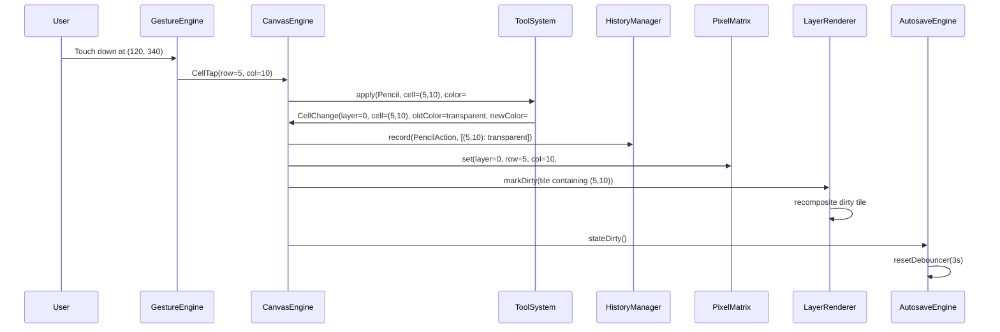

## 28.16 Future Animation Support

The engine is architecturally prepared for animation (V2) through:

- **Frame concept:** Each frame is a complete `LayerStack` (identical structure to the current single-frame project). Adding animation = adding a list of frames.
- **Onion skinning:** The renderer can composite the previous frame's layers at reduced opacity behind the current frame — this requires only a rendering pipeline change, not a data structure change.
- **Playback:** A `Timer`-based playback controller iterates through frames at a configurable FPS, sending each frame to the renderer.
- **Data model:** The `.pxc` `extensions.animation_v1` section holds frame metadata. Each frame references its own `layers` array.

---

# 29. Performance Budget

> Every number in this section is a hard engineering target. Performance regressions that violate these targets are treated as P1 bugs and must be fixed before release.

## 29.1 Startup Performance

| Metric | Target | Measurement Method | Max Acceptable |
|---|---|---|---|
| **Cold start → Splash visible** | < 500ms | Firebase Performance `app_start` trace | 800ms |
| **Cold start → Home interactive** | < 2.0s | Firebase Performance custom trace | 3.0s |
| **Warm start → Home interactive** | < 500ms | Firebase Performance custom trace | 800ms |
| **Hot restart (dev only)** | < 1.0s | Manual stopwatch | — |

**Startup initialization sequence (budget allocation):**

| Phase | Budget | Work |
|---|---|---|
| Flutter engine init | ~400ms (framework) | Not controllable |
| `main()` → `ProviderScope` | < 50ms | Create provider container |
| Isar DB open | < 100ms | Open existing DB (no migration) |
| Supabase client init | < 50ms | Initialize client (no network) |
| Auth state check | < 50ms | Read token from secure storage |
| Splash animation | 1000ms (intentional) | Brand animation + parallel init |
| Route resolution | < 50ms | Determine target screen |
| **Total** | **< 2000ms** | |

## 29.2 Memory Budget

| Component | Budget (Typical) | Budget (Maximum) | Alert Threshold |
|---|---|---|---|
| **Flutter framework overhead** | 30 MB | 40 MB | — |
| **App code + assets** | 15 MB | 20 MB | — |
| **Canvas engine (active project)** | 20 MB | 50 MB | > 40 MB |
| **Undo/redo history** | 5 MB | 20 MB | > 15 MB |
| **Image cache (thumbnails + gallery)** | 15 MB | 40 MB | > 30 MB |
| **Isar DB in-memory** | 5 MB | 10 MB | > 8 MB |
| **Total app RSS** | 90 MB | 150 MB | > 180 MB (P1 bug) |

**Device tier memory strategies:**

| Tier | Total RAM | Strategy |
|---|---|---|
| Low-end (≤ 3 GB) | Max 100 MB app RSS | Limit undo to 25 steps, reduce image cache to 20 MB, max 4 layers |
| Mid-range (4–6 GB) | Max 150 MB app RSS | Full 50 undo steps, standard caches |
| High-end (≥ 8 GB) | Max 200 MB app RSS | Extended undo (100 steps), larger caches |

## 29.3 CPU & Frame Rate Budget

| Metric | Target | Max Acceptable |
|---|---|---|
| **Frame rate during idle** | 0 FPS (no rendering) | — |
| **Frame rate during drawing** | 60 FPS | 55 FPS |
| **Frame rate during zoom/pan** | 60 FPS | 50 FPS |
| **Jank frames (> 16ms)** | < 0.5% of total frames | < 2% |
| **Severely janky frames (> 32ms)** | 0% | < 0.1% |
| **CustomPainter.paint() duration** | < 4ms | < 8ms |
| **Touch-to-pixel-visible latency** | < 16ms (1 frame) | < 32ms (2 frames) |

## 29.4 Canvas Performance by Size

| Canvas Size | Max Layers | Target FPS (Drawing) | Max Memory | Auto-Save Time |
|---|---|---|---|---|
| 8×8 | 8 | 60 | 5 MB | < 10ms |
| 16×16 | 8 | 60 | 8 MB | < 15ms |
| 32×32 | 8 | 60 | 15 MB | < 25ms |
| 64×64 | 8 | 60 | 30 MB | < 40ms |
| 128×128 | 4 | 60 | 50 MB | < 80ms |
| 256×256 | 4 | 55 | 80 MB | < 150ms |

## 29.5 Undo/Redo Performance

| Metric | Target |
|---|---|
| **Undo execution time** | < 2ms per step |
| **Redo execution time** | < 2ms per step |
| **History recording time** | < 1ms per action |
| **Max undo stack depth** | 50 steps (configurable per device tier) |
| **Memory per undo step (avg)** | ~400 bytes (diff-based) |
| **Memory per undo step (max)** | ~100 KB (full-canvas fill operation) |

## 29.6 Export Performance

| Canvas | Scale | Output Size | Target Time | Isolate? |
|---|---|---|---|---|
| 16×16 | 8x | 128×128 | < 50ms | No |
| 32×32 | 8x | 256×256 | < 100ms | No |
| 64×64 | 8x | 512×512 | < 250ms | No |
| 128×128 | 4x | 512×512 | < 300ms | Yes |
| 128×128 | 8x | 1024×1024 | < 800ms | Yes |
| 256×256 | 4x | 1024×1024 | < 800ms | Yes |
| 256×256 | 8x | 2048×2048 | < 2.0s | Yes |
| 256×256 | 16x | 4096×4096 | < 5.0s | Yes |

## 29.7 Database Performance

| Operation | Target | Max Acceptable |
|---|---|---|
| **Isar: Single project read** | < 3ms | < 10ms |
| **Isar: Project list (100 items)** | < 15ms | < 50ms |
| **Isar: Auto-save write** | < 10ms | < 50ms |
| **Isar: Full project delete** | < 5ms | < 20ms |
| **Isar: Search by name** | < 10ms | < 30ms |
| **Supabase: API round-trip** | < 500ms | < 2.0s |
| **Supabase: Image upload (500 KB)** | < 3.0s | < 8.0s |

## 29.8 Animation Performance (V2)

| Metric | Target |
|---|---|
| **Playback FPS** | Configurable 1–30 FPS |
| **Frame switch time** | < 5ms |
| **Onion skin render** | < 8ms additional per frame |
| **GIF export (16 frames, 32×32)** | < 2.0s |
| **GIF export (64 frames, 64×64)** | < 10.0s |

## 29.9 App Size Budget

| Component | Budget | Notes |
|---|---|---|
| Flutter engine | 8 MB | Not reducible |
| Dart AOT code | 3 MB | Tree-shaken release build |
| Native libraries (Isar) | 2 MB | Per-ABI |
| Bundled templates | 2 MB | 30 templates × ~60 KB each |
| Bundled palettes | 50 KB | 16 palettes × ~3 KB JSON each |
| Fonts (Inter) | 200 KB | Subset to Latin, Cyrillic |
| Onboarding illustrations | 500 KB | WebP compressed |
| Lottie animations | 300 KB | 3 animations |
| Icons + misc assets | 200 KB | SVG/vector icons |
| **Total APK (universal)** | **< 20 MB** | |
| **AAB (per-device download)** | **< 15 MB** | ABI-split + resource optimization |

## 29.10 Battery Budget

| Scenario | Target Battery Drain | Measurement |
|---|---|---|
| **Active editing (30 min)** | < 3% battery | Manual test on mid-range device |
| **App in background (1 hour, no sync)** | < 0.1% battery | Battery historian |
| **Background sync (10 projects)** | < 0.5% battery | Battery historian |
| **Idle on Home screen (10 min)** | < 0.5% battery | Manual test |

## 29.11 Network / Sync Budget

| Operation | Target | Max Acceptable |
|---|---|---|
| **Single project sync (32×32)** | < 1.0s | < 3.0s |
| **Full sync (50 projects)** | < 30s | < 60s |
| **Gallery page load (20 items)** | < 1.5s | < 3.0s |
| **Gallery image load (single)** | < 500ms | < 1.5s |
| **Publish artwork** | < 3.0s | < 8.0s |
| **Data transferred per sync** | < 500 KB typical | < 2 MB max |

---

# 30. Asset Pipeline

## 30.1 Asset Directory Structure

```
assets/
├── images/
│   ├── logo/
│   │   ├── logo.webp                    # App logo (full)
│   │   ├── logo_icon.webp               # App icon variant
│   │   └── logo_splash.webp             # Splash screen logo
│   ├── onboarding/
│   │   ├── onboarding_create.webp       # Onboarding step 1
│   │   ├── onboarding_color.webp        # Onboarding step 2
│   │   └── onboarding_share.webp        # Onboarding step 3
│   ├── empty_states/
│   │   ├── empty_projects.webp          # No projects yet
│   │   ├── empty_gallery.webp           # No gallery content
│   │   ├── empty_notifications.webp     # No notifications
│   │   └── empty_search.webp            # No search results
│   ├── auth/
│   │   └── auth_illustration.webp       # Auth screen illustration
│   └── misc/
│       ├── offline_banner.webp          # Offline indicator
│       └── update_prompt.webp           # Update available
│
├── illustrations/                        # Vector illustrations (SVG)
│   ├── welcome.svg
│   ├── achievement_unlocked.svg
│   └── error_generic.svg
│
├── templates/
│   ├── manifest.json                     # Template index file
│   ├── animals/
│   │   ├── cat_16x16.json              # Template data
│   │   ├── cat_16x16_thumb.webp        # Template thumbnail
│   │   ├── dog_16x16.json
│   │   ├── dog_16x16_thumb.webp
│   │   └── ...
│   ├── characters/
│   │   └── ...
│   ├── food/
│   │   └── ...
│   ├── nature/
│   │   └── ...
│   └── patterns/
│       └── ...
│
├── palettes/
│   ├── manifest.json                     # Palette index file
│   ├── default.json                      # Default 16-color palette
│   ├── gameboy.json                      # 4-color Game Boy
│   ├── nes.json                          # NES system palette
│   ├── pastel.json
│   ├── neon.json
│   ├── earth.json
│   ├── ocean.json
│   ├── sunset.json
│   ├── monochrome.json
│   ├── retro.json
│   ├── candy.json
│   ├── forest.json
│   ├── metal.json
│   ├── skin_tones.json
│   ├── pico8.json                        # PICO-8 palette
│   └── endesga32.json                    # Endesga-32 (popular pixel art palette)
│
├── lottie/
│   ├── splash_logo.json                 # Splash screen animation
│   ├── save_success.json               # Checkmark success animation
│   └── confetti.json                    # Achievement / publish celebration
│
├── fonts/
│   ├── Inter-Regular.ttf
│   ├── Inter-Medium.ttf
│   ├── Inter-SemiBold.ttf
│   └── Inter-Bold.ttf
│
├── icons/                               # Custom SVG icons (beyond Material)
│   ├── tool_pencil.svg
│   ├── tool_eraser.svg
│   ├── tool_fill.svg
│   ├── tool_line.svg
│   ├── tool_rectangle.svg
│   ├── tool_circle.svg
│   ├── tool_eyedropper.svg
│   ├── tool_select.svg
│   ├── tool_move.svg
│   ├── icon_symmetry_h.svg
│   ├── icon_symmetry_v.svg
│   ├── icon_layers.svg
│   ├── icon_grid.svg
│   └── icon_export.svg
│
├── sounds/                              # Future — haptic companion sounds
│   └── .gitkeep
│
└── l10n/                                # Localization ARB files
    ├── app_en.arb                       # English (default)
    └── .gitkeep                         # Future language files
```

## 30.2 Asset Naming Convention

| Rule | Format | Example |
|---|---|---|
| **All lowercase** | `snake_case` | `cat_16x16.json` |
| **Prefix by context** | `{context}_{descriptor}` | `onboarding_create.webp`, `tool_pencil.svg` |
| **Template files** | `{name}_{width}x{height}.json` | `dragon_32x32.json` |
| **Template thumbnails** | `{name}_{width}x{height}_thumb.webp` | `dragon_32x32_thumb.webp` |
| **Palette files** | `{palette_name}.json` | `gameboy.json` |
| **Lottie files** | `{animation_name}.json` | `save_success.json` |
| **Empty state images** | `empty_{context}.webp` | `empty_projects.webp` |
| **Resolution suffixes** | Not used — Flutter handles DPI variants via directory structure | `images/2.0x/logo.webp` |

## 30.3 Optimization Strategy

| Asset Type | Format | Optimization | Target Size |
|---|---|---|---|
| **Photos / Illustrations** | WebP | Lossy, quality 80, max 512px longest edge | < 50 KB each |
| **Icons** | SVG | Minified (SVGO), single color path, 24×24 viewBox | < 2 KB each |
| **Lottie animations** | JSON | Minified JSON, max 150 frames, no embedded images | < 100 KB each |
| **Fonts** | TTF | Subset to Latin + Cyrillic + common symbols | < 60 KB per weight |
| **Template data** | JSON | Minified, sparse pixel format | < 10 KB each |
| **Template thumbnails** | WebP | Lossy, quality 75, 128×128 | < 5 KB each |
| **Palette data** | JSON | Minified | < 3 KB each |

## 30.4 Loading Strategy

| Asset Type | Load Timing | Method |
|---|---|---|
| **Splash logo / animation** | App startup | Synchronous — bundled with app, pre-cached |
| **Onboarding images** | First launch only | Lazy load when onboarding screen is navigated to |
| **Template thumbnails** | Templates tab visible | Lazy load with `FadeInImage` + shimmer placeholder |
| **Template data** | User taps "Use Template" | On-demand — load JSON, parse, and create project |
| **Palette data** | Editor opens | Pre-load all palettes (< 50 KB total) on first editor open, cache in memory |
| **Gallery images** | Community tab scroll | Lazy load with `CachedNetworkImage`, progressive: thumbnail first, then full |
| **Lottie animations** | First trigger | Lazy load — initialize `AnimationController` on first play |
| **Fonts** | App startup | Pre-loaded via `GoogleFonts.interTextTheme()` in `app_theme.dart` |

## 30.5 Caching Strategy

| Asset Type | Cache Location | Max Cache Size | Eviction |
|---|---|---|---|
| **Network images (gallery)** | Disk (app cache dir) | 50 MB | LRU |
| **Network images (gallery)** | Memory | 30 MB | LRU |
| **Template thumbnails** | Memory | 5 MB | LRU |
| **Composited canvas thumbnails** | Disk (app docs dir) | 10 MB | LRU (100 most recent) |
| **Palette data** | Memory | < 1 MB (all palettes) | Never evicted (small enough to keep) |
| **Font glyphs** | System font cache | System managed | System managed |

## 30.6 Bundle Strategy

**What ships with the APK:**
- All images, icons, fonts, Lottie animations.
- 16 built-in palettes.
- 30 starter templates (data + thumbnails).
- Total bundled asset size: ~5 MB.

**What loads from network (optional, enhances experience):**
- Additional templates (added without app update).
- Community gallery images.
- User avatars.
- Push notification payloads.

## 30.7 Future CDN Strategy (Post-MVP)

When the template library grows beyond the bundled set:
- Templates served from Supabase Storage with CDN caching (Supabase uses a global CDN).
- Client caches downloaded templates in Isar (offline access).
- `manifest.json` includes a `version` field — client checks for updates on app startup (max 1 request per 24 hours).
- Delta updates: only download new/changed templates, not the full library.

---

# 31. Design Tokens

> All design tokens are the single source of truth for the entire application's visual language. No color, spacing, radius, or typography value should ever be hardcoded in a widget. Every value references a token.

## 31.1 Color Tokens

### Primary

| Token | Value | Usage |
|---|---|---|
| `primary.50` | `#F3F1FE` | Lightest tint — hover backgrounds, selected row |
| `primary.100` | `#E0DBFC` | Light backgrounds, chip backgrounds |
| `primary.200` | `#C4B9F9` | Disabled button backgrounds |
| `primary.300` | `#A29BFE` | Secondary accents, progress bars |
| `primary.400` | `#8B7DF7` | Hover states on primary elements |
| `primary.500` | `#6C5CE7` | **Primary — buttons, FAB, links, active states** |
| `primary.600` | `#5A4BD4` | Pressed states |
| `primary.700` | `#4A3CB5` | Focus rings, emphasis |
| `primary.800` | `#3A2E96` | Dark accent (rare) |
| `primary.900` | `#2A1F77` | Darkest — headings on light background (rare) |

### Neutral

| Token | Value | Usage |
|---|---|---|
| `neutral.0` | `#FFFFFF` | Pure white — cards, surfaces, canvas background |
| `neutral.50` | `#F8F9FA` | Screen background, scaffold |
| `neutral.100` | `#F1F3F5` | Divider backgrounds, disabled fields |
| `neutral.200` | `#DFE6E9` | Borders, dividers, outlines |
| `neutral.300` | `#B2BEC3` | Placeholder text, disabled icons |
| `neutral.400` | `#636E72` | Secondary text, captions |
| `neutral.500` | `#2D3436` | Primary text, headings |
| `neutral.600` | `#1A1A2E` | High-emphasis text (rare) |
| `neutral.900` | `#000000` | Pure black — shadows only |

### Semantic Colors

| Token | Value | Usage |
|---|---|---|
| `success.light` | `#E8F8F5` | Success container backgrounds |
| `success.main` | `#00B894` | Success icons, text, borders |
| `success.dark` | `#008C6F` | Pressed success states |
| `warning.light` | `#FFF8E1` | Warning container backgrounds |
| `warning.main` | `#FDCB6E` | Warning icons, text, borders |
| `warning.dark` | `#E0A800` | Pressed warning states |
| `danger.light` | `#FFF0F0` | Error container backgrounds |
| `danger.main` | `#FF6B6B` | Error icons, text, borders, destructive buttons |
| `danger.dark` | `#E05555` | Pressed error states |
| `info.light` | `#E8F4FD` | Info container backgrounds |
| `info.main` | `#0984E3` | Info icons, links |
| `info.dark` | `#0767B2` | Pressed info states |

### Canvas-Specific Colors

| Token | Value | Usage |
|---|---|---|
| `canvas.background` | `#FFFFFF` | Default canvas fill |
| `canvas.gridLine` | `#E0E0E0` at 50% opacity | Standard grid lines |
| `canvas.gridLineMajor` | `#BDBDBD` at 50% opacity | Major grid lines (every 8 cells) |
| `canvas.checkerLight` | `#EEEEEE` | Transparency checker — light square |
| `canvas.checkerDark` | `#CCCCCC` | Transparency checker — dark square |
| `canvas.selectionBorder` | `#6C5CE7` | Selection rectangle (marching ants) |
| `canvas.toolPreview` | `#6C5CE7` at 30% opacity | Ghost preview of shape tool while dragging |

## 31.2 Spacing Tokens

| Token | Value (dp) | Usage |
|---|---|---|
| `space.xxs` | 2 | Hairline gaps, icon inner padding |
| `space.xs` | 4 | Minimum spacing, tag gap |
| `space.sm` | 8 | Between related elements, chip padding, icon gap |
| `space.md` | 12 | Input inner padding, small card padding |
| `space.base` | 16 | Standard padding (screen edges, card content, list item) |
| `space.lg` | 20 | Between sections, group spacing |
| `space.xl` | 24 | Major section spacing |
| `space.xxl` | 32 | Screen-level section breaks |
| `space.xxxl` | 48 | Top/bottom screen padding, hero spacing |
| `space.xxxxl` | 64 | Splash/onboarding hero spacing |

## 31.3 Border Radius Tokens

| Token | Value (dp) | Usage |
|---|---|---|
| `radius.none` | 0 | Canvas, pixel grid, sharp-edged elements |
| `radius.xs` | 4 | Small chips, tags, inline badges |
| `radius.sm` | 8 | Text inputs, small cards, list items |
| `radius.md` | 12 | Standard cards, dialogs |
| `radius.lg` | 16 | Bottom sheets, large cards, modals |
| `radius.xl` | 20 | Onboarding cards, feature cards |
| `radius.xxl` | 24 | Prominent containers |
| `radius.full` | 999 | FAB, circular buttons, avatars, pills |

## 31.4 Elevation / Shadow Tokens

| Token | CSS-equivalent | `BoxShadow` Offset / Blur / Spread / Color | Usage |
|---|---|---|---|
| `elevation.none` | none | — | Flat elements |
| `elevation.xs` | 0 1px 2px | (0, 1) / 2 / 0 / black 5% | Subtle lift — chips, tags |
| `elevation.sm` | 0 1px 3px | (0, 1) / 3 / 0 / black 8% | Cards, list items |
| `elevation.md` | 0 4px 12px | (0, 4) / 12 / 0 / black 10% | Floating elements, dropdowns |
| `elevation.lg` | 0 8px 24px | (0, 8) / 24 / 0 / black 12% | Dialogs, bottom sheets |
| `elevation.xl` | 0 16px 48px | (0, 16) / 48 / 0 / black 16% | Modals, full-screen overlays |

## 31.5 Opacity Tokens

| Token | Value | Usage |
|---|---|---|
| `opacity.transparent` | 0.0 | Fully transparent |
| `opacity.hover` | 0.04 | Hover overlay on surfaces |
| `opacity.pressed` | 0.08 | Press/tap overlay |
| `opacity.disabled` | 0.38 | Disabled text, icons, buttons |
| `opacity.gridLine` | 0.50 | Canvas grid lines |
| `opacity.toolPreview` | 0.30 | Tool ghost preview |
| `opacity.overlay` | 0.50 | Modal backdrop |
| `opacity.opaque` | 1.0 | Fully opaque |

## 31.6 Animation Tokens

### Duration

| Token | Value (ms) | Usage |
|---|---|---|
| `duration.instant` | 100 | Micro-feedback (tap highlight, toggle) |
| `duration.fast` | 150 | Tooltips, chips, quick transitions |
| `duration.normal` | 250 | Page transitions, bottom sheets, dialogs |
| `duration.slow` | 350 | Complex transitions, onboarding animations |
| `duration.slower` | 500 | Large-area animations, splash |
| `duration.slowest` | 1000 | Splash logo, celebration animations |

### Curve

| Token | Value | Usage |
|---|---|---|
| `curve.standard` | `Curves.easeInOutCubic` | General-purpose transitions |
| `curve.enter` | `Curves.easeOutCubic` | Elements entering the screen |
| `curve.exit` | `Curves.easeInCubic` | Elements leaving the screen |
| `curve.emphasize` | `Curves.easeOutBack` | Attention-drawing animations (FAB, success) |
| `curve.linear` | `Curves.linear` | Progress bars, loaders |
| `curve.spring` | `Curves.elasticOut` | Playful feedback (like button, confetti) — use sparingly |

## 31.7 Typography Tokens

| Token | Family | Weight | Size (sp) | Height | Spacing | Usage |
|---|---|---|---|---|---|---|
| `text.displayLg` | Inter | 700 | 32 | 40 | -0.5 | Hero text, splash |
| `text.displayMd` | Inter | 700 | 28 | 36 | -0.25 | Large headings |
| `text.headlineLg` | Inter | 600 | 24 | 32 | 0 | Screen titles |
| `text.headlineMd` | Inter | 600 | 20 | 28 | 0 | Section headers |
| `text.headlineSm` | Inter | 600 | 18 | 24 | 0 | Sub-section headers |
| `text.titleLg` | Inter | 500 | 18 | 24 | 0 | Card titles |
| `text.titleMd` | Inter | 500 | 16 | 22 | 0.1 | List item titles |
| `text.titleSm` | Inter | 500 | 14 | 20 | 0.1 | Toolbar labels |
| `text.bodyLg` | Inter | 400 | 16 | 24 | 0.15 | Body text |
| `text.bodyMd` | Inter | 400 | 14 | 20 | 0.25 | Descriptions |
| `text.bodySm` | Inter | 400 | 12 | 16 | 0.4 | Captions, timestamps |
| `text.labelLg` | Inter | 600 | 14 | 20 | 0.1 | Button text |
| `text.labelMd` | Inter | 500 | 12 | 16 | 0.5 | Chip text, badges |
| `text.labelSm` | Inter | 500 | 10 | 14 | 0.5 | Overlines, tiny metadata |

## 31.8 Component Tokens

### Button Tokens

| Token | Value |
|---|---|
| `button.height.lg` | 52 dp |
| `button.height.md` | 44 dp |
| `button.height.sm` | 36 dp |
| `button.radius` | `radius.full` (999) |
| `button.paddingH` | `space.xl` (24) |
| `button.iconSize` | 20 dp |
| `button.iconGap` | `space.sm` (8) |
| `button.text` | `text.labelLg` |
| `button.primary.bg` | `primary.500` |
| `button.primary.fg` | `neutral.0` |
| `button.primary.bgPressed` | `primary.600` |
| `button.primary.bgDisabled` | `primary.200` |
| `button.secondary.bg` | `transparent` |
| `button.secondary.border` | `primary.500` |
| `button.secondary.fg` | `primary.500` |
| `button.destructive.bg` | `danger.main` |
| `button.destructive.fg` | `neutral.0` |

### Card Tokens

| Token | Value |
|---|---|
| `card.radius` | `radius.md` (12) |
| `card.padding` | `space.base` (16) |
| `card.elevation` | `elevation.sm` |
| `card.bg` | `neutral.0` |
| `card.border` | `neutral.200` at 0.5 width |
| `card.hoverElevation` | `elevation.md` |

### Dialog Tokens

| Token | Value |
|---|---|
| `dialog.radius` | `radius.lg` (16) |
| `dialog.padding` | `space.xl` (24) |
| `dialog.elevation` | `elevation.lg` |
| `dialog.bg` | `neutral.0` |
| `dialog.overlayColor` | `neutral.900` at `opacity.overlay` |
| `dialog.maxWidth` | 400 dp |
| `dialog.titleText` | `text.headlineMd` |
| `dialog.bodyText` | `text.bodyMd` |

### Bottom Sheet Tokens

| Token | Value |
|---|---|
| `sheet.radius` | `radius.lg` (16) — top corners only |
| `sheet.padding` | `space.xl` (24) |
| `sheet.handleWidth` | 40 dp |
| `sheet.handleHeight` | 4 dp |
| `sheet.handleColor` | `neutral.200` |
| `sheet.handleRadius` | `radius.full` |
| `sheet.bg` | `neutral.0` |
| `sheet.elevation` | `elevation.xl` |
| `sheet.maxHeight` | 85% of screen height |

### Navigation Tokens

| Token | Value |
|---|---|
| `bottomNav.height` | 64 dp |
| `bottomNav.bg` | `neutral.0` |
| `bottomNav.elevation` | `elevation.sm` |
| `bottomNav.activeColor` | `primary.500` |
| `bottomNav.inactiveColor` | `neutral.300` |
| `bottomNav.iconSize` | 24 dp |
| `bottomNav.labelText` | `text.labelSm` |
| `appBar.height` | 56 dp |
| `appBar.bg` | `neutral.0` |
| `appBar.elevation` | `elevation.none` |
| `appBar.titleText` | `text.headlineMd` |
| `appBar.iconSize` | 24 dp |

---

# 32. Pixel Engine Rules

> These rules define the hard limits, defaults, and behavioral contracts of the pixel editor. Every rule is measurable and testable. These rules must be enforced programmatically — never rely on documentation alone.

## 32.1 Canvas Rules

| Rule | Value | Enforced By |
|---|---|---|
| **Default canvas size** | 32×32 | New project dialog default |
| **Minimum canvas size** | 8×8 | Input validation — reject smaller |
| **Maximum canvas size (MVP)** | 128×128 | Input validation — reject larger |
| **Maximum canvas size (V2)** | 256×256 | Feature-gated unlock |
| **Allowed canvas sizes** | 8, 16, 32, 64, 128 (MVP); + 256 (V2); + custom (V2) | Dropdown/picker options |
| **Canvas aspect ratio** | Square only (width == height) in MVP | Input validation |
| **Non-square canvas** | Supported in V2 | Feature gate |
| **Default background** | Transparent (`#00FFFFFF`) | New project dialog |
| **Background options** | Transparent, White | New project dialog toggle |
| **Canvas resize** | Not supported in MVP | Feature gate; V2 with content-aware crop/expand |

## 32.2 Grid Rules

| Rule | Value |
|---|---|
| **Grid visible by default** | Yes |
| **Grid line color** | `canvas.gridLine` (`#E0E0E0` at 50% opacity) |
| **Grid line width** | 0.5 logical pixels (constant apparent width) |
| **Major grid lines** | Every 8 cells, at `canvas.gridLineMajor` |
| **Grid visible threshold** | `cellDisplaySize >= 8dp` — grid hidden below this zoom level |
| **Grid toggle persistence** | Persisted per project in `.pxc` settings |
| **Grid performance** | Cached as a single `Path` — regenerated only on viewport change |

## 32.3 Zoom Rules

| Rule | Value |
|---|---|
| **Default zoom** | Auto-fit canvas to screen with 16dp padding |
| **Minimum zoom** | 0.25x (canvas at 25% of actual size) |
| **Maximum zoom** | 32x |
| **Zoom step (button)** | 2x increment/decrement |
| **Zoom gesture** | Pinch — continuous scaling |
| **Double-tap zoom** | Toggle between fit-to-screen and 4x |
| **Zoom centroid** | Pinch center point; double-tap point |
| **Zoom snap (optional)** | Snap to nearest power of 2 for pixel-perfect rendering |
| **Minimum cell display size** | 4dp (prevents cells too small to tap) |
| **Maximum cell display size** | 64dp |

## 32.4 Tool Rules

### Pencil Tool

| Rule | Value |
|---|---|
| **Size** | 1 pixel (MVP) — no variable brush size |
| **Behavior — tap** | Color single cell with current color |
| **Behavior — drag** | Color all cells along drag path (Bresenham interpolation) |
| **Alpha handling** | Full replacement — no alpha blending within a single layer |
| **Overwrite** | Overwrites existing cell color (no blending) |

### Eraser Tool

| Rule | Value |
|---|---|
| **Size** | 1 pixel (MVP) |
| **Behavior — tap** | Set cell to transparent (`#00000000`) |
| **Behavior — drag** | Erase all cells along drag path |
| **Affects** | Active layer only |

### Fill Tool (Flood Fill)

| Rule | Value |
|---|---|
| **Algorithm** | Iterative flood fill (BFS with queue) — NOT recursive (stack overflow risk) |
| **Connectivity** | 4-connected (up, down, left, right) — no diagonals |
| **Target** | Fills all contiguous cells of the same color as the tapped cell |
| **Active layer only** | Yes — does not consider other layers' pixels |
| **Max fill area** | Entire canvas (no artificial limit) |
| **Performance** | Must complete in < 50ms for 128×128 canvas |
| **Protection** | If fill area > 50% of canvas, show brief "Filling…" indicator |

### Line Tool (V1.0)

| Rule | Value |
|---|---|
| **Algorithm** | Bresenham's line algorithm |
| **Preview** | Ghost line shown during drag |
| **Snap angles** | Optional: hold to snap to 0°, 45°, 90° |
| **Width** | 1 pixel |

### Rectangle Tool (V1.0)

| Rule | Value |
|---|---|
| **Modes** | Outline, Filled |
| **Preview** | Ghost rectangle shown during drag |
| **Width** | 1 pixel outline |
| **Minimum size** | 2×2 pixels |

### Circle Tool (V1.0)

| Rule | Value |
|---|---|
| **Algorithm** | Midpoint circle algorithm (Bresenham's circle) |
| **Modes** | Outline, Filled |
| **Preview** | Ghost circle shown during drag |
| **Aspect** | Always circular (bound by smaller dimension of drag rect) |
| **Minimum size** | 3×3 pixels |

### Eyedropper Tool

| Rule | Value |
|---|---|
| **Activation** | Long-press on canvas (global) or dedicated eyedropper tool |
| **Reads from** | Composited output (all visible layers combined) |
| **Feedback** | Magnifier bubble shows zoomed-in area + picked color HEX |
| **Result** | Sets current color to picked color |

## 32.5 Selection Rules (V1.0)

| Rule | Value |
|---|---|
| **Type** | Rectangular only (MVP) |
| **Display** | Animated dashed border (marching ants) |
| **Operations** | Copy, Cut, Paste, Move, Deselect |
| **Cross-layer** | Selection from active layer only |
| **Paste target** | Active layer |
| **Move** | Drag floating selection to new position |
| **Out-of-bounds paste** | Clip to canvas bounds — no content outside canvas |
| **Max selection** | Entire canvas |

## 32.6 Undo / Redo Rules

| Rule | Value |
|---|---|
| **Max undo steps** | 50 (low-end device: 25) |
| **Max redo steps** | Equal to undo depth |
| **Redo cleared** | When any new action is performed after undo |
| **Stroke coalescing** | Continuous drag stroke = 1 undo step |
| **Storage** | Diffs only (changed cells + previous values) |
| **Memory cap** | 20 MB for entire history stack |
| **Overflow behavior** | Oldest entries pruned (FIFO) |
| **Undoable actions** | Pencil, Eraser, Fill, Line, Rectangle, Circle, Selection Move/Paste, Layer visibility/opacity/order |
| **Non-undoable actions** | Zoom, Pan, Grid toggle, Tool switch, Color change |
| **Persistence** | Not persisted to file — history resets on project reopen |

## 32.7 Autosave Rules

| Rule | Value |
|---|---|
| **Debounce interval** | 3 seconds of inactivity |
| **Max interval** | 30 seconds unconditional |
| **Lifecycle triggers** | `paused`, `inactive`, `dispose` — immediate save |
| **Save format** | Isar transaction (atomic) |
| **Thumbnail update** | On every save |
| **Max save duration** | 50ms (64×64, 4 layers) |
| **Failure behavior** | Retry once after 1 second. If second attempt fails, log error. Do not block user. |
| **Dirty flag** | Set on any canvas mutation. Cleared on successful save. |

## 32.8 Color Rules

| Rule | Value |
|---|---|
| **Color format (internal)** | 32-bit ARGB integer |
| **Color format (display)** | HEX string (6-char RGB or 8-char ARGB) |
| **Default color** | First color in active palette |
| **Max custom palette colors** | 64 |
| **Max custom palettes** | 50 per user |
| **Recent colors** | Last 16 unique colors (LRU) |
| **Color picker** | HSL wheel + HEX input + opacity slider (V2) |
| **Alpha support** | Yes — 0–255 alpha per pixel |

## 32.9 Layer Rules (V1.0)

| Rule | Value |
|---|---|
| **Max layers** | 8 (low-end: 4) |
| **Default layers** | 1 ("Layer 1") |
| **Layer name max length** | 30 characters |
| **Layer name default** | "Layer {n}" |
| **Opacity range** | 0.0–1.0 (step: 0.01) |
| **Default opacity** | 1.0 |
| **Blend mode** | `normal` only (MVP) |
| **Reorder** | Drag handle in Layer Panel |
| **Merge down** | Merge active layer into layer below (destructive, undoable) |
| **Delete** | Allowed if > 1 layer exists. Last layer cannot be deleted. |
| **Duplicate** | Creates copy above current layer (if under max) |

## 32.10 Export Rules

| Rule | Value |
|---|---|
| **Default format** | PNG |
| **Default scale** | 4x |
| **Available scales** | 1x, 2x, 4x, 8x, 16x |
| **Max output resolution** | 4096×4096 pixels |
| **Scaling algorithm** | Nearest-neighbor (no interpolation) |
| **Transparency** | Preserved if canvas background is transparent |
| **Compression** | PNG lossless (no quality slider) |
| **File name format** | `{project_name}_{width}x{height}_{scale}x.png` |
| **GIF export (V2)** | Max 64 frames, configurable FPS 1–30 |
| **Sprite sheet (V2)** | Auto-layout grid, PNG format |

## 32.11 Gesture Rules

| Gesture | Action | Conflicts Resolution |
|---|---|---|
| **Single tap** | Apply active tool at cell | — |
| **Pan (1 finger drag)** | If tool is Pencil/Eraser/Line/Rect/Circle: tool drag. If no tool: canvas pan. | Tool action always takes priority |
| **Pinch (2 fingers)** | Zoom + pan (always, regardless of tool) | 2-finger gesture overrides tool |
| **Double-tap** | Toggle zoom (fit ↔ 4x) | — |
| **Long-press** | Eyedropper (pick color from canvas) | If Eyedropper tool is active, defers to normal tap |
| **Two-finger tap** | Undo (optional shortcut) | — |
| **Three-finger tap** | Redo (optional shortcut) | — |

## 32.12 Performance Limits

| Scenario | Hard Limit | Behavior If Exceeded |
|---|---|---|
| Canvas > 256×256 | Blocked | Show error: "Maximum canvas size is 256×256" |
| Layers > 8 | Blocked | Show error: "Maximum 8 layers" |
| Undo steps > 50 | Auto-prune | Oldest entry silently removed |
| History > 20 MB | Auto-prune | Oldest entries removed until under budget |
| Fill > 50% canvas | Show indicator | Brief "Filling…" text — not blocked |
| Export > 4096×4096 | Scale capped | Auto-reduce scale to fit within limit |
| Total app memory > 200 MB | Degrade | Reduce caches, limit undo stack, log warning |

## 32.13 Validation Rules

| Input | Validation |
|---|---|
| **Project name** | 1–100 characters. Allowed: alphanumeric, spaces, hyphens, underscores, emoji. |
| **Layer name** | 1–30 characters. Same char rules as project name. |
| **Palette name** | 1–50 characters. Same char rules. |
| **HEX color input** | Must be valid 3, 4, 6, or 8 character hex (with or without `#`). |
| **Grid size** | Must be one of allowed sizes (8, 16, 32, 64, 128, 256). |
| **Opacity slider** | Clamped to 0.0–1.0. Step: 0.01. |
| **Export scale** | Must be one of 1, 2, 4, 8, 16. |

## 32.14 Future Animation Rules (V2)

| Rule | Value |
|---|---|
| **Max frames** | 64 |
| **Default FPS** | 12 |
| **FPS range** | 1–30 |
| **Onion skin depth** | Previous 1 frame (default), configurable up to 3 |
| **Onion skin opacity** | 30% (configurable) |
| **Frame duplication** | Copy current frame to new frame |
| **Playback** | Play / Pause / Stop / Loop toggle |
| **GIF export max file size** | 10 MB |

## 32.15 Future AI Rules (V2)

| Rule | Value |
|---|---|
| **AI rate limit** | 10 requests / user / hour |
| **AI timeout** | 30 seconds per request |
| **AI offline behavior** | Feature disabled — show "AI requires internet" |
| **AI result caching** | Cache last 10 results per user in Isar |
| **AI output format** | Sparse pixel data (same as canvas format) |
| **AI canvas size limit** | 64×64 max input for AI processing |

---

# 33. AI Architecture (Future — V2+)

> PixelCanvas does NOT ship with AI features in MVP. This section defines the architecture that will be implemented when AI features are introduced. The architecture is designed to be modular, swap-friendly, privacy-first, and cost-optimized for free-tier services.

## 33.1 Architecture Overview

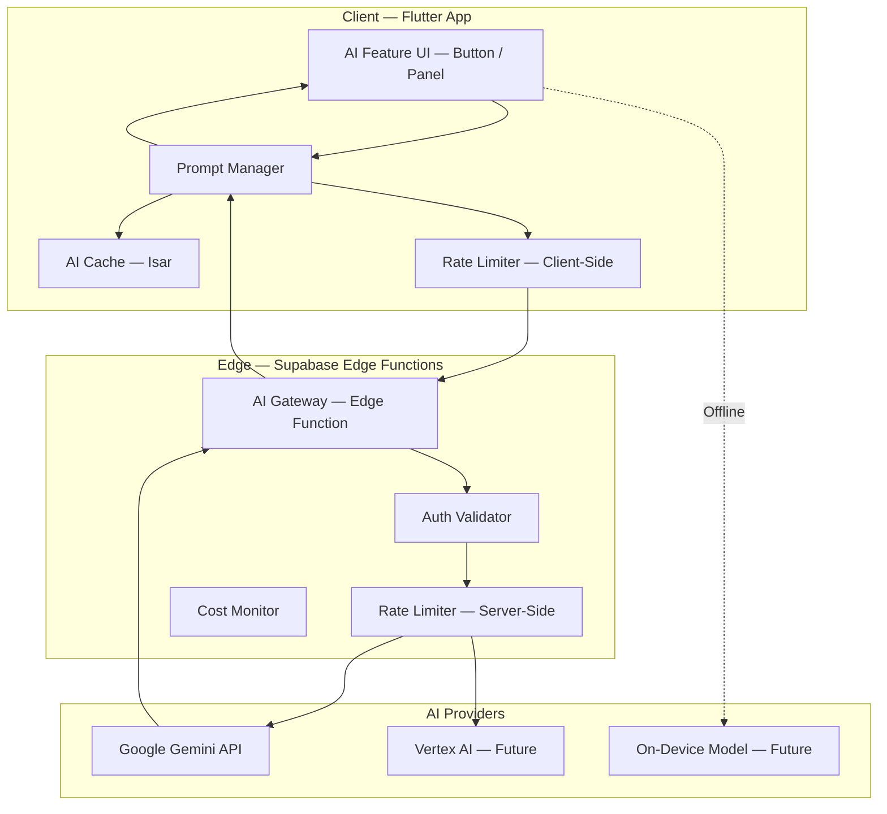

## 33.2 AI Gateway (Supabase Edge Function)

The AI Gateway is a single Supabase Edge Function that acts as a proxy between the Flutter client and AI provider APIs.

**Responsibilities:**
- Validate JWT (authenticated users only).
- Enforce server-side rate limits (10 req/user/hour).
- Route requests to the appropriate AI model.
- Transform requests/responses between PixelCanvas format and AI API format.
- Log usage for cost monitoring.
- Handle errors and return structured error responses.

**Why a gateway instead of direct API calls from the client:**
- API keys are never exposed in the client app.
- Server-side rate limiting prevents abuse.
- Model provider can be swapped without app update.
- Usage tracking for cost control.

## 33.3 Prompt Manager

The Prompt Manager is a client-side module that constructs, manages, and caches AI prompts.

**Responsibilities:**
- Construct prompts from user intent + canvas context.
- Prepend system context: "You are a pixel art assistant. Output pixel data in sparse format."
- Include relevant canvas metadata (size, existing colors, layer structure).
- Cache prompt-response pairs for identical requests.
- Handle response parsing (AI text output → pixel data).

## 33.4 AI Features (Planned)

| Feature | Input | Output | Model | Priority |
|---|---|---|---|---|
| **Color Suggest** | Current palette + artwork thumbnail | 3–5 complementary colors | Gemini 2.0 Flash | V2.0 |
| **Auto-Complete** | Partial canvas (sparse pixels) | Completed canvas suggestion | Gemini 2.0 Pro | V2.0 |
| **Palette from Image** | Camera / gallery photo | 8–16 color palette extracted | On-device (ML Kit) | V2.0 |
| **Background Removal** | Pixel art with background | Pixel art with transparent background | On-device (ML Kit) | V2.5 |
| **Style Transfer** | Canvas + style prompt ("make it 8-bit NES style") | Recolored canvas | Gemini 2.0 Pro | V3.0 |
| **Generate from Prompt** | Text prompt ("pixel art sword") | Complete pixel art on canvas | Gemini 2.0 Pro | V3.0 |

## 33.5 AI Pixel Converter

All AI models output suggestions as structured data, not raw images. The Pixel Converter translates AI responses into the PixelCanvas sparse pixel format.

**Input format (from AI):**
```json
{
  "suggestion_type": "auto_complete",
  "pixels": [
    { "row": 5, "col": 3, "color": "#FF6C5CE7" },
    { "row": 5, "col": 4, "color": "#FFA29BFE" }
  ],
  "confidence": 0.87
}
```

**Output format (to Canvas Engine):**
```
Map<(int, int), int>  // (row, col) → ARGB color
```

The user previews the suggestion as a semi-transparent overlay. Tapping "Accept" commits the pixels to the active layer via the Canvas Engine (undoable).

## 33.6 Caching

| What | Where | TTL | Key |
|---|---|---|---|
| AI responses | Isar (`AiCacheCollection`) | 7 days | SHA-256 of prompt + canvas hash |
| Identical prompt detection | In-memory | Session | Prompt string hash |

**Cache hit rate target:** > 30% (common prompts like "suggest colors for sunset palette" should hit cache).

## 33.7 Rate Limiting

| Layer | Limit | Enforcement |
|---|---|---|
| **Client-side** | 10 requests / hour (soft) | Client counts requests in SharedPreferences. Shows "You've used 8/10 AI credits this hour" |
| **Server-side** | 10 requests / hour (hard) | Edge Function checks Supabase table `ai_usage`. Returns 429 if exceeded |
| **Daily cap** | 50 requests / day | Server-side. Prevents accumulated abuse |
| **Burst limit** | 3 requests / minute | Server-side. Prevents rapid-fire spam |

## 33.8 Offline Behavior

When the device is offline, all AI features:
- Show a disabled state with message: "AI features require an internet connection."
- Hide AI buttons/panels entirely (cleaner UX than grayed-out buttons).
- Queue nothing — AI requests are not queued for later execution (results would be stale).

**Exception:** `Palette from Image` uses on-device ML Kit and works fully offline.

## 33.9 Fallback Behavior

| Failure | Fallback |
|---|---|
| AI API timeout (> 30s) | Cancel request. Show "AI is taking too long. Please try again." |
| AI API error (5xx) | Retry once after 2s. If still failing, show error and disable AI for 5 minutes. |
| Rate limit exceeded | Show countdown: "AI credits refresh in {minutes} minutes." |
| Invalid AI response | Log error. Show "AI produced an unexpected result. Try a different prompt." |
| Model deprecated | Gateway routes to replacement model. No client change needed. |

## 33.10 Privacy

- Canvas data sent to AI is the **minimum necessary** — sparse pixel data only, no user ID, no project name, no metadata.
- AI requests are logged with anonymous usage IDs, not user IDs.
- Users can opt out of AI data logging in Settings → Privacy → AI.
- No canvas data is used for model training (per Google Gemini API terms for API consumers).
- Privacy policy explicitly discloses AI feature data handling.

## 33.11 Cost Optimization

| Strategy | Savings |
|---|---|
| Gemini 2.0 Flash for simple tasks (color suggest) | 10x cheaper than Pro |
| Client-side caching | Eliminates redundant API calls |
| Strict rate limits | Caps cost per user |
| On-device ML Kit for image analysis | Zero API cost |
| Sparse pixel format (not images) | Smaller payload = lower token cost |

**Estimated cost at scale:**
- 10,000 MAU × 10% AI usage × 5 requests/user/month = 5,000 requests/month.
- At Gemini Flash pricing (~$0.10/1M tokens): < $5/month.
- Gemini Pro requests (~$1.25/1M tokens): < $50/month even at 50K requests.

## 33.12 Future Extensibility

The AI architecture supports adding new models without app updates:

1. New model added to the AI Gateway Edge Function.
2. Gateway routing table updated: `feature → model` mapping.
3. Client sends feature-type (e.g., `auto_complete`), not model name.
4. Gateway resolves the best model for that feature.
5. Client receives structured response in the same format regardless of model.

**Future local models:** TFLite models for simple tasks (palette extraction, color suggestion) can run on-device via the `tflite_flutter` package, bypassing the Gateway entirely.

---

# 34. Error Management System

> Every error in PixelCanvas has a unique code, a user-facing message, a developer-facing message, a recovery strategy, and a logging level. No error should ever be caught and silently swallowed.

## 34.1 Error Code Format

```
PC-{DOMAIN}-{NUMBER}
```

| Segment | Values | Example |
|---|---|---|
| `PC` | PixelCanvas prefix (constant) | `PC` |
| `DOMAIN` | 3-letter domain code | `AUT`, `PRJ`, `CNV`, `EXP`, `IMP`, `DAT`, `SYN`, `STO`, `AIX`, `NET`, `NTF`, `PRM`, `UNK` |
| `NUMBER` | 3-digit sequential number | `001`, `002` |

## 34.2 Error Domains

### Authentication Errors (`PC-AUT-xxx`)

| Code | Description | User Message | Developer Message | Recovery | Log Level |
|---|---|---|---|---|---|
| `PC-AUT-001` | Invalid email format | "Please enter a valid email address." | `Auth: email validation failed: {email}` | Inline field validation | DEBUG |
| `PC-AUT-002` | Weak password | "Password must be at least 8 characters." | `Auth: password too short: {length} chars` | Inline field validation | DEBUG |
| `PC-AUT-003` | Email already registered | "An account with this email already exists. Try logging in." | `Auth: signup conflict: {email}` | Show login option | INFO |
| `PC-AUT-004` | Invalid credentials | "Incorrect email or password. Please try again." | `Auth: login failed: invalid_credentials` | Clear password field, show retry | INFO |
| `PC-AUT-005` | Google Sign-In cancelled | (No message — silent) | `Auth: Google sign-in cancelled by user` | Return to auth screen | DEBUG |
| `PC-AUT-006` | Google Sign-In failed | "Google sign-in failed. Please try again." | `Auth: Google sign-in error: {error}` | Show retry button | ERROR |
| `PC-AUT-007` | Session expired | "Your session has expired. Please log in again." | `Auth: JWT refresh failed: {error}` | Navigate to auth screen | WARN |
| `PC-AUT-008` | Account deleted | "This account has been deleted." | `Auth: login attempt on deleted account: {userId}` | Show register option | INFO |
| `PC-AUT-009` | Rate limited | "Too many login attempts. Please try again in a few minutes." | `Auth: rate limited: {ip}` | Disable form for 60 seconds | WARN |
| `PC-AUT-010` | Network error during auth | "Unable to connect. Check your internet and try again." | `Auth: network error: {error}` | Show retry button | WARN |

### Project Errors (`PC-PRJ-xxx`)

| Code | Description | User Message | Developer Message | Recovery | Log Level |
|---|---|---|---|---|---|
| `PC-PRJ-001` | Project not found | "This project could not be found." | `Project: ID not found: {projectId}` | Navigate to Home | ERROR |
| `PC-PRJ-002` | Project corrupted | "This project file is damaged. We'll try to recover it." | `Project: deserialization failed: {projectId}, {error}` | Attempt recovery from backup | ERROR |
| `PC-PRJ-003` | Max projects reached | "You've reached the maximum number of projects. Delete some to create more." | `Project: limit reached: {count}/{max}` | Navigate to project list | WARN |
| `PC-PRJ-004` | Invalid project name | "Project name must be 1–100 characters." | `Project: name validation: {name}` | Inline validation | DEBUG |
| `PC-PRJ-005` | Duplicate project name | (No error — append number) | `Project: auto-renamed: {name} → {name} (2)` | Auto-rename silently | DEBUG |
| `PC-PRJ-006` | Save failed | "Unable to save. Your work is safe in memory. Retrying…" | `Project: Isar write failed: {error}` | Auto-retry once. If fails, keep in memory. | ERROR |
| `PC-PRJ-007` | Thumbnail generation failed | (No user message — silent fallback) | `Project: thumbnail gen failed: {projectId}, {error}` | Use placeholder thumbnail | WARN |

### Canvas Errors (`PC-CNV-xxx`)

| Code | Description | User Message | Developer Message | Recovery | Log Level |
|---|---|---|---|---|---|
| `PC-CNV-001` | Invalid canvas size | "Canvas size must be between 8×8 and 128×128." | `Canvas: invalid size: {w}×{h}` | Reset to default | DEBUG |
| `PC-CNV-002` | Max layers exceeded | "Maximum 8 layers allowed." | `Canvas: layer limit: {count}/8` | Block add layer button | DEBUG |
| `PC-CNV-003` | Undo stack empty | (No message — disable undo button) | `Canvas: undo on empty stack` | Disable undo button | DEBUG |
| `PC-CNV-004` | Memory limit exceeded | "Your canvas is using a lot of memory. Consider closing other apps." | `Canvas: memory > {current}MB / {limit}MB` | Degrade (reduce caches) | WARN |
| `PC-CNV-005` | Render timeout | (No user message — frame skip) | `Canvas: paint() > 16ms: {duration}ms` | Log + analyze | WARN |
| `PC-CNV-006` | Fill operation timeout | "Fill operation timed out on this canvas size." | `Canvas: flood fill > 50ms: {duration}ms, {cellCount} cells` | Commit partial fill | WARN |

### Export Errors (`PC-EXP-xxx`)

| Code | Description | User Message | Developer Message | Recovery | Log Level |
|---|---|---|---|---|---|
| `PC-EXP-001` | Export encoding failed | "Unable to export your artwork. Please try again." | `Export: PNG encoding failed: {error}` | Retry button | ERROR |
| `PC-EXP-002` | Storage permission denied | "PixelCanvas needs storage access to save your artwork." | `Export: permission denied: WRITE_EXTERNAL_STORAGE` | Show permission rationale → Settings | WARN |
| `PC-EXP-003` | Insufficient storage | "Not enough storage space to save this image." | `Export: disk space insufficient: {available}MB needed: {needed}MB` | Show device storage settings | WARN |
| `PC-EXP-004` | Share failed | "Unable to share. Please try again." | `Export: share intent failed: {error}` | Retry or save locally | ERROR |
| `PC-EXP-005` | Output too large | "This export would create a very large file. Try a smaller scale." | `Export: output > 4096×4096: {w}×{h}` | Suggest lower scale | WARN |

### Import Errors (`PC-IMP-xxx`)

| Code | Description | User Message | Developer Message | Recovery | Log Level |
|---|---|---|---|---|---|
| `PC-IMP-001` | Invalid file format | "This file is not a valid PixelCanvas project (.pxc)." | `Import: not a .pxc file: {extension}` | Show file picker again | WARN |
| `PC-IMP-002` | Incompatible version | "This project was created with a newer version of PixelCanvas. Please update." | `Import: pxc_version {file} > {app}` | Show update prompt | WARN |
| `PC-IMP-003` | Checksum mismatch | "This file may be corrupted. We'll try to open it anyway." | `Import: checksum mismatch: expected {expected}, got {actual}` | Attempt parse anyway | WARN |
| `PC-IMP-004` | Parse failed | "Unable to read this project file." | `Import: JSON parse failed: {error}` | Show error screen | ERROR |

### Database Errors (`PC-DAT-xxx`)

| Code | Description | User Message | Developer Message | Recovery | Log Level |
|---|---|---|---|---|---|
| `PC-DAT-001` | DB open failed | "Unable to open local database. Trying to recover…" | `DB: Isar open failed: {error}` | Delete and recreate DB. Sync from cloud. | CRITICAL |
| `PC-DAT-002` | Read failed | "Unable to load your projects." | `DB: Isar read failed: {collection}, {error}` | Retry once. If fails, show error screen. | ERROR |
| `PC-DAT-003` | Write failed | "Unable to save changes." | `DB: Isar write failed: {collection}, {error}` | Retry once. Keep data in memory. | ERROR |
| `PC-DAT-004` | Migration failed | "Updating local data… This may take a moment." | `DB: migration failed: v{from} → v{to}: {error}` | Wipe and re-sync. | CRITICAL |

### Sync Errors (`PC-SYN-xxx`)

| Code | Description | User Message | Developer Message | Recovery | Log Level |
|---|---|---|---|---|---|
| `PC-SYN-001` | Sync failed (network) | (Silent — retry later) | `Sync: network error: {error}` | Exponential backoff retry | WARN |
| `PC-SYN-002` | Sync conflict detected | "A newer version of this project exists on another device." | `Sync: LWW conflict: local={localTs}, remote={remoteTs}` | LWW resolution. Archive loser. | INFO |
| `PC-SYN-003` | Sync queue overflow | (Silent — pause sync) | `Sync: queue > 100 items` | Process in batches, pause if still growing | WARN |
| `PC-SYN-004` | Auth expired during sync | (Silent — retry after refresh) | `Sync: 401 — token refresh needed` | Refresh token and retry | WARN |
| `PC-SYN-005` | Server error | (Silent — retry later) | `Sync: Supabase 5xx: {status}` | Exponential backoff | ERROR |

### Storage Errors (`PC-STO-xxx`)

| Code | Description | User Message | Developer Message | Recovery | Log Level |
|---|---|---|---|---|---|
| `PC-STO-001` | Upload failed | "Unable to upload image." | `Storage: upload failed: {bucket}/{path}: {error}` | Retry with exponential backoff | ERROR |
| `PC-STO-002` | Download failed | "Unable to load image." | `Storage: download failed: {url}: {error}` | Show placeholder + retry button | WARN |
| `PC-STO-003` | File too large | "This file is too large to upload." | `Storage: file > {limit}MB: {size}MB` | Compress or reject | WARN |

### AI Errors (`PC-AIX-xxx`)

| Code | Description | User Message | Developer Message | Recovery | Log Level |
|---|---|---|---|---|---|
| `PC-AIX-001` | AI rate limited | "AI credits used up. Resets in {minutes} minutes." | `AI: rate limit exceeded: {userId}` | Show cooldown timer | INFO |
| `PC-AIX-002` | AI timeout | "AI is taking too long. Please try again." | `AI: timeout > 30s: {feature}` | Cancel + retry button | WARN |
| `PC-AIX-003` | AI unavailable | "AI features are temporarily unavailable." | `AI: gateway error: {status}: {error}` | Disable AI features for 5 minutes | ERROR |
| `PC-AIX-004` | AI response invalid | "AI produced an unexpected result. Try again with a different approach." | `AI: parse error: {response}` | Log full response for analysis | ERROR |
| `PC-AIX-005` | AI offline | "AI features require an internet connection." | `AI: offline attempt` | Hide AI buttons | DEBUG |

### Network Errors (`PC-NET-xxx`)

| Code | Description | User Message | Developer Message | Recovery | Log Level |
|---|---|---|---|---|---|
| `PC-NET-001` | No connection | "You're offline. Your work is saved locally." | `Net: no connectivity` | Show offline banner | DEBUG |
| `PC-NET-002` | Connection timeout | "Connection timed out. Please try again." | `Net: timeout: {url}: {duration}ms` | Retry with longer timeout | WARN |
| `PC-NET-003` | Server unreachable | "Unable to reach PixelCanvas servers." | `Net: DNS/TLS error: {error}` | Show retry + offline mode | ERROR |

### Notification Errors (`PC-NTF-xxx`)

| Code | Description | User Message | Developer Message | Recovery | Log Level |
|---|---|---|---|---|---|
| `PC-NTF-001` | FCM token failed | (Silent) | `Notification: FCM token registration failed: {error}` | Retry on next app start | WARN |
| `PC-NTF-002` | Permission denied | (Silent — notifications disabled) | `Notification: POST_NOTIFICATIONS denied` | Respect user choice | INFO |

### Permission Errors (`PC-PRM-xxx`)

| Code | Description | User Message | Developer Message | Recovery | Log Level |
|---|---|---|---|---|---|
| `PC-PRM-001` | Permission denied | "PixelCanvas needs this permission to {action}." | `Permission: {permission} denied` | Show rationale → redirect to Settings | INFO |
| `PC-PRM-002` | Permanently denied | "This permission was permanently denied. Enable it in Settings." | `Permission: {permission} permanently denied` | Show Settings redirect dialog | WARN |

### Unknown Errors (`PC-UNK-xxx`)

| Code | Description | User Message | Developer Message | Recovery | Log Level |
|---|---|---|---|---|---|
| `PC-UNK-001` | Unhandled exception | "Something went wrong. Please try again." | `Unhandled: {error}\n{stackTrace}` | Show generic error screen + report button | CRITICAL |
| `PC-UNK-002` | Widget build error | (Error widget with retry) | `Build: {widget}: {error}` | Show error boundary widget with retry | ERROR |

## 34.3 Error Handling Architecture

```
Exception thrown anywhere in the app
         │
         ▼
┌─────────────────────────────────┐
│   AppException (typed)          │
│   - code: PC-XXX-NNN            │
│   - userMessage: String         │
│   - devMessage: String          │
│   - stackTrace: StackTrace      │
│   - recovery: RecoveryAction    │
│   - logLevel: LogLevel          │
└───────────────┬─────────────────┘
                │
         ┌──────┴──────┐
         ▼             ▼
   Repository      Notifier
   catches &       catches &
   wraps raw       presents to UI
   exceptions
                       │
                       ▼
              ┌────────────────────┐
              │  UI Error Handler  │
              │  - Snackbar        │
              │  - Dialog          │
              │  - Error Screen    │
              │  - Inline message  │
              └────────┬───────────┘
                       │
                       ▼
              ┌────────────────────┐
              │  Logger            │
              │  - Console (dev)   │
              │  - Crashlytics     │
              │  - Analytics event │
              └────────────────────┘
```

## 34.4 Error Presentation Rules

| Severity | Presentation | Duration |
|---|---|---|
| **INFO** | Subtle snackbar (bottom, auto-dismiss) | 3 seconds |
| **WARN** | Standard snackbar with action button | 5 seconds |
| **ERROR** | Persistent snackbar or dialog | Until dismissed |
| **CRITICAL** | Full-screen error boundary | Until action taken |

---

# 35. Observability

## 35.1 Logging Strategy

### Log Levels

| Level | When | Example | Output (Debug) | Output (Release) |
|---|---|---|---|---|
| `VERBOSE` | Extremely detailed trace | `Canvas: cell (3,5) colored #FF6C5CE7` | Console | None |
| `DEBUG` | Useful for debugging | `Auth: login attempt: user@email.com` | Console | None |
| `INFO` | Normal operation milestones | `Sync: 5 projects synced successfully` | Console | Crashlytics log |
| `WARN` | Recoverable problems | `Export: retry 1/3 after encoding failure` | Console | Crashlytics log |
| `ERROR` | Failed operations | `DB: Isar write failed: TimeoutException` | Console | Crashlytics log + non-fatal |
| `CRITICAL` | App stability threats | `DB: Isar open failed — cannot start` | Console | Crashlytics non-fatal + alert |

### Structured Log Format

```
[{LEVEL}] {TIMESTAMP} [{DOMAIN}] {MESSAGE} | {KEY=VALUE, ...}
```

Example:
```
[WARN] 2026-07-25T12:34:56Z [SYNC] Sync failed — network timeout | projectId=abc123, attempt=2, duration=5003ms
```

### Sensitive Data Rules

- **Never log:** passwords, auth tokens, full email addresses, pixel art data.
- **Always hash:** user IDs in production logs (`userId=sha256:abc...`).
- **Truncate:** long strings to 200 characters.

## 35.2 Crash Reporting — Firebase Crashlytics

| Configuration | Value |
|---|---|
| **Enabled** | Release builds only |
| **Custom keys** | `userId` (hashed), `currentScreen`, `canvasSize`, `layerCount`, `isOffline` |
| **Breadcrumbs** | Last 20 significant events (screen navigation, tool changes, save actions) |
| **Non-fatal errors** | All `ERROR` and `CRITICAL` level exceptions |
| **Fatal crashes** | Automatic (unhandled exceptions + Flutter framework errors) |
| **Consent** | Opt-out toggle in Settings → Privacy → Crash Reports |

## 35.3 Analytics — Firebase Analytics

### Screen Tracking

| Event | Parameters | Trigger |
|---|---|---|
| `screen_view` | `screen_name`, `screen_class` | Every screen navigation |

### Core Events

| Event | Parameters | Trigger |
|---|---|---|
| `project_created` | `canvas_size`, `from_template` (bool), `template_id` | New project created |
| `project_opened` | `canvas_size`, `layer_count`, `age_days` | Existing project opened |
| `project_deleted` | `canvas_size`, `age_days`, `edit_time_seconds` | Project deleted |
| `tool_used` | `tool_name`, `duration_ms` | Tool activated (debounced per session) |
| `color_picked` | `source` (palette / custom / eyedropper) | Color selected |
| `export_completed` | `format`, `scale`, `canvas_size`, `duration_ms` | Export finished |
| `export_shared` | `format`, `share_target` (if available) | Share sheet used |
| `artwork_published` | `canvas_size`, `layer_count`, `tag_count` | Published to gallery |
| `artwork_liked` | `artwork_id` | Gallery artwork liked |
| `template_used` | `template_id`, `category` | Template selected |
| `palette_created` | `color_count` | Custom palette created |
| `layer_added` | `total_layers` | New layer created |
| `auth_signup` | `method` (email / google / guest) | Account created |
| `auth_login` | `method` | Login completed |
| `sync_completed` | `items_synced`, `duration_ms`, `direction` (up/down) | Sync batch finished |
| `ai_used` | `feature`, `cached` (bool), `duration_ms` | AI feature invoked (V2) |

### User Properties

| Property | Value |
|---|---|
| `user_tier` | `guest`, `free`, `premium` (future) |
| `project_count` | Number of projects |
| `total_edit_time_hours` | Cumulative editing time |
| `app_version` | Semantic version |
| `device_tier` | `low`, `mid`, `high` (based on RAM) |

## 35.4 Performance Monitoring — Firebase Performance

### Automatic Traces

| Trace | Automatic |
|---|---|
| App startup time | ✅ (Firebase default) |
| Screen rendering time | ✅ (Firebase default) |
| Network request latency | ✅ (Firebase default for Supabase calls) |

### Custom Traces

| Trace Name | Start | End | Attributes |
|---|---|---|---|
| `editor_open` | Editor screen `initState` | Canvas fully rendered (first `paint()`) | `canvasSize`, `layerCount` |
| `auto_save` | Save triggered | Isar write complete | `canvasSize`, `pixelCount`, `layerCount` |
| `export_render` | Export button tapped | PNG bytes generated | `canvasSize`, `scale`, `outputSize` |
| `sync_batch` | Sync batch start | All items in batch synced | `itemCount`, `totalBytes` |
| `project_load` | Project tap | Canvas rendered | `canvasSize`, `source` (isar/cloud) |
| `flood_fill` | Fill tool applied | All cells colored | `canvasSize`, `cellCount` |

## 35.5 Sync Monitoring

| Metric | Tracked How | Alert Condition |
|---|---|---|
| Sync queue depth | Custom trace attribute | > 50 pending items |
| Sync failure rate | Analytics event | > 10% failure rate in 1 hour |
| Sync latency (per item) | Custom trace | p95 > 5 seconds |
| Conflict rate | Analytics event | > 5 conflicts / day / user |

## 35.6 Canvas Monitoring

| Metric | Tracked How | Alert Condition |
|---|---|---|
| `paint()` duration | Custom trace | p95 > 8ms |
| Jank frames | Firebase Performance | > 2% of frames |
| Memory usage (canvas) | Custom metric (sampled) | > 100 MB |
| Undo stack depth | Analytics event (session end) | > 50 (shouldn't happen — indicates bug) |

## 35.7 Feature Usage Dashboard (Future)

A future admin dashboard (web-based, V2+) will display:
- DAU/MAU trend.
- Top-used tools (pie chart).
- Popular canvas sizes (bar chart).
- Template usage ranking.
- Export format distribution.
- Sync health (failure rate, latency p50/p95/p99).
- AI feature usage and cost.
- Crash-free rate trend.

**Data source:** Firebase Analytics + BigQuery export (Firebase free tier supports BigQuery export).

---

# 36. Quality Gates

> Every development phase must pass through these quality gates before being considered complete. No exceptions.

## 36.1 Definition of Ready (DoR)

Before any task enters development, it must have:

- [ ] Clear acceptance criteria (testable, measurable).
- [ ] UI design finalized in Stitch (if visual).
- [ ] Data model documented (if new entity).
- [ ] API endpoints documented (if network).
- [ ] Dependencies identified and available.
- [ ] No blocking questions — all ambiguities resolved.
- [ ] Estimated complexity (T-shirt size: S, M, L, XL).
- [ ] Linked to a roadmap phase.

## 36.2 Definition of Done (DoD)

A task is done when ALL of the following are true:

- [ ] Feature implemented according to acceptance criteria.
- [ ] All unit tests pass (new tests written for new logic).
- [ ] All widget tests pass (new tests for new UI components).
- [ ] No lint warnings (`flutter analyze` clean).
- [ ] Code formatted (`dart format` applied).
- [ ] Code reviewed (if team > 1) — or self-reviewed against checklist.
- [ ] Documentation updated (doc comments on public APIs).
- [ ] Accessibility verified (Semantics labels, touch targets, contrast).
- [ ] Performance verified (no regressions on target metrics).
- [ ] Tested on low-end device (if UI or performance-sensitive).
- [ ] Edge cases tested manually (offline, empty state, error state, boundary values).
- [ ] No P0 or P1 bugs introduced.
- [ ] Merged to `develop` branch.

## 36.3 Code Review Checklist

| Category | Check |
|---|---|
| **Architecture** | Follows feature-first structure? Data flows through repository? No cross-feature presentation imports? |
| **State Management** | Uses Riverpod correctly? Provider scoping correct (auto-dispose vs. keep-alive)? No state mutation outside notifiers? |
| **Error Handling** | All errors typed as `AppException` with correct error code? No silent catches? User-facing message appropriate? |
| **Naming** | Follows naming conventions? No abbreviations? Boolean has `is`/`has` prefix? |
| **Null Safety** | No unnecessary `!` operators? Null cases handled? |
| **Dispose** | Controllers disposed? Streams closed? `ref.onDispose` used? |
| **Performance** | No `setState` in `build`? No expensive computation in `build`? Lists use `const` constructors? |
| **Security** | No secrets in code? No PII in logs? Auth checked where required? |
| **Tests** | New logic has unit tests? Edge cases covered? Mocks used appropriately? |

## 36.4 Architecture Checklist

| Check | Passes? |
|---|---|
| Feature folder contains only `data/`, `domain/`, `presentation/` | |
| Domain layer has zero imports from `data/` or `presentation/` | |
| Repository interface defined in `domain/`, implementation in `data/` | |
| Notifier receives dependencies via constructor (from Riverpod) | |
| No direct Isar/Supabase calls in presentation layer | |
| Shared widgets are in `shared/widgets/` with `Pc` prefix | |
| Theme tokens used (no hardcoded colors, spacing, fonts) | |
| Navigation uses named routes from `route_names.dart` | |

## 36.5 Performance Checklist

| Check | Target |
|---|---|
| `flutter analyze` — no warnings | 0 warnings |
| `CustomPainter.paint()` < 8ms | Verified with DevTools |
| No jank during canvas interaction | < 2% jank frames |
| Auto-save < 50ms (64×64, 4 layers) | Verified with trace |
| Memory < 150 MB during editor session | Verified with DevTools |
| No memory leak over 10-minute session | Verified with DevTools |
| Cold start < 2s | Verified on mid-range device |
| APK size < 20 MB | Verified with `--analyze-size` |

## 36.6 Security Checklist

| Check |
|---|
| No API keys, tokens, or secrets in source code |
| Auth tokens stored in `flutter_secure_storage` only |
| All Supabase tables have RLS policies |
| User input sanitized before display (XSS prevention in WebView if used) |
| No PII in logs (production builds) |
| Destructive actions require confirmation dialog |
| Rate limiting on sensitive endpoints |

## 36.7 Accessibility Checklist

| Check |
|---|
| Every interactive widget has a `Semantics` label |
| All text meets WCAG AA contrast ratio (4.5:1 normal, 3:1 large) |
| Touch targets ≥ 48×48 dp |
| Screen reader can navigate all screens logically |
| Color is not the only indicator of state |
| Font sizes scale with system accessibility settings (tested at 200%) |
| Haptic feedback is toggleable in Settings |
| No flashing/strobing content |

## 36.8 Testing Checklist

| Level | Requirement |
|---|---|
| **Unit** | ≥ 80% coverage overall, ≥ 95% for canvas engine and tools |
| **Widget** | ≥ 70% for shared widgets |
| **Integration** | All critical user journeys covered (auth, create, edit, export, sync) |
| **Manual** | Edge cases tested (offline, empty state, error state, max limits) |
| **Device** | Tested on at least 1 low-end (4GB RAM) and 1 mid-range device |
| **Regression** | Full test suite passes before every merge to `develop` |

## 36.9 Documentation Checklist

| Check |
|---|
| All public classes have `///` doc comments |
| Complex algorithms have inline comments explaining "why" |
| README updated if new setup steps are needed |
| CHANGELOG updated with user-facing changes |
| Architecture decisions documented (if significant) |
| Error codes documented in Error Management System |

---

# 37. Final Architect Review

> This section critically examines the entire PixelCanvas blueprint, identifies gaps, weak areas, and potential bottlenecks, and provides actionable improvements.

## 37.1 Identified Gaps

| # | Gap | Section(s) Affected | Severity | Recommendation |
|---|---|---|---|---|
| 1 | **No explicit data migration strategy** for Isar schema changes | §12, §11 | High | Add a schema migration plan: version-tagged Isar schemas, migration functions per version increment, and rollback procedures. Isar supports lazy schema migration — document the process and testing approach. |
| 2 | **No rate-limiting strategy for community features** beyond likes | §14, §17 | Medium | Add publish rate: 5 artworks/day. Comment rate (V2): 30/hour. Follow rate (V2): 100/day. Report rate: 10/day. Enforce server-side via Supabase RLS + Edge Function. |
| 3 | **No content moderation pipeline** for community gallery | §17, §14 | Medium | Phase 1 (MVP): User report → manual review queue in Supabase. Phase 2: Automated content filtering via Cloud Vision API (free tier: 1,000 images/month). Phase 3: Community moderators with elevated permissions. |
| 4 | **No explicit crash recovery UX flow** | §11, §27 | Medium | On app relaunch after crash: detect `is_dirty` flag → show banner: "We recovered your last edit. Everything is saved." → open Home with recovered project at top. No additional user action needed. |
| 5 | **No device-tier detection strategy** | §18, §29 | Medium | On first launch, detect device tier by reading `totalPhysicalMemory`. Low: ≤ 3GB. Mid: 4–6GB. High: ≥ 8GB. Store in SharedPreferences. Use to set layer limits, undo depth, cache sizes. |
| 6 | **No analytics consent flow** | §35 | Medium | First launch: show analytics opt-in/out choice during onboarding or Settings. Default: opted-in for crash reports, opted-in for anonymous analytics. User can change anytime in Settings → Privacy. |
| 7 | **Guest-to-authenticated migration path** not detailed | §3, §6 | High | When a guest user signs up: (a) All local projects retain their UUIDs, (b) `userId` field is populated on all local entities, (c) Sync queue processes all existing projects, (d) No data loss, no re-creation. This migration must be atomic and tested thoroughly. |

## 37.2 Weak Architecture Areas

| # | Weakness | Analysis | Improvement |
|---|---|---|---|
| 1 | **Pixel Matrix as `Map<int, Map<int, int>>`** is hash-map-heavy for dense canvases | For a fully-filled 128×128 canvas, this creates 128 inner maps with 128 entries each. Access is O(1) but memory overhead from hash tables is significant. | Add the hybrid strategy described in §28.5 — auto-switch to `Uint32List` (dense array) when fill > 70%. The canvas engine must abstract this behind a `PixelGrid` interface so the renderer is agnostic to the underlying storage. |
| 2 | **Single-threaded auto-save** could cause micro-stutters | Isar writes are fast (~10ms) but serialization + thumbnail generation adds up. On low-end devices, this could cause 1–2 frame drops. | Move serialization and thumbnail generation to an isolate. Only the final Isar write (which is inherently main-thread due to Isar's API) stays on the main thread. This keeps the save operation non-blocking. |
| 3 | **LWW conflict resolution is lossy** | If a user edits the same pixel on two devices, one edit is silently lost. For creative work, this is frustrating. | Short-term: Archive the "losing" version and notify the user via subtle snackbar ("A sync conflict was resolved. Tap to view the other version."). Long-term (V3): Cell-level CRDT merge for pixel data — merge non-overlapping changes, conflict only overlapping cells. |
| 4 | **Community gallery pagination via offset** is inefficient at scale | `offset=1000` requires the database to scan and skip 1,000 rows. | Switch to cursor-based pagination: `published_at < {lastItemTimestamp}`. This is O(1) regardless of page depth. Implement from V1.0. |

## 37.3 Potential Bottlenecks

| # | Bottleneck | Scenario | Impact | Mitigation |
|---|---|---|---|---|
| 1 | **Supabase Storage 1 GB limit** | If the community gallery grows beyond ~15,000 published artworks (avg 60 KB each) | Publish feature breaks | Monitor storage usage. At 70%: alert. At 90%: disable publishing for new users, prompt upgrade. Implement image compression to target ~30 KB per gallery image. |
| 2 | **Isar DB file size on power users** | User with 500+ projects, each 50 KB → 25 MB DB file | Slow project list loads, slow search | Implement lazy loading for project list. Only load metadata (name, thumbnail path, date) — not pixel data. Pixel data loaded on-demand when project is opened. |
| 3 | **Template bundle size** | 30 templates × 60 KB = ~2 MB in APK. Growing to 100+ templates = 6+ MB. | APK size exceeds 20 MB budget | Cap bundled templates at 30. Additional templates fetched from Supabase Storage on-demand. Cache in Isar. |
| 4 | **Undo/redo memory for fill operations** | Filling a 128×128 canvas (16,384 cells) stores all previous colors. At ~6 bytes/cell = ~100 KB per fill undo entry. 10 fills = 1 MB. | History stack fills up quickly | Compress undo entries: if all old colors are the same (typical for fill), store as `{color, cellCount, boundingBox}` instead of per-cell. Saves ~95%. |

## 37.4 Scalability Concerns

| # | Concern | At What Scale | Recommendation |
|---|---|---|---|
| 1 | **Supabase API rate limits** (500K/month) | ~15K DAU × 30 API calls/session × 30 days = 13.5M | Well before 15K DAU, upgrade to Supabase Pro ($25/month). Budget for this in Year 1 monetization plan. |
| 2 | **Gallery search** currently relies on PostgreSQL full-text on tags | 100K+ artworks | Add search indexing. Short-term: PostgreSQL `tsvector` index on tags. Long-term: Supabase full-text search or external search service (MeiliSearch self-hosted). |
| 3 | **Push notifications** via FCM + Edge Functions | 50K users × daily notification = 1.5M/month | FCM is free and handles this scale. Edge Function invocations may need monitoring (500K free tier). Batch notification delivery via Edge Function cron. |

## 37.5 Architectural Improvements Applied

Based on this review, the following improvements are **incorporated into the blueprint**:

> [!IMPORTANT]
> These are amendments to earlier sections. They should be treated as addenda, not replacements.

### Amendment A: Guest-to-Auth Migration (extends §6.2, Auth Module)

When a guest user registers:
1. Generate a Supabase user ID via auth signup.
2. Query all local Isar records where `userId == null` (guest records).
3. Update all records with the new `userId`.
4. Trigger full sync queue processing for all migrated records.
5. Persist `migrated_at` timestamp in user preferences.
6. Show success: "Your {n} projects are now backed up to the cloud."

This migration is **atomic** — if any step fails, the local data remains intact (still usable offline) and migration retries on next app open.

### Amendment B: Cursor-Based Pagination (extends §14.4)

Replace offset pagination with cursor pagination for gallery:

```
GET /rest/v1/published_artworks
  ?order=published_at.desc
  &published_at=lt.{cursor_timestamp}
  &limit=20
```

First page: no cursor (latest 20). Subsequent pages: cursor = `published_at` of the last item on the current page.

### Amendment C: Data Migration Strategy (extends §12)

**Isar Schema Versioning:**

| App Version | Isar Schema Version | Migration |
|---|---|---|
| 1.0.0 | 1 | Initial schema |
| 1.1.0 | 2 | Add `tags` field to `ProjectCollection` |
| 2.0.0 | 3 | Add `AnimationFrame` collection |

**Migration process:**
1. On app startup, compare current schema version with DB schema version.
2. If DB is older, run migration functions sequentially (v1→v2, v2→v3).
3. Each migration function is idempotent (safe to run multiple times).
4. Migrations run inside a transaction — atomic, all-or-nothing.
5. If migration fails: log error, attempt again on next startup. After 3 failures, offer "Reset local data" (re-sync from cloud).

### Amendment D: Isolate-Based Auto-Save (extends §28.13)

Auto-save pipeline moves serialization to an isolate:

```
Main Isolate                    Save Isolate
     │                               │
     │── Send canvas state ──────────>│
     │                                │── Serialize to JSON
     │                                │── Generate thumbnail PNG
     │                                │── Gzip compress
     │<── Return serialized bytes ───│
     │
     │── Write to Isar (main thread, < 5ms)
     │── Enqueue sync
     │── Show "✓ Saved"
```

This ensures serialization (potentially 10–30ms for large canvases) never causes frame drops.

### Amendment E: Content Moderation Pipeline (extends §17.5)

**Phase 1 (MVP):**
- Report button on every gallery artwork.
- Report writes to `reports` table: `reporter_id`, `artwork_id`, `reason`, `created_at`.
- Supabase Edge Function: if `report_count > 3` on an artwork, auto-hide it (set `is_public = false`). Notify creator.
- Manual admin review via Supabase dashboard (direct DB access).

**Phase 2 (V2):**
- Google Cloud Vision API `SAFE_SEARCH_DETECTION` on every published image.
- Reject images flagged as `LIKELY` or `VERY_LIKELY` for adult/violence content.
- Free tier: 1,000 images/month (sufficient for early growth).

### Amendment F: Analytics Consent (extends §35.3)

**Implementation:**
- On first app launch, after onboarding and before/during auth, show a brief consent screen:
  - "Help improve PixelCanvas by sharing anonymous usage data and crash reports."
  - Two toggles: "Usage analytics" (default ON), "Crash reports" (default ON).
  - "Learn more" link to privacy policy.
  - "Continue" button.
- Consent choices stored in SharedPreferences.
- Firebase Analytics and Crashlytics initialized conditionally based on consent.
- Consent can be changed anytime in Settings → Privacy.

---

> **End of Extended Blueprint**
>
> This document now contains 37 sections and constitutes the complete, production-grade Software Architecture Document for PixelCanvas.
> It is the single source of truth for all architecture, planning, and engineering decisions.
> Flutter development can begin immediately by following the Development Roadmap (§23) with every architectural question answered in this document.
> No Flutter code, SQL, or UI has been generated — only architecture, planning, and strategy.
