# PixelCanvas — Product Architecture Blueprint

> **Version:** 1.0.0-draft  
> **Date:** 2026-07-25  
> **Platform:** Android First → iOS → Web → Desktop  
> **Theme:** Light Only  
> **Backend:** Supabase (Free Tier)  
> **Framework:** Flutter  
> **State Management:** Riverpod  
> **Architecture:** Feature-First, Offline-First  

---

## Table of Contents

1. [Executive Summary](#1-executive-summary)
2. [Complete Feature List](#2-complete-feature-list)
3. [User Personas](#3-user-personas)
4. [User Journeys](#4-user-journeys)
5. [Information Architecture](#5-information-architecture)
6. [Application Modules](#6-application-modules)
7. [Navigation Architecture](#7-navigation-architecture)
8. [Folder Architecture](#8-folder-architecture)
9. [Design System Mapping](#9-design-system-mapping)
10. [State Management Strategy](#10-state-management-strategy)
11. [Offline-First Strategy](#11-offline-first-strategy)
12. [Database Planning](#12-database-planning)
13. [Storage Planning](#13-storage-planning)
14. [API Planning](#14-api-planning)
15. [Permissions](#15-permissions)
16. [Notifications Strategy](#16-notifications-strategy)
17. [Security Planning](#17-security-planning)
18. [Performance Planning](#18-performance-planning)
19. [Accessibility](#19-accessibility)
20. [Testing Strategy](#20-testing-strategy)
21. [Release Planning](#21-release-planning)
22. [Risk Analysis](#22-risk-analysis)
23. [Development Roadmap](#23-development-roadmap)
24. [Coding Standards](#24-coding-standards)
25. [Success Metrics](#25-success-metrics)

---

# 1. Executive Summary

## 1.1 Vision

To become the most loved, accessible, and creative pixel art platform in the world — the "Canva of Pixel Art" — where anyone, regardless of skill level, can create, share, and celebrate pixel art.

## 1.2 Mission

Deliver a beautifully crafted, offline-first, mobile-native pixel art creation experience that feels as intuitive as a coloring book but as powerful as a professional pixel art editor. Every interaction should spark joy and creativity.

## 1.3 Problem Statement

| Problem | Impact |
|---|---|
| Existing pixel art apps are cluttered with Photoshop-style complexity | Beginners abandon within minutes |
| Most creative apps require constant internet connectivity | Unusable during commutes, travel, classrooms |
| Professional pixel art tools ignore mobile-first design principles | Poor touch UX, tiny hit targets, desktop UI ported to mobile |
| No single platform combines creation, templates, community, and export in a simple package | Users juggle 3–4 apps for one workflow |
| Pixel art tools lack modern design language | Apps feel dated, utilitarian, and unengaging |

## 1.4 Solution

PixelCanvas solves these problems by providing:

- **A zero-learning-curve editor** — tap a cell, pick a color, create art. No menus, no panels, no confusion.
- **Offline-first architecture** — every feature works without internet. Sync happens silently in the background.
- **Mobile-native touch UX** — gestures, haptics, and interactions designed specifically for fingers on glass.
- **Curated templates and palettes** — users start creating immediately instead of staring at a blank grid.
- **One-tap export** — PNG, GIF (animated sprites), and share-to-social in a single action.
- **Community gallery** — discover, remix, and celebrate pixel art from other creators.

## 1.5 Unique Selling Proposition (USP)

> **"The simplest way to create pixel art — anywhere, anytime, even offline."**

Key differentiators:
1. **Coloring-book simplicity** — not a stripped-down Photoshop, but a purpose-built pixel art experience.
2. **True offline-first** — create, save, export, and manage projects without any network dependency.
3. **Premium design language** — light, clean, modern Material 3 / Apple HIG-inspired UI that feels expensive.
4. **Template-driven onboarding** — new users complete their first artwork in under 60 seconds.
5. **Sprite animation** — built-in frame-by-frame animation with GIF/sprite-sheet export (V2).

## 1.6 Target Audience

| Segment | Age | Motivation | Technical Skill |
|---|---|---|---|
| Beginners | 8–16 | Fun, creativity, coloring | Very Low |
| Students | 16–24 | Coursework, game dev projects, hobby | Low–Medium |
| Professional Artists | 22–40 | Client work, game assets, NFT art | High |
| Game Developers | 20–35 | Sprite sheets, tilesets, character design | High |
| Teachers & Educators | 28–55 | Classroom activities, digital art lessons | Low |
| Hobbyists | 25–60 | Relaxation, nostalgia, creative outlet | Low–Medium |

## 1.7 Business Goals

| Goal | Metric | Target (Year 1) |
|---|---|---|
| User Acquisition | Monthly Active Users | 50,000 MAU |
| Engagement | Avg. Session Duration | > 8 minutes |
| Retention | D7 Retention | > 35% |
| Content Creation | Artworks Created / Month | > 200,000 |
| Community | Gallery Submissions / Month | > 10,000 |
| Revenue (Future) | Premium Conversion | 3–5% of MAU |

## 1.8 Long-Term Vision

```
Year 1: Android launch, core editor, offline-first, community gallery.
Year 2: iOS launch, animation editor, AI-assisted tools, premium tier.
Year 3: Web app, marketplace for templates/palettes, education partnerships.
Year 4: Desktop app, plugin system, API for game engines, enterprise tier.
Year 5: Platform — PixelCanvas becomes the creative ecosystem for pixel art.
```

---

# 2. Complete Feature List

## 2.1 MVP (Minimum Viable Product)

| # | Feature | Category | Priority |
|---|---|---|---|
| 1 | Splash Screen with branding animation | **Core** | P0 |
| 2 | Onboarding flow (3 screens) | **Core** | P0 |
| 3 | Email + Password Authentication | **Core** | P0 |
| 4 | Google Sign-In | **Core** | P0 |
| 5 | Guest Mode (skip login, full editor access) | **Core** | P0 |
| 6 | Home screen with recent projects | **Core** | P0 |
| 7 | Create new project (select grid size) | **Core** | P0 |
| 8 | Pixel editor — tap-to-color cells | **Core** | P0 |
| 9 | Color picker (palette bar + custom color wheel) | **Core** | P0 |
| 10 | Pencil tool | **Core** | P0 |
| 11 | Eraser tool | **Core** | P0 |
| 12 | Fill tool (bucket / flood fill) | **Core** | P0 |
| 13 | Undo / Redo (min 50 steps) | **Core** | P0 |
| 14 | Grid toggle (show/hide gridlines) | **Core** | P0 |
| 15 | Pinch-to-zoom and pan | **Core** | P0 |
| 16 | Auto-save to local database | **Core** | P0 |
| 17 | Manual save | **Core** | P0 |
| 18 | Export as PNG (1x, 2x, 4x, 8x scale) | **Core** | P0 |
| 19 | Share artwork via share sheet | **Core** | P0 |
| 20 | Project list (grid/list view toggle) | **Core** | P0 |
| 21 | Delete project | **Core** | P0 |
| 22 | Rename project | **Core** | P0 |
| 23 | Basic settings (grid size defaults, haptics toggle) | **Core** | P0 |
| 24 | Profile screen (avatar, username, artwork count) | **Core** | P0 |
| 25 | Offline-first local persistence (Isar) | **Core** | P0 |

## 2.2 Version 1.0

| # | Feature | Category | Priority |
|---|---|---|---|
| 26 | Pre-built color palettes (16 curated palettes) | **Core** | P1 |
| 27 | Custom palette creation and saving | **Core** | P1 |
| 28 | Eyedropper / color picker from canvas | **Core** | P1 |
| 29 | Line tool (straight lines) | **Core** | P1 |
| 30 | Rectangle tool (outline + filled) | **Core** | P1 |
| 31 | Circle tool (outline + filled) | **Core** | P1 |
| 32 | Selection tool (rectangular selection) | **Advanced** | P1 |
| 33 | Copy / Paste selection | **Advanced** | P1 |
| 34 | Move selection | **Advanced** | P1 |
| 35 | Mirror / Symmetry mode (horizontal, vertical) | **Advanced** | P1 |
| 36 | Layer system (up to 8 layers) | **Advanced** | P1 |
| 37 | Layer opacity control | **Advanced** | P1 |
| 38 | Layer visibility toggle | **Advanced** | P1 |
| 39 | Layer reorder (drag to reorder) | **Advanced** | P1 |
| 40 | Starter templates library (30+ templates) | **Core** | P1 |
| 41 | Template categories (Animals, Characters, Food, Landscapes) | **Core** | P1 |
| 42 | Community gallery — browse artwork | **Core** | P1 |
| 43 | Publish artwork to gallery | **Core** | P1 |
| 44 | Like artwork | **Core** | P1 |
| 45 | Cloud sync (Supabase) | **Core** | P1 |
| 46 | Background sync with conflict resolution | **Advanced** | P1 |
| 47 | Push notifications (daily reminder, community) | **Core** | P1 |
| 48 | In-app notification center | **Core** | P1 |
| 49 | Search projects | **Core** | P1 |
| 50 | Sort projects (date, name, size) | **Core** | P1 |

## 2.3 Version 2.0

| # | Feature | Category | Priority |
|---|---|---|---|
| 51 | Animation editor — frame-by-frame | **Advanced** | P2 |
| 52 | Onion skinning (ghost previous frame) | **Advanced** | P2 |
| 53 | Animation preview (play/pause/speed) | **Advanced** | P2 |
| 54 | Export animated GIF | **Advanced** | P2 |
| 55 | Export sprite sheet (PNG atlas) | **Advanced** | P2 |
| 56 | AI color suggestion | **Future** | P2 |
| 57 | AI auto-complete artwork | **Future** | P2 |
| 58 | Daily creative challenges | **Core** | P2 |
| 59 | Achievement / badge system | **Core** | P2 |
| 60 | Comment on gallery artwork | **Core** | P2 |
| 61 | Follow other creators | **Core** | P2 |
| 62 | Creator profile pages | **Core** | P2 |
| 63 | Remix artwork (fork from gallery) | **Advanced** | P2 |
| 64 | Advanced export options (SVG, JPEG, ICO) | **Advanced** | P2 |
| 65 | Tileset mode (seamless tile preview) | **Advanced** | P2 |
| 66 | Custom grid sizes (up to 256×256) | **Advanced** | P2 |
| 67 | Reference image overlay | **Advanced** | P2 |
| 68 | Gradient fill tool | **Advanced** | P2 |
| 69 | Dithering tool | **Advanced** | P2 |
| 70 | Premium tier (subscription) | **Future** | P2 |

## 2.4 Future Roadmap

| # | Feature | Category | Priority |
|---|---|---|---|
| 71 | iOS app | **Future** | P3 |
| 72 | Web app (Flutter Web) | **Future** | P3 |
| 73 | Desktop app (macOS, Windows) | **Future** | P3 |
| 74 | Template marketplace (buy/sell) | **Future** | P3 |
| 75 | Palette marketplace | **Future** | P3 |
| 76 | Real-time collaborative editing | **Future** | P3 |
| 77 | Plugin / extension system | **Future** | P3 |
| 78 | Game engine export (Unity, Godot) | **Future** | P3 |
| 79 | Classroom mode for teachers | **Future** | P3 |
| 80 | Timelapse recording of artwork creation | **Future** | P3 |
| 81 | Tablet-optimized layout | **Future** | P3 |
| 82 | Apple Pencil / Stylus pressure sensitivity | **Future** | P3 |
| 83 | Widget for homescreen (artwork of the day) | **Future** | P3 |
| 84 | Localization (10+ languages) | **Future** | P3 |
| 85 | Accessibility audit + WCAG AA compliance | **Future** | P3 |

---

# 3. User Personas

## 3.1 Persona: Arjun — The Beginner (Age 12)

| Attribute | Detail |
|---|---|
| **Background** | Middle school student, loves gaming, watches pixel art on YouTube |
| **Device** | Budget Android phone (4GB RAM, 720p display) |
| **Tech Comfort** | Uses Instagram, YouTube, simple games |
| **Goals** | Create pixel art characters from his favorite games; share with friends on WhatsApp |
| **Pain Points** | Gets overwhelmed by complex tools; loses work when app crashes; can't use apps that need fast internet (rural area) |
| **Key Need** | Dead-simple editor, auto-save, offline support, templates to start with |
| **Success Metric** | Completes first artwork within 2 minutes of opening the app |

## 3.2 Persona: Priya — The Art Student (Age 20)

| Attribute | Detail |
|---|---|
| **Background** | Visual arts college student, takes a digital art elective, uses Figma and Procreate casually |
| **Device** | Mid-range Android phone, sometimes uses college lab computers |
| **Tech Comfort** | Comfortable with creative software, understands layers and color theory |
| **Goals** | Create pixel art assignments, build a portfolio, experiment with animation |
| **Pain Points** | Existing pixel art apps feel ugly and outdated; no layer support in simple apps; export quality is poor |
| **Key Need** | Layers, custom palettes, high-resolution PNG export, clean modern UI |
| **Success Metric** | Uses PixelCanvas as her primary mobile pixel art tool; submits assignments made in-app |

## 3.3 Persona: Marcus — The Professional Artist (Age 31)

| Attribute | Detail |
|---|---|
| **Background** | Freelance pixel artist, creates game assets and NFT collections, uses Aseprite on desktop |
| **Device** | Flagship Android phone + Samsung tablet |
| **Tech Comfort** | Expert — uses Aseprite, Photoshop, Git, game engines |
| **Goals** | Quick sketches and prototypes on mobile; finalize on desktop; needs animation and sprite sheet export |
| **Pain Points** | No mobile app matches Aseprite's quality; needs precise control (symmetry, dithering, tilesets); poor export options in competitors |
| **Key Need** | Symmetry mode, animation, sprite sheet export, large canvas (128×128+), layer system |
| **Success Metric** | Uses PixelCanvas daily for mobile prototyping; exports directly to game engine workflow |

## 3.4 Persona: Kenji — The Indie Game Developer (Age 27)

| Attribute | Detail |
|---|---|
| **Background** | Solo indie dev building a retro platformer in Godot, needs sprites, tiles, and UI assets |
| **Device** | Android phone + Linux desktop |
| **Tech Comfort** | High — writes code, uses terminal, understands asset pipelines |
| **Goals** | Create character sprites, tilesets, and animated assets on mobile during commute; export as sprite sheets |
| **Pain Points** | Existing mobile tools can't export sprite sheets; no tileset preview mode; has to recreate assets on desktop |
| **Key Need** | Sprite sheet export, tileset mode, animation editor, consistent PNG export at exact pixel dimensions |
| **Success Metric** | Exports assets from PixelCanvas directly into Godot project without post-processing |

## 3.5 Persona: Mrs. Lakshmi — The Teacher (Age 42)

| Attribute | Detail |
|---|---|
| **Background** | Elementary school art teacher, wants to introduce digital art in her classroom |
| **Device** | School-issued Android tablets |
| **Tech Comfort** | Basic — uses WhatsApp, Google Classroom, YouTube |
| **Goals** | Give students a guided creative activity; use templates so students have structure; collect finished artwork |
| **Pain Points** | Most apps have ads, in-app purchases, or inappropriate content; needs something safe and simple; students lose work |
| **Key Need** | Templates, auto-save, no ads, no inappropriate content, easy share/export |
| **Success Metric** | Students independently complete pixel art projects in class without teacher intervention |

---

# 4. User Journeys

## 4.1 First-Time User Journey (Guest)

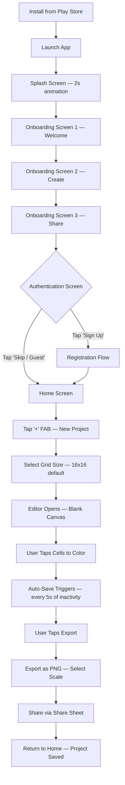

## 4.2 Returning User Journey

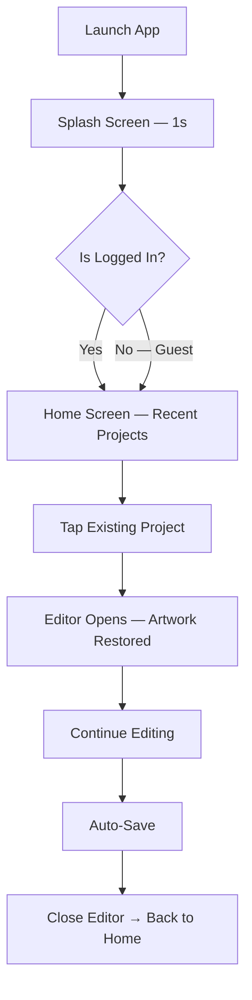

## 4.3 Template-Based Creation Journey

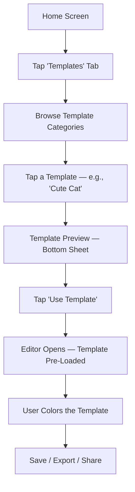

## 4.4 Community Gallery Journey

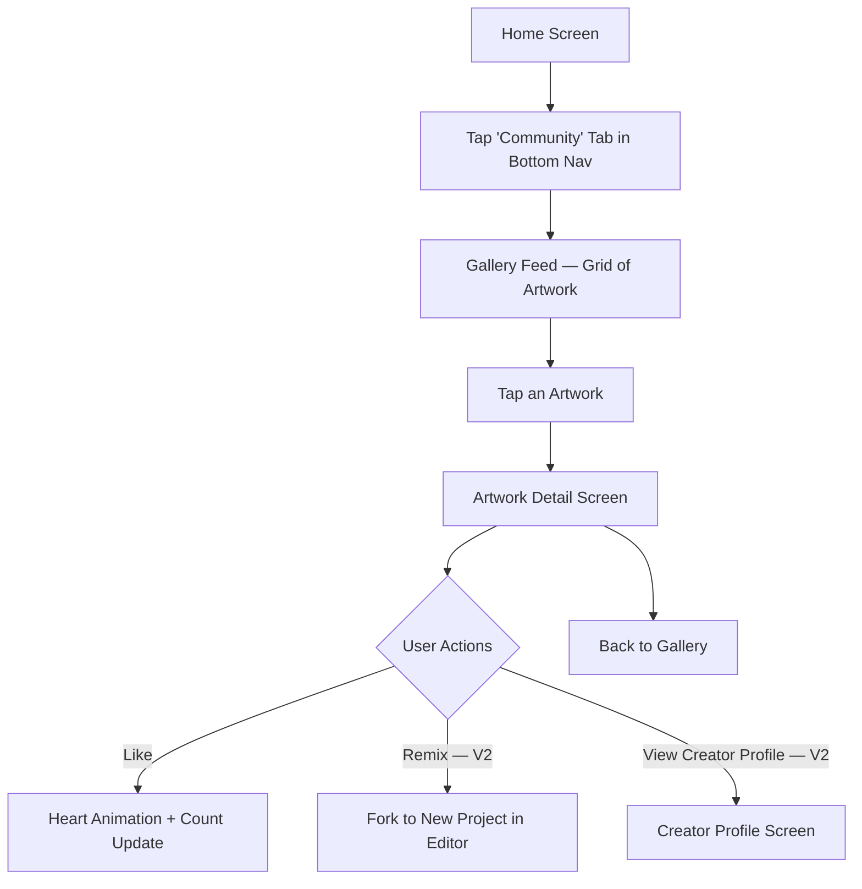

## 4.5 Cloud Sync Journey

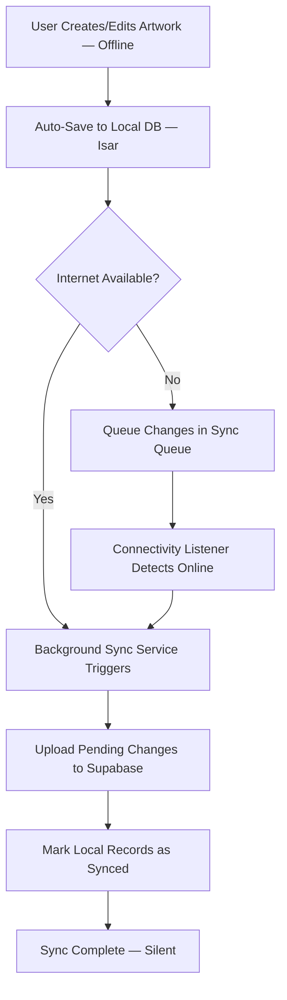

## 4.6 Export Journey

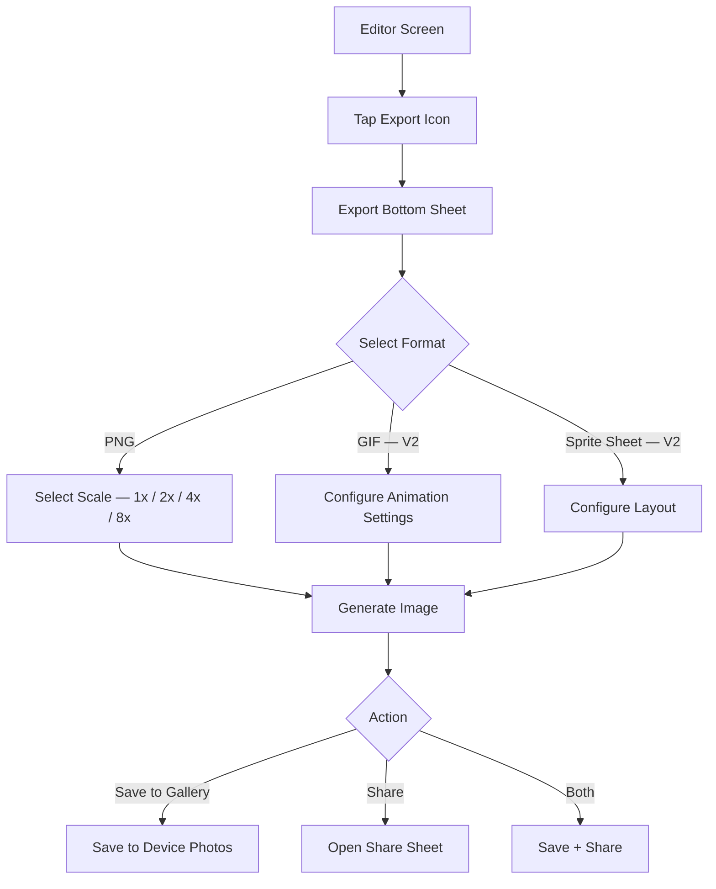

## 4.7 Authentication Journey

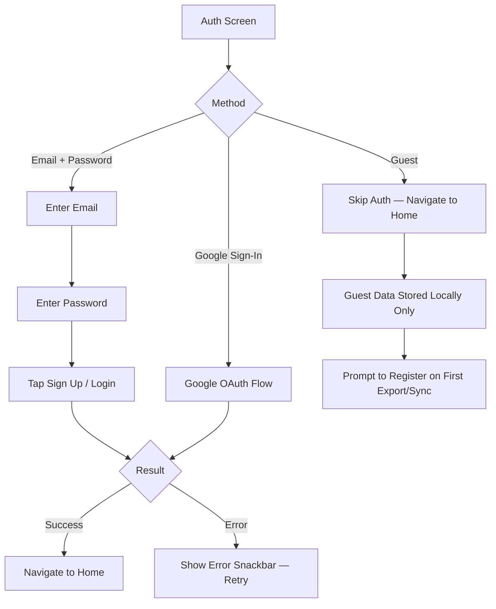

---

# 5. Information Architecture

## 5.1 Screen Inventory

### Splash Screen

| Attribute | Detail |
|---|---|
| **Purpose** | Brand impression, load app state, check auth status |
| **Components** | App logo animation, loading indicator (subtle) |
| **Navigation** | Auto-navigates to Onboarding (first launch) or Home (returning user) |
| **Entry Point** | App cold start |
| **Exit Point** | Onboarding or Home |
| **Dependencies** | Local preferences (isFirstLaunch, authToken) |

### Onboarding (3 Screens)

| Attribute | Detail |
|---|---|
| **Purpose** | Introduce app value proposition, build excitement |
| **Components** | Illustration, headline, sub-text, page indicator dots, Skip button, Next button, Get Started (final screen) |
| **Navigation** | Swipe horizontal or tap Next; Skip jumps to Auth; Get Started navigates to Auth |
| **Entry Point** | Splash (first launch only) |
| **Exit Point** | Authentication screen |
| **Dependencies** | None |

### Authentication Screen

| Attribute | Detail |
|---|---|
| **Purpose** | Register, login, or skip as guest |
| **Components** | Email input, Password input, Sign Up button, Login button, Google Sign-In button, Guest/Skip link, Terms of Service link |
| **Navigation** | Success → Home; Guest → Home (limited sync) |
| **Entry Point** | Onboarding or Settings (login later) |
| **Exit Point** | Home screen |
| **Dependencies** | Supabase Auth, Google Sign-In SDK |

### Home Screen

| Attribute | Detail |
|---|---|
| **Purpose** | Central hub — view recent projects, navigate to all features |
| **Components** | App bar (logo, search, notifications bell), Recent projects grid/list, FAB (new project), Empty state (first-time illustration), Sort/filter chips |
| **Navigation** | Part of Bottom Navigation shell; FAB → New Project dialog; Tap project → Editor; Bell → Notification center |
| **Entry Point** | Auth success, Back from Editor, Bottom Nav tap |
| **Exit Point** | Editor, New Project dialog, Templates, Community, Profile |
| **Dependencies** | Projects repository, local DB |

### New Project Dialog / Bottom Sheet

| Attribute | Detail |
|---|---|
| **Purpose** | Configure new canvas dimensions and name |
| **Components** | Project name input (optional — auto-generated default), Grid size picker (8×8, 16×16, 32×32, 64×64, custom), Background color toggle (transparent or white), Create button |
| **Navigation** | Create → Editor with blank canvas |
| **Entry Point** | FAB on Home |
| **Exit Point** | Editor or Cancel → Home |
| **Dependencies** | None |

### Editor Screen

| Attribute | Detail |
|---|---|
| **Purpose** | Core pixel art creation experience |
| **Components** | Canvas (interactive grid), Tool bar (bottom — pencil, eraser, fill, shape tools), Color palette bar (bottom — current palette, tap to expand), Top bar (undo, redo, layers, grid toggle, zoom reset, export, more menu), Layer panel (slide-out or bottom sheet), Zoom/pan gesture detector |
| **Navigation** | Back → Home (auto-save on exit); Export → Export sheet; Layers → Layer panel; Palette expand → Color picker |
| **Entry Point** | Home (new or existing project), Templates |
| **Exit Point** | Home (back), Export sheet, Share |
| **Dependencies** | Canvas rendering engine, Color palette, Layer system, Project repository, Auto-save service |

### Color Picker (Expanded)

| Attribute | Detail |
|---|---|
| **Purpose** | Select custom color or switch palettes |
| **Components** | Color wheel / HSL picker, HEX input, Recent colors row, Palette selector tabs, Saved palettes list, Eyedropper button |
| **Navigation** | Overlay on Editor; dismiss returns to Editor |
| **Entry Point** | Tap color swatch in palette bar |
| **Exit Point** | Select color → return to Editor |
| **Dependencies** | Palette repository |

### Layer Panel

| Attribute | Detail |
|---|---|
| **Purpose** | Manage canvas layers |
| **Components** | Layer list (thumbnail, name, visibility toggle, opacity slider), Add layer button, Delete layer (swipe or button), Reorder (drag handle), Merge down (long-press menu) |
| **Navigation** | Bottom sheet or side panel in Editor |
| **Entry Point** | Layers button in Editor top bar |
| **Exit Point** | Dismiss → Editor |
| **Dependencies** | Layer state in canvas engine |

### Templates Screen

| Attribute | Detail |
|---|---|
| **Purpose** | Browse and select pre-made templates |
| **Components** | Category chips (All, Animals, Characters, Food, Nature, etc.), Template grid (thumbnail + name), Search bar |
| **Navigation** | Part of Bottom Navigation; Tap template → Preview sheet → Editor |
| **Entry Point** | Bottom Nav tab |
| **Exit Point** | Editor (with template loaded) |
| **Dependencies** | Template repository (bundled assets + remote) |

### Community Gallery Screen

| Attribute | Detail |
|---|---|
| **Purpose** | Discover artwork from other creators |
| **Components** | Gallery grid (artwork thumbnails), Trending / Recent / Popular tabs, Search bar, Pull-to-refresh |
| **Navigation** | Part of Bottom Navigation; Tap artwork → Detail |
| **Entry Point** | Bottom Nav tab |
| **Exit Point** | Artwork detail, Creator profile |
| **Dependencies** | Community API (Supabase), Internet required (cached for offline browsing of previously loaded items) |

### Artwork Detail Screen

| Attribute | Detail |
|---|---|
| **Purpose** | View a single community artwork in detail |
| **Components** | Full artwork display, Title, Creator info (avatar + name), Like button + count, Created date, Remix button (V2), Comment section (V2), Report button |
| **Navigation** | Back → Gallery |
| **Entry Point** | Tap artwork in Gallery |
| **Exit Point** | Gallery, Creator profile, Editor (remix) |
| **Dependencies** | Community API |

### Profile Screen

| Attribute | Detail |
|---|---|
| **Purpose** | View and edit user profile, see personal stats |
| **Components** | Avatar, Username, Email, Artwork count, Total likes received, Published artworks grid, Edit profile button, Settings link, Logout button |
| **Navigation** | Part of Bottom Navigation |
| **Entry Point** | Bottom Nav tab |
| **Exit Point** | Settings, Edit Profile, Artwork detail |
| **Dependencies** | Auth state, User repository |

### Settings Screen

| Attribute | Detail |
|---|---|
| **Purpose** | App preferences and account management |
| **Components** | Default grid size, Haptic feedback toggle, Auto-save interval, Notifications toggle, Export quality default, Account section (change password, delete account), About section (version, licenses, privacy policy), Logout |
| **Navigation** | Push screen from Profile |
| **Entry Point** | Profile → Settings gear icon |
| **Exit Point** | Back → Profile |
| **Dependencies** | Preferences repository (local) |

### Notification Center Screen

| Attribute | Detail |
|---|---|
| **Purpose** | View in-app notifications |
| **Components** | Notification list (icon, title, message, timestamp), Read/unread indicators, Clear all button, Empty state |
| **Navigation** | Push screen from Home app bar bell icon |
| **Entry Point** | Bell icon on Home |
| **Exit Point** | Back → Home, Tap notification → relevant screen |
| **Dependencies** | Notifications repository |

### Export Bottom Sheet

| Attribute | Detail |
|---|---|
| **Purpose** | Configure and execute artwork export |
| **Components** | Format selector (PNG, GIF — V2, Sprite Sheet — V2), Scale selector (1x, 2x, 4x, 8x, 16x), Preview thumbnail, Save to device button, Share button, File size estimate |
| **Navigation** | Bottom sheet over Editor |
| **Entry Point** | Export button in Editor |
| **Exit Point** | Dismiss → Editor |
| **Dependencies** | Export service, image encoding library |

---

# 6. Application Modules

## 6.1 Module Overview

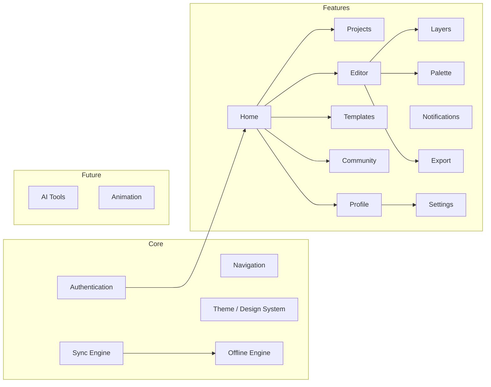

## 6.2 Module Responsibilities

### Authentication Module
- **Responsibility:** User identity lifecycle — registration, login, logout, session management, token refresh, guest mode, account deletion.
- **Owns:** Auth state, user tokens, session expiry logic.
- **Depends on:** Supabase Auth, Google Sign-In SDK, Secure Storage.
- **Exposes:** `AuthNotifier` (Riverpod), `AuthRepository`, `AuthGuard` for route protection.

### Home Module
- **Responsibility:** Central dashboard — displays recent projects, entry point to all features, search, and quick actions.
- **Owns:** Home screen UI, project sorting/filtering, empty states.
- **Depends on:** Projects module, Navigation module.
- **Exposes:** `HomeScreen` widget.

### Projects Module
- **Responsibility:** CRUD operations on user projects — create, read, update, delete, rename, duplicate, list, search, sort.
- **Owns:** Project entity, project list state, project metadata.
- **Depends on:** Local DB (Isar), Sync engine, Storage module.
- **Exposes:** `ProjectRepository`, `ProjectListNotifier`, project models.

### Editor Module
- **Responsibility:** Core pixel art editing experience — canvas rendering, tool management, gesture handling, undo/redo stack, auto-save orchestration.
- **Owns:** Canvas state (2D pixel grid per layer), active tool, zoom/pan transform, undo/redo history.
- **Depends on:** Layers module, Palette module, Projects module (save/load), Export module.
- **Exposes:** `EditorScreen`, `CanvasNotifier`, `ToolNotifier`, `HistoryNotifier`.

### Layers Module
- **Responsibility:** Multi-layer management — add, remove, reorder, toggle visibility, adjust opacity, merge layers.
- **Owns:** Layer stack, per-layer pixel data, active layer state.
- **Depends on:** Editor module (canvas compositing).
- **Exposes:** `LayerNotifier`, `LayerRepository` (persists layer data within project).

### Palette Module
- **Responsibility:** Color management — built-in palettes, custom palettes, color picker UI, recent colors, eyedropper coordination.
- **Owns:** Palette library, active palette, current color state, custom palette CRUD.
- **Depends on:** Local DB (persist custom palettes).
- **Exposes:** `PaletteNotifier`, `ColorPickerWidget`, `PaletteRepository`.

### Templates Module
- **Responsibility:** Browse, search, preview, and instantiate pre-built templates.
- **Owns:** Template library (bundled + remote), template categories, template metadata.
- **Depends on:** Projects module (create project from template), Assets (bundled templates).
- **Exposes:** `TemplatesScreen`, `TemplateRepository`.

### Community Module
- **Responsibility:** Social features — gallery browsing, publishing artwork, likes, (future: comments, follows, remix).
- **Owns:** Gallery feed state, published artwork metadata, like state.
- **Depends on:** Community API (Supabase), Auth module (must be logged in to publish/like).
- **Exposes:** `CommunityScreen`, `ArtworkDetailScreen`, `CommunityRepository`.

### Notifications Module
- **Responsibility:** Push notification handling, in-app notification center, notification preferences.
- **Owns:** Notification list, read/unread state, FCM token management.
- **Depends on:** Firebase Cloud Messaging, Supabase (notification records), Auth module.
- **Exposes:** `NotificationCenterScreen`, `NotificationRepository`, `NotificationService`.

### Profile Module
- **Responsibility:** User profile display and editing — avatar, username, stats, published artworks.
- **Owns:** Profile screen UI, user stats aggregation.
- **Depends on:** Auth module, Projects module (artwork count), Community module (published artworks, total likes).
- **Exposes:** `ProfileScreen`, `EditProfileScreen`.

### Settings Module
- **Responsibility:** App preferences — defaults, toggles, account management.
- **Owns:** Settings state, preferences persistence.
- **Depends on:** SharedPreferences / local config, Auth module (logout, delete account).
- **Exposes:** `SettingsScreen`, `SettingsRepository`.

### Export Module
- **Responsibility:** Render canvas to exportable formats, handle save-to-device and share-sheet integration.
- **Owns:** Image encoding pipeline, scale selection, format handling, file I/O.
- **Depends on:** Editor module (canvas data), Layers module (composited output), platform channels (save to gallery, share sheet).
- **Exposes:** `ExportService`, `ExportBottomSheet`.

### AI Module (Future — V2)
- **Responsibility:** AI-powered features — color suggestions, auto-complete, style transfer.
- **Owns:** AI model integration, prompt handling, result rendering.
- **Depends on:** External AI API (e.g., Vertex AI, Gemini API), Editor module.
- **Exposes:** `AiService`, `AiSuggestionWidget`.

### Offline Sync Module
- **Responsibility:** Orchestrate offline-first data flow — local persistence, sync queue, background sync, conflict resolution.
- **Owns:** Sync queue, sync status per entity, connectivity listener, conflict resolution strategy.
- **Depends on:** Local DB (Isar), Supabase REST, Connectivity Plus package.
- **Exposes:** `SyncService`, `SyncStatusNotifier`, `ConnectivityNotifier`.

---

# 7. Navigation Architecture

## 7.1 Navigation Stack

```
App Entry
├── Splash Screen (auto-route)
├── Onboarding Flow (PageView — 3 pages, first launch only)
├── Authentication Screen
└── App Shell (ScaffoldWithBottomNavBar)
    ├── Tab 0: Home
    │   ├── Project List
    │   ├── → Editor (push)
    │   └── → Notification Center (push)
    ├── Tab 1: Templates
    │   ├── Template Grid
    │   └── → Editor (push, with template data)
    ├── Tab 2: Community
    │   ├── Gallery Feed
    │   └── → Artwork Detail (push)
    │       └── → Creator Profile (push, V2)
    ├── Tab 3: Profile
    │   ├── Profile View
    │   ├── → Settings (push)
    │   └── → Edit Profile (push)
    └── FAB: New Project (Bottom Sheet over any tab)
```

## 7.2 Bottom Navigation

| Index | Label | Icon | Screen | Badge |
|---|---|---|---|---|
| 0 | Home | `Icons.home_rounded` | Home / Projects | — |
| 1 | Templates | `Icons.grid_view_rounded` | Template Library | — |
| 2 | Community | `Icons.explore_rounded` | Gallery Feed | — |
| 3 | Profile | `Icons.person_rounded` | Profile | — |

> **Note:** The FAB (Floating Action Button) for "New Project" floats above the Bottom Navigation bar, centered or docked. It is NOT a tab.

## 7.3 Nested Navigation

Each Bottom Nav tab maintains its own `Navigator` (using `go_router` `StatefulShellRoute`). This ensures:
- Independent back stacks per tab.
- Tab state preservation when switching between tabs.
- Deep link support per tab.

## 7.4 Dialogs

| Dialog | Type | Trigger |
|---|---|---|
| New Project | Bottom Sheet | FAB tap |
| Delete Project Confirmation | Alert Dialog | Long-press project → Delete |
| Rename Project | Alert Dialog with TextField | Long-press project → Rename |
| Discard Changes | Alert Dialog | Back from Editor with unsaved changes (edge case) |
| Logout Confirmation | Alert Dialog | Profile → Settings → Logout |
| Delete Account Confirmation | Alert Dialog (destructive) | Settings → Delete Account |
| Export Options | Bottom Sheet | Editor → Export icon |
| Color Picker | Bottom Sheet (large) | Tap color swatch in palette bar |
| Layer Panel | Bottom Sheet (draggable) | Editor → Layers icon |

## 7.5 Deep Links (Future)

| Deep Link | Target |
|---|---|
| `pixelcanvas://artwork/{id}` | Community → Artwork Detail |
| `pixelcanvas://project/{id}` | Home → Editor (if owned) |
| `pixelcanvas://template/{id}` | Templates → Preview → Editor |
| `pixelcanvas://profile/{userId}` | Community → Creator Profile |
| `pixelcanvas://challenge/{id}` | Daily Challenge (V2) |

## 7.6 Navigation Package

**go_router** (latest stable) — chosen for:
- Declarative routing.
- `StatefulShellRoute` for bottom nav with preserved state.
- Built-in deep link support.
- Redirect guards (auth check).
- Typed route parameters.

---

# 8. Folder Architecture

## 8.1 Feature-First Structure

```
lib/
├── main.dart                          # App entry point
├── app.dart                           # MaterialApp.router configuration
├── bootstrap.dart                     # Dependency initialization
│
├── core/                              # Shared core — NOT feature-specific
│   ├── constants/
│   │   ├── app_constants.dart         # Grid sizes, max layers, undo limit
│   │   ├── api_constants.dart         # Supabase URLs, endpoints
│   │   └── storage_constants.dart     # DB names, bucket names
│   │
│   ├── errors/
│   │   ├── app_exception.dart         # Base exception class
│   │   ├── network_exception.dart
│   │   └── storage_exception.dart
│   │
│   ├── extensions/
│   │   ├── context_extensions.dart    # Theme, MediaQuery shortcuts
│   │   ├── color_extensions.dart      # HEX ↔ Color, brightness
│   │   ├── date_extensions.dart
│   │   └── string_extensions.dart
│   │
│   ├── network/
│   │   ├── connectivity_service.dart  # Online/offline stream
│   │   ├── supabase_client.dart       # Singleton Supabase init
│   │   └── api_interceptor.dart       # Logging, error handling
│   │
│   ├── storage/
│   │   ├── local_database.dart        # Isar DB initialization
│   │   ├── secure_storage.dart        # flutter_secure_storage wrapper
│   │   └── preferences_service.dart   # SharedPreferences wrapper
│   │
│   ├── sync/
│   │   ├── sync_service.dart          # Background sync orchestrator
│   │   ├── sync_queue.dart            # Pending operations queue
│   │   ├── sync_status.dart           # Enum: synced, pending, conflict
│   │   └── conflict_resolver.dart     # LWW conflict resolution
│   │
│   └── utils/
│       ├── image_utils.dart           # PNG encoding, scaling
│       ├── color_utils.dart           # Color math, palette generation
│       ├── debouncer.dart             # Auto-save debounce
│       └── logger.dart                # Structured logging
│
├── shared/                            # Shared UI components — used across features
│   ├── widgets/
│   │   ├── pc_button.dart             # PixelCanvas branded button
│   │   ├── pc_icon_button.dart
│   │   ├── pc_card.dart
│   │   ├── pc_text_field.dart
│   │   ├── pc_bottom_sheet.dart
│   │   ├── pc_dialog.dart
│   │   ├── pc_loading.dart            # Shimmer / skeleton loader
│   │   ├── pc_empty_state.dart
│   │   ├── pc_error_state.dart
│   │   ├── pc_avatar.dart
│   │   ├── pc_snackbar.dart
│   │   └── pc_chip.dart
│   │
│   ├── layout/
│   │   ├── app_scaffold.dart          # Base scaffold with bottom nav
│   │   └── responsive_builder.dart    # Breakpoint-based layout
│   │
│   └── animations/
│       ├── fade_in.dart
│       ├── slide_up.dart
│       └── scale_bounce.dart
│
├── theme/
│   ├── app_theme.dart                 # ThemeData — LIGHT ONLY
│   ├── app_colors.dart                # Color palette constants
│   ├── app_typography.dart            # TextStyles (Google Fonts)
│   ├── app_spacing.dart               # Spacing scale (4, 8, 12, 16, 20, 24, 32, 48)
│   ├── app_radius.dart                # Border radius scale
│   └── app_shadows.dart               # Elevation shadows
│
├── navigation/
│   ├── app_router.dart                # go_router configuration
│   ├── route_names.dart               # Named route constants
│   └── auth_guard.dart                # Redirect logic for auth
│
├── features/
│   ├── splash/
│   │   └── presentation/
│   │       └── splash_screen.dart
│   │
│   ├── onboarding/
│   │   └── presentation/
│   │       ├── onboarding_screen.dart
│   │       └── widgets/
│   │           └── onboarding_page.dart
│   │
│   ├── auth/
│   │   ├── data/
│   │   │   ├── auth_repository_impl.dart
│   │   │   └── models/
│   │   │       └── user_model.dart
│   │   ├── domain/
│   │   │   ├── auth_repository.dart   # Abstract interface
│   │   │   └── entities/
│   │   │       └── app_user.dart
│   │   └── presentation/
│   │       ├── auth_screen.dart
│   │       ├── providers/
│   │       │   └── auth_notifier.dart
│   │       └── widgets/
│   │           ├── login_form.dart
│   │           └── signup_form.dart
│   │
│   ├── home/
│   │   └── presentation/
│   │       ├── home_screen.dart
│   │       ├── providers/
│   │       │   └── home_notifier.dart
│   │       └── widgets/
│   │           ├── project_grid.dart
│   │           ├── project_card.dart
│   │           └── new_project_sheet.dart
│   │
│   ├── projects/
│   │   ├── data/
│   │   │   ├── project_repository_impl.dart
│   │   │   ├── models/
│   │   │   │   └── project_model.dart # Isar schema
│   │   │   └── datasources/
│   │   │       ├── project_local_ds.dart
│   │   │       └── project_remote_ds.dart
│   │   ├── domain/
│   │   │   ├── project_repository.dart
│   │   │   └── entities/
│   │   │       └── project.dart
│   │   └── presentation/
│   │       └── providers/
│   │           └── project_list_notifier.dart
│   │
│   ├── editor/
│   │   ├── data/
│   │   │   └── models/
│   │   │       ├── pixel_data.dart     # Per-cell color data
│   │   │       └── canvas_state.dart
│   │   ├── domain/
│   │   │   ├── canvas_engine.dart      # Core canvas logic
│   │   │   ├── tools/
│   │   │   │   ├── tool.dart           # Abstract tool interface
│   │   │   │   ├── pencil_tool.dart
│   │   │   │   ├── eraser_tool.dart
│   │   │   │   ├── fill_tool.dart
│   │   │   │   ├── line_tool.dart
│   │   │   │   ├── rectangle_tool.dart
│   │   │   │   └── circle_tool.dart
│   │   │   └── history/
│   │   │       ├── history_manager.dart # Undo/Redo stack
│   │   │       └── canvas_action.dart   # Command pattern
│   │   └── presentation/
│   │       ├── editor_screen.dart
│   │       ├── providers/
│   │       │   ├── canvas_notifier.dart
│   │       │   ├── tool_notifier.dart
│   │       │   └── zoom_notifier.dart
│   │       └── widgets/
│   │           ├── canvas_painter.dart  # CustomPainter
│   │           ├── tool_bar.dart
│   │           ├── grid_overlay.dart
│   │           └── canvas_gesture_handler.dart
│   │
│   ├── layers/
│   │   ├── data/
│   │   │   └── models/
│   │   │       └── layer_model.dart
│   │   ├── domain/
│   │   │   └── entities/
│   │   │       └── layer.dart
│   │   └── presentation/
│   │       ├── providers/
│   │       │   └── layer_notifier.dart
│   │       └── widgets/
│   │           ├── layer_panel.dart
│   │           └── layer_tile.dart
│   │
│   ├── palette/
│   │   ├── data/
│   │   │   ├── palette_repository_impl.dart
│   │   │   └── models/
│   │   │       └── palette_model.dart
│   │   ├── domain/
│   │   │   ├── palette_repository.dart
│   │   │   └── entities/
│   │   │       └── color_palette.dart
│   │   └── presentation/
│   │       ├── providers/
│   │       │   └── palette_notifier.dart
│   │       └── widgets/
│   │           ├── palette_bar.dart
│   │           ├── color_picker_sheet.dart
│   │           └── palette_selector.dart
│   │
│   ├── templates/
│   │   ├── data/
│   │   │   ├── template_repository_impl.dart
│   │   │   └── models/
│   │   │       └── template_model.dart
│   │   ├── domain/
│   │   │   ├── template_repository.dart
│   │   │   └── entities/
│   │   │       └── pixel_template.dart
│   │   └── presentation/
│   │       ├── templates_screen.dart
│   │       ├── providers/
│   │       │   └── template_notifier.dart
│   │       └── widgets/
│   │           ├── template_grid.dart
│   │           ├── template_card.dart
│   │           └── template_preview_sheet.dart
│   │
│   ├── community/
│   │   ├── data/
│   │   │   ├── community_repository_impl.dart
│   │   │   └── models/
│   │   │       └── gallery_artwork_model.dart
│   │   ├── domain/
│   │   │   ├── community_repository.dart
│   │   │   └── entities/
│   │   │       └── gallery_artwork.dart
│   │   └── presentation/
│   │       ├── community_screen.dart
│   │       ├── artwork_detail_screen.dart
│   │       ├── providers/
│   │       │   └── community_notifier.dart
│   │       └── widgets/
│   │           ├── gallery_grid.dart
│   │           └── artwork_card.dart
│   │
│   ├── notifications/
│   │   ├── data/
│   │   │   ├── notification_repository_impl.dart
│   │   │   └── models/
│   │   │       └── notification_model.dart
│   │   ├── domain/
│   │   │   ├── notification_repository.dart
│   │   │   ├── notification_service.dart
│   │   │   └── entities/
│   │   │       └── app_notification.dart
│   │   └── presentation/
│   │       ├── notification_center_screen.dart
│   │       └── providers/
│   │           └── notification_notifier.dart
│   │
│   ├── profile/
│   │   └── presentation/
│   │       ├── profile_screen.dart
│   │       ├── edit_profile_screen.dart
│   │       └── providers/
│   │           └── profile_notifier.dart
│   │
│   ├── settings/
│   │   ├── data/
│   │   │   └── settings_repository_impl.dart
│   │   ├── domain/
│   │   │   └── settings_repository.dart
│   │   └── presentation/
│   │       ├── settings_screen.dart
│   │       └── providers/
│   │           └── settings_notifier.dart
│   │
│   └── export/
│       ├── data/
│       │   └── export_service_impl.dart
│       ├── domain/
│       │   └── export_service.dart
│       └── presentation/
│           └── widgets/
│               └── export_bottom_sheet.dart
│
├── l10n/                              # Localization (Future)
│   └── app_en.arb
│
└── gen/                               # Generated files (Isar, Riverpod, etc.)
    └── ...

assets/
├── images/
│   ├── logo/
│   │   ├── logo.png
│   │   └── logo_splash.png
│   ├── onboarding/
│   │   ├── onboarding_1.png
│   │   ├── onboarding_2.png
│   │   └── onboarding_3.png
│   └── empty_states/
│       ├── no_projects.png
│       └── no_community.png
│
├── palettes/                          # Bundled color palettes as JSON
│   ├── default.json
│   ├── gameboy.json
│   ├── pastel.json
│   ├── neon.json
│   └── ...
│
├── templates/                         # Bundled template data (JSON + thumbnail PNGs)
│   ├── animals/
│   ├── characters/
│   ├── food/
│   └── nature/
│
├── fonts/                             # Google Fonts cached locally
│   └── ...
│
└── lottie/                            # Lottie animation files
    ├── splash_animation.json
    └── save_success.json

test/
├── core/
│   ├── sync/
│   │   └── sync_service_test.dart
│   └── utils/
│       └── color_utils_test.dart
├── features/
│   ├── editor/
│   │   ├── domain/
│   │   │   ├── canvas_engine_test.dart
│   │   │   └── tools/
│   │   │       ├── pencil_tool_test.dart
│   │   │       ├── fill_tool_test.dart
│   │   │       └── ...
│   │   └── presentation/
│   │       └── editor_screen_test.dart
│   ├── projects/
│   │   └── data/
│   │       └── project_repository_test.dart
│   └── ...
└── shared/
    └── widgets/
        └── pc_button_test.dart

integration_test/
├── auth_flow_test.dart
├── editor_flow_test.dart
└── export_flow_test.dart
```

## 8.2 Architecture Layers per Feature

Each feature follows a 3-layer architecture:

```
feature/
├── data/            # Implementation layer
│   ├── models/      # DB models, API DTOs (Isar schemas, JSON serializable)
│   ├── datasources/ # Local (Isar) and Remote (Supabase) data sources
│   └── *_repository_impl.dart  # Concrete repository implementation
│
├── domain/          # Business logic layer
│   ├── entities/    # Pure Dart entities (UI-facing, no serialization)
│   ├── *_repository.dart  # Abstract repository interface
│   └── *_service.dart     # Use cases / business logic
│
└── presentation/    # UI layer
    ├── *_screen.dart      # Screen widgets
    ├── providers/         # Riverpod notifiers
    └── widgets/           # Feature-specific reusable widgets
```

**Data flows upward:** `DataSource → Repository → Notifier → Widget`
**Dependencies point inward:** Presentation depends on Domain. Data implements Domain. Domain depends on nothing.

---

# 9. Design System Mapping

> All design tokens are derived from the existing Stitch UI. Light theme only. No dark theme.

## 9.1 Color Palette

| Token | HEX | Usage |
|---|---|---|
| `primary` | `#6C5CE7` | Primary buttons, FAB, active states, links |
| `primaryLight` | `#A29BFE` | Hover states, light backgrounds, selected chips |
| `primaryDark` | `#4A3CB5` | Pressed states, emphasis |
| `secondary` | `#00CEC9` | Accent highlights, badges, progress indicators |
| `surface` | `#FFFFFF` | Cards, sheets, dialogs, inputs |
| `background` | `#F8F9FA` | Screen background, scaffold |
| `onPrimary` | `#FFFFFF` | Text/icons on primary surfaces |
| `onSurface` | `#2D3436` | Primary text, headings |
| `onSurfaceVariant` | `#636E72` | Secondary text, captions, placeholders |
| `outline` | `#DFE6E9` | Borders, dividers, input outlines |
| `outlineFocused` | `#6C5CE7` | Focused input borders |
| `error` | `#FF6B6B` | Error states, destructive actions |
| `errorContainer` | `#FFF0F0` | Error backgrounds |
| `success` | `#00B894` | Success states, sync complete |
| `successContainer` | `#E8F8F5` | Success backgrounds |
| `warning` | `#FDCB6E` | Warning states |
| `gridLine` | `#E0E0E0` | Canvas gridlines (at 50% opacity) |
| `canvasBackground` | `#FFFFFF` | Default canvas background |
| `transparentCheckerLight` | `#EEEEEE` | Transparency checker pattern - light |
| `transparentCheckerDark` | `#CCCCCC` | Transparency checker pattern - dark |

## 9.2 Typography

| Style | Font Family | Weight | Size | Line Height | Usage |
|---|---|---|---|---|---|
| `displayLarge` | Inter | Bold (700) | 32 | 40 | Splash branding |
| `headlineLarge` | Inter | SemiBold (600) | 24 | 32 | Screen titles |
| `headlineMedium` | Inter | SemiBold (600) | 20 | 28 | Section headers |
| `titleLarge` | Inter | Medium (500) | 18 | 24 | Card titles, project names |
| `titleMedium` | Inter | Medium (500) | 16 | 22 | Toolbar labels |
| `bodyLarge` | Inter | Regular (400) | 16 | 24 | Body text |
| `bodyMedium` | Inter | Regular (400) | 14 | 20 | Descriptions, secondary text |
| `bodySmall` | Inter | Regular (400) | 12 | 16 | Captions, timestamps |
| `labelLarge` | Inter | SemiBold (600) | 14 | 20 | Button text |
| `labelMedium` | Inter | Medium (500) | 12 | 16 | Chips, badges |
| `labelSmall` | Inter | Medium (500) | 10 | 14 | Overlines, metadata |

## 9.3 Spacing Scale

| Token | Value | Usage |
|---|---|---|
| `xs` | 4 | Minimum spacing, icon padding |
| `sm` | 8 | Between related elements, chip padding |
| `md` | 12 | Input padding, small gaps |
| `base` | 16 | Standard padding (screen edges, card padding) |
| `lg` | 20 | Between sections |
| `xl` | 24 | Between unrelated groups |
| `xxl` | 32 | Large section separators |
| `xxxl` | 48 | Screen top/bottom padding |

## 9.4 Border Radius

| Token | Value | Usage |
|---|---|---|
| `none` | 0 | Sharp corners (canvas, pixel grid) |
| `sm` | 4 | Chips, tags |
| `md` | 8 | Inputs, small cards |
| `base` | 12 | Cards, dialogs |
| `lg` | 16 | Bottom sheets, large cards |
| `xl` | 20 | Modals, onboarding cards |
| `full` | 999 | FAB, circular avatars, pills |

## 9.5 Shadows / Elevation

| Token | Elevation | Usage |
|---|---|---|
| `none` | 0 | Flat elements |
| `low` | `0 1px 3px rgba(0,0,0,0.08)` | Cards, inputs |
| `medium` | `0 4px 12px rgba(0,0,0,0.10)` | Floating elements, dropdowns |
| `high` | `0 8px 24px rgba(0,0,0,0.12)` | Dialogs, bottom sheets |
| `highest` | `0 16px 48px rgba(0,0,0,0.16)` | Modals, overlays |

## 9.6 Component Mapping

### Buttons

| Variant | Style | Use Case |
|---|---|---|
| `PcButton.primary` | Filled, primary color, rounded-full | Main CTAs (Create, Sign Up, Export) |
| `PcButton.secondary` | Outlined, primary border, transparent fill | Secondary actions (Cancel, Skip) |
| `PcButton.text` | No border, no fill, primary text | Tertiary actions (Links, "Forgot password") |
| `PcButton.destructive` | Filled, error color | Delete, Logout |
| `PcButton.icon` | CircleAvatar-style, icon only | Toolbar icons, action icons |

### Cards

| Variant | Use Case |
|---|---|
| `PcCard.project` | Project thumbnail in Home grid — image, title, date, 3-dot menu |
| `PcCard.template` | Template in library — image, category badge, title |
| `PcCard.artwork` | Gallery artwork — image, creator avatar, like count |
| `PcCard.notification` | Notification item — icon, title, message, timestamp |

### Inputs

| Variant | Use Case |
|---|---|
| `PcTextField.standard` | Email, password, project name |
| `PcTextField.search` | Search bar with leading icon and clear button |
| `PcTextField.hex` | HEX color input with # prefix and color preview |

### Dialogs

| Variant | Use Case |
|---|---|
| `PcDialog.confirm` | Confirmation with title, message, Cancel + Confirm buttons |
| `PcDialog.destructive` | Delete confirmation with red Confirm button |
| `PcDialog.input` | Dialog with text input (Rename project) |

### Bottom Sheets

| Variant | Use Case |
|---|---|
| `PcBottomSheet.standard` | Draggable with handle, title, content area |
| `PcBottomSheet.colorPicker` | Large sheet for color picker with preview |
| `PcBottomSheet.export` | Export options with format/scale selectors |
| `PcBottomSheet.layers` | Scrollable layer list with drag-to-reorder |
| `PcBottomSheet.newProject` | Grid size selection with preview |

### Icons

Use Material Symbols Rounded (filled variant for active state, outlined for inactive).

| Context | Style |
|---|---|
| Bottom Nav (active) | Filled |
| Bottom Nav (inactive) | Outlined |
| Toolbar | Outlined, 24dp |
| Action buttons | Outlined, 20dp |

### Grid System

Canvas grid rendering uses `CustomPainter` with:
- Grid lines drawn at pixel boundaries.
- Line color: `gridLine` at 50% opacity.
- Line width: 0.5 logical pixels at 1x zoom, scale-independent.
- Grid fades out when zoom level < 0.5x (too dense to be useful).
- Grid intensifies when zoom > 2x.

---

# 10. State Management Strategy

## 10.1 Why Riverpod

| Criterion | Riverpod | Provider | BLoC |
|---|---|---|---|
| Compile-time safety | ✅ | ❌ | ✅ |
| No BuildContext needed for DI | ✅ | ❌ | ❌ |
| Code generation support | ✅ | ❌ | ✅ |
| Testing (no widget tree needed) | ✅ | ❌ | ✅ |
| Caching & auto-dispose | ✅ Built-in | ❌ | ❌ Manual |
| Learning curve | Medium | Low | High |
| Community & maintenance | Active | Legacy | Active |

**Decision:** Use **Riverpod 2.x with code generation** (`riverpod_annotation`, `riverpod_generator`).

## 10.2 Provider Hierarchy

```
┌──────────────────────────────────────────────────────────────┐
│                    Infrastructure Providers                   │
│  (Never auto-dispose — live for app lifetime)                │
├──────────────────────────────────────────────────────────────┤
│  supabaseClientProvider          → Supabase.instance         │
│  isarProvider                    → Isar database instance     │
│  secureStorageProvider           → FlutterSecureStorage       │
│  connectivityProvider            → Stream<ConnectivityStatus>  │
│  sharedPreferencesProvider       → SharedPreferences instance  │
└──────────────────────────────────────────────────────────────┘
                              │
                              ▼
┌──────────────────────────────────────────────────────────────┐
│                    Repository Providers                       │
│  (Never auto-dispose — stateless services)                   │
├──────────────────────────────────────────────────────────────┤
│  authRepositoryProvider          → AuthRepository            │
│  projectRepositoryProvider       → ProjectRepository         │
│  paletteRepositoryProvider       → PaletteRepository         │
│  templateRepositoryProvider      → TemplateRepository        │
│  communityRepositoryProvider     → CommunityRepository       │
│  notificationRepositoryProvider  → NotificationRepository    │
│  settingsRepositoryProvider      → SettingsRepository        │
│  syncServiceProvider             → SyncService               │
│  exportServiceProvider           → ExportService             │
└──────────────────────────────────────────────────────────────┘
                              │
                              ▼
┌──────────────────────────────────────────────────────────────┐
│                 Feature State Providers                       │
│  (Auto-dispose when no listeners — screen-scoped)            │
├──────────────────────────────────────────────────────────────┤
│  authNotifierProvider            → AsyncNotifier<AuthState>   │
│  projectListProvider             → AsyncNotifier<List<Proj>>  │
│  canvasNotifierProvider(projId)  → Notifier<CanvasState>      │
│  toolNotifierProvider            → Notifier<ToolState>        │
│  layerNotifierProvider(projId)   → Notifier<LayerState>       │
│  paletteNotifierProvider         → Notifier<PaletteState>     │
│  communityFeedProvider           → AsyncNotifier<GalleryFeed> │
│  notificationListProvider        → AsyncNotifier<List<Notif>> │
│  profileProvider                 → AsyncNotifier<UserProfile> │
│  settingsNotifierProvider        → Notifier<SettingsState>    │
│  zoomNotifierProvider            → Notifier<ZoomState>        │
│  historyNotifierProvider(projId) → Notifier<HistoryState>     │
│  syncStatusProvider              → StreamProvider<SyncStatus>  │
│  exportNotifierProvider          → AsyncNotifier<ExportState>  │
└──────────────────────────────────────────────────────────────┘
```

## 10.3 State Flow — Editor Example

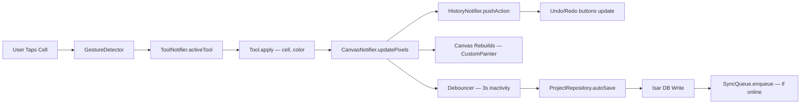

## 10.4 Caching Strategy

| Data | Cache Location | TTL | Invalidation |
|---|---|---|---|
| Auth token | Secure Storage | Until logout | Manual on logout |
| Active project canvas | In-memory (Notifier state) | While editor is open | Auto-dispose on navigate away |
| Project list | Isar (local DB) | Permanent | Re-fetch on pull-to-refresh |
| Community gallery page | In-memory + Isar cache | 5 minutes | Pull-to-refresh, scroll-to-load |
| Templates | Bundled assets + Isar cache | 24 hours for remote | App update or force refresh |
| Color palettes | Isar | Permanent | User edit or app update |
| Settings / Preferences | SharedPreferences | Permanent | User change |
| User profile | Isar + in-memory | 10 minutes | Profile edit, pull-to-refresh |

## 10.5 Repository Pattern

Every data-accessing feature implements:

```
Abstract Repository (Domain layer)
     ↑ implements
Concrete RepositoryImpl (Data layer)
     ├── LocalDataSource (Isar)
     └── RemoteDataSource (Supabase)
```

The repository is responsible for:
1. Checking connectivity.
2. Reading from local first (offline-first).
3. Attempting remote sync in background.
4. Handling errors and returning domain entities.

## 10.6 Dependency Injection

All DI is handled via Riverpod providers. No `get_it`, no `injectable`, no service locators.

- Infrastructure is initialized in `bootstrap.dart` and overridden in `ProviderScope.overrides` for testing.
- Repositories are wired via `ref.watch(isarProvider)` and `ref.watch(supabaseClientProvider)`.
- Feature notifiers receive repositories via constructor injection from Riverpod's `ref`.

---

# 11. Offline-First Strategy

## 11.1 Design Principles

1. **Local is truth.** Every user action writes to the local database first. Network operations are always secondary.
2. **Background sync is invisible.** Users never wait for network. Sync happens silently.
3. **Every feature works offline.** Create, edit, save, export, manage projects — all offline.
4. **Community features degrade gracefully.** Gallery shows cached content with a "You're offline" banner. Publishing queues for later.

## 11.2 Local Database — Isar

**Why Isar:**
- NoSQL — perfect for flexible pixel art data structures.
- Extremely fast — native Dart implementation.
- Built for Flutter — zero overhead, async queries.
- Supports complex objects, lists, embedded objects.
- Full-text search built-in.
- Free and open-source.

**Collections (Tables):**

| Collection | Contents |
|---|---|
| `ProjectCollection` | Project metadata + per-layer pixel data (embedded) |
| `PaletteCollection` | Custom and downloaded palettes |
| `TemplateCollection` | Cached template metadata + data |
| `NotificationCollection` | Cached notifications |
| `GalleryCache` | Cached community artwork for offline browsing |
| `SyncQueueCollection` | Pending sync operations |
| `UserPreferencesCollection` | Local settings and preferences |

## 11.3 Auto-Save Pipeline

```
User action (tap cell, change color, move layer)
         │
         ▼
  Canvas state mutation (in-memory)
         │
         ▼
  Debouncer resets (3 seconds)
         │
    ┌────┴────────────────────┐
    │  3s inactivity elapsed  │
    └────┬────────────────────┘
         │
         ▼
  Serialize canvas state to ProjectModel
         │
         ▼
  Write to Isar (async, non-blocking)
         │
         ▼
  Update project.updatedAt timestamp
         │
         ▼
  Enqueue sync operation (if user is authenticated)
         │
         ▼
  UI shows subtle "Saved" indicator (checkmark, fades after 1s)
```

**Auto-save also triggers on:**
- Editor `dispose()` (navigate away).
- App lifecycle `paused` / `inactive` (user switches app).
- Every 30 seconds unconditionally (safety net).

## 11.4 Sync Queue

The sync queue is a persistent Isar collection that stores operations pending upload.

| Field | Type | Description |
|---|---|---|
| `id` | int (auto) | Local queue ID |
| `entityType` | String | `project`, `palette`, `like`, `profile` |
| `entityId` | String | Local UUID of the entity |
| `operation` | String | `create`, `update`, `delete` |
| `payload` | String (JSON) | Serialized entity data |
| `createdAt` | DateTime | When the operation was queued |
| `retryCount` | int | Number of failed sync attempts |
| `status` | String | `pending`, `in_progress`, `failed`, `completed` |

## 11.5 Background Sync Service

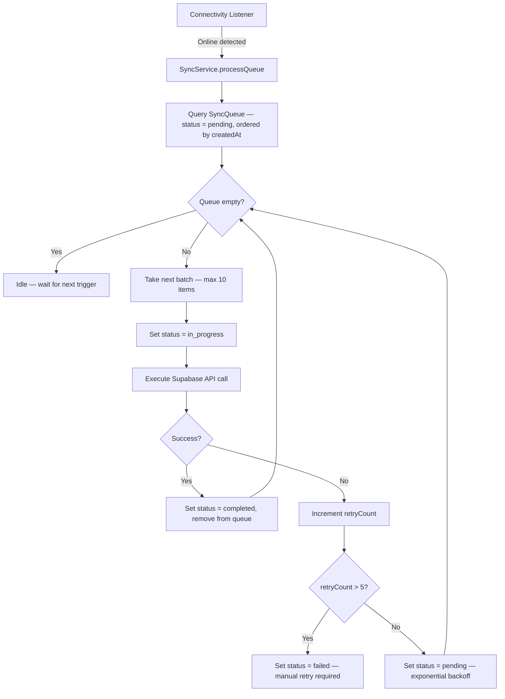

**Sync triggers:**
- Connectivity changes from offline → online.
- App foregrounding after being backgrounded.
- Every 5 minutes via periodic timer (when online).
- Manual pull-to-refresh on project list.

## 11.6 Conflict Resolution — Last-Write-Wins (LWW)

**Strategy:** If the server has a newer `updatedAt` than the local pending change, the server version wins. The local change is discarded and the user is notified via a subtle snackbar.

**Why LWW:** For a single-user creative tool, conflicts are extremely rare (same user, different devices). The simplest conflict strategy that works is LWW. Full CRDTs are over-engineered for this use case.

**Edge case:** If a conflict is detected, the "losing" local version is saved to a `_conflict_archive` Isar collection so the user can recover it from Settings → Sync → Conflicts (V2 feature).

## 11.7 Offline Export

Export works fully offline because:
- Canvas data is in local memory / Isar.
- PNG encoding is done via `dart:ui` / `image` package — no network needed.
- Share sheet uses local file URI.
- Save-to-gallery uses platform channel to write to device storage.

---

# 12. Database Planning

> No SQL generated. Logical planning only.

## 12.1 Entity Relationship Diagram

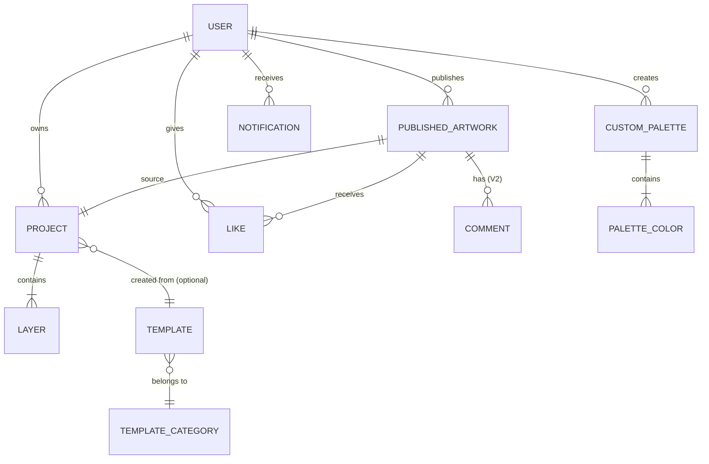

## 12.2 Entities

### User

| Field | Type | Constraints | Notes |
|---|---|---|---|
| `id` | UUID | PK, generated by Supabase Auth | Supabase `auth.users.id` |
| `email` | String | Unique, not null | From auth provider |
| `username` | String | Unique, 3-20 chars, alphanumeric + underscore | User-chosen, editable |
| `displayName` | String | Max 50 chars | Optional, shown in community |
| `avatarUrl` | String | URL | Supabase Storage URL or null |
| `bio` | String | Max 200 chars | Optional |
| `createdAt` | DateTime | Not null, default now | Account creation |
| `updatedAt` | DateTime | Not null, auto-update | Last profile update |
| `isGuest` | Boolean | Default false | True for unauthenticated users (local only) |

### Project

| Field | Type | Constraints | Notes |
|---|---|---|---|
| `id` | UUID | PK, generated locally | Client-generated UUID for offline-first |
| `userId` | UUID | FK → User.id | Owner |
| `name` | String | Max 100 chars, default "Untitled" | User-editable |
| `width` | Int | 8–256 | Grid width in pixels |
| `height` | Int | 8–256 | Grid height in pixels |
| `thumbnailPath` | String | Local file path | Auto-generated on save |
| `templateId` | UUID? | FK → Template.id, nullable | If created from template |
| `createdAt` | DateTime | Not null | |
| `updatedAt` | DateTime | Not null | Auto-save updates this |
| `lastOpenedAt` | DateTime | Not null | For "Recent" sorting |
| `syncStatus` | Enum | `local_only`, `synced`, `pending_sync`, `conflict` | Sync state |
| `isDeleted` | Boolean | Default false | Soft delete for sync |

### Layer

| Field | Type | Constraints | Notes |
|---|---|---|---|
| `id` | UUID | PK | |
| `projectId` | UUID | FK → Project.id | Parent project |
| `name` | String | Default "Layer {n}" | User-editable |
| `order` | Int | Not null | Z-order (0 = bottom) |
| `isVisible` | Boolean | Default true | |
| `opacity` | Double | 0.0–1.0, default 1.0 | |
| `pixelData` | Binary / JSON | Not null | Compressed pixel color data (see Storage section) |
| `createdAt` | DateTime | | |

### Pixel Data (Embedded in Layer)

**Storage format:** Sparse map — only non-transparent cells are stored.

```
{
  "format": "sparse_v1",
  "pixels": {
    "3,5": "#FF6C5CE7",   // row 3, col 5 → color with alpha
    "3,6": "#FF00CEC9",
    ...
  }
}
```

**Why sparse:** A 64×64 canvas has 4,096 cells. Most will be empty. Storing only colored cells saves 80%+ space for typical artwork.

**Compression:** Pixel data is gzipped before storage in Isar and Supabase to further reduce size.

### Custom Palette

| Field | Type | Constraints | Notes |
|---|---|---|---|
| `id` | UUID | PK | |
| `userId` | UUID | FK → User.id | Owner |
| `name` | String | Max 50 chars | |
| `colors` | List<String> | Max 64 colors, HEX format | Ordered list |
| `createdAt` | DateTime | | |
| `updatedAt` | DateTime | | |
| `syncStatus` | Enum | | |

### Template

| Field | Type | Constraints | Notes |
|---|---|---|---|
| `id` | UUID | PK | |
| `name` | String | | |
| `categoryId` | UUID | FK → TemplateCategory.id | |
| `width` | Int | | Grid dimensions |
| `height` | Int | | |
| `thumbnailUrl` | String | | CDN or bundled asset path |
| `pixelData` | Binary / JSON | | Pre-filled pixel data |
| `difficulty` | Enum | `easy`, `medium`, `hard` | For sorting/filtering |
| `isBundled` | Boolean | | True = shipped with app |
| `createdAt` | DateTime | | |

### Template Category

| Field | Type | Constraints | Notes |
|---|---|---|---|
| `id` | UUID | PK | |
| `name` | String | Unique | Animals, Characters, Food, etc. |
| `iconName` | String | | Material icon name |
| `order` | Int | | Display order |

### Published Artwork

| Field | Type | Constraints | Notes |
|---|---|---|---|
| `id` | UUID | PK | |
| `projectId` | UUID | FK → Project.id | Source project |
| `userId` | UUID | FK → User.id | Creator |
| `title` | String | Max 100 chars | |
| `imageUrl` | String | | Supabase Storage URL (rendered PNG) |
| `thumbnailUrl` | String | | Smaller version for gallery grid |
| `width` | Int | | Canvas dimensions (metadata) |
| `height` | Int | | |
| `likeCount` | Int | Default 0 | Denormalized count |
| `commentCount` | Int | Default 0 | V2 |
| `isPublic` | Boolean | Default true | |
| `publishedAt` | DateTime | | |
| `tags` | List<String> | Max 10 tags | For search/discovery |

### Like

| Field | Type | Constraints | Notes |
|---|---|---|---|
| `id` | UUID | PK | |
| `userId` | UUID | FK → User.id | Who liked |
| `artworkId` | UUID | FK → PublishedArtwork.id | What was liked |
| `createdAt` | DateTime | | |
| **Unique constraint** | | `(userId, artworkId)` | One like per user per artwork |

### Notification

| Field | Type | Constraints | Notes |
|---|---|---|---|
| `id` | UUID | PK | |
| `userId` | UUID | FK → User.id | Recipient |
| `type` | Enum | `like`, `comment`, `follow`, `challenge`, `system`, `reminder` | |
| `title` | String | | |
| `message` | String | | |
| `data` | JSON | Nullable | Deep link data (artworkId, etc.) |
| `isRead` | Boolean | Default false | |
| `createdAt` | DateTime | | |

### Comment (V2)

| Field | Type | Constraints | Notes |
|---|---|---|---|
| `id` | UUID | PK | |
| `artworkId` | UUID | FK → PublishedArtwork.id | |
| `userId` | UUID | FK → User.id | Author |
| `text` | String | Max 500 chars | |
| `createdAt` | DateTime | | |
| `isDeleted` | Boolean | Default false | Soft delete |

## 12.3 Indexes

| Entity | Index | Type | Reason |
|---|---|---|---|
| Project | `userId + updatedAt DESC` | Composite | Home screen recent projects |
| Project | `userId + name` | Composite | Search by name |
| Project | `syncStatus` | Single | Find pending sync items |
| Published Artwork | `publishedAt DESC` | Single | Gallery feed sorting |
| Published Artwork | `likeCount DESC` | Single | Popular sorting |
| Published Artwork | `userId` | Single | User's published artworks |
| Like | `userId + artworkId` | Unique Composite | Prevent duplicate likes |
| Like | `artworkId` | Single | Count likes for artwork |
| Notification | `userId + isRead + createdAt DESC` | Composite | Unread notifications |
| Template | `categoryId + difficulty` | Composite | Filter templates |
| SyncQueue | `status + createdAt ASC` | Composite | Process queue in order |

## 12.4 Ownership & Permissions

| Entity | Owner | Read | Write | Delete |
|---|---|---|---|---|
| User | Self | Self + public profile | Self | Self |
| Project | User | Owner only | Owner only | Owner only |
| Layer | Project owner | Owner only | Owner only | Owner only |
| Custom Palette | User | Owner only | Owner only | Owner only |
| Published Artwork | User | Everyone (public) | Owner only | Owner only |
| Like | User | Everyone (count) | Creator only | Creator only |
| Notification | User | Recipient only | System only | Recipient only |

All permissions enforced via Supabase Row Level Security (RLS) policies.

## 12.5 Future Expansion

| Entity | Version | Notes |
|---|---|---|
| Follow | V2 | `follower_id, following_id, created_at` |
| Challenge | V2 | Daily challenges with theme, deadline, entries |
| ChallengeEntry | V2 | Links user artwork to challenge |
| Achievement | V2 | Badge definitions and user-achievement joins |
| AnimationFrame | V2 | Per-frame pixel data, frame order, duration |

---

# 13. Storage Planning

## 13.1 Local Storage

| Data Type | Storage | Format | Size Estimate |
|---|---|---|---|
| Project metadata | Isar DB | Isar objects | ~1 KB per project |
| Layer pixel data | Isar DB | Gzipped JSON (sparse format) | ~2–50 KB per layer (depends on fill density, canvas size) |
| Project thumbnails | App documents directory | PNG, 128×128 | ~5–15 KB each |
| Custom palettes | Isar DB | Isar objects | < 1 KB each |
| Cached templates | Isar DB + files | Isar metadata + PNG thumbnails | ~50 KB per template |
| Cached gallery | Isar DB | Isar objects + cached image files | ~20 KB per artwork entry |
| Sync queue | Isar DB | Isar objects | ~1 KB per entry |
| Preferences | SharedPreferences | Key-value | < 5 KB total |
| Auth tokens | flutter_secure_storage | Encrypted key-value | < 1 KB |
| Exported images | Device gallery / Downloads | PNG/GIF | Varies (10 KB – 2 MB) |

**Total estimated local footprint per user (100 projects):** ~15–30 MB.

## 13.2 Cloud Storage (Supabase Storage)

| Bucket | Contents | Access | Max File Size | Naming |
|---|---|---|---|---|
| `avatars` | User profile pictures | Public read, owner write | 2 MB | `{userId}/avatar.{ext}` |
| `gallery` | Published artwork PNGs | Public read, owner write | 5 MB | `{userId}/{artworkId}.png` |
| `gallery-thumbnails` | Gallery thumbnail PNGs | Public read, owner write | 500 KB | `{userId}/{artworkId}_thumb.png` |
| `templates` | Remote template assets | Public read, admin write | 1 MB | `{categoryId}/{templateId}.json` |

**Supabase free tier storage:** 1 GB total. Sufficient for MVP with ~10K published artworks (avg 50 KB each = ~500 MB).

## 13.3 Project File Format

Each project is stored locally in Isar as a single document containing all layers. For cloud sync, the project is serialized to JSON:

```json
{
  "version": "1.0",
  "id": "uuid",
  "name": "My Pixel Art",
  "width": 32,
  "height": 32,
  "backgroundColor": "#00FFFFFF",
  "layers": [
    {
      "id": "uuid",
      "name": "Background",
      "order": 0,
      "visible": true,
      "opacity": 1.0,
      "pixels": {
        "0,0": "#FF6C5CE7",
        "0,1": "#FFA29BFE"
      }
    }
  ],
  "metadata": {
    "createdAt": "ISO8601",
    "updatedAt": "ISO8601",
    "templateId": null
  }
}
```

This format is:
- Human-readable for debugging.
- Versionable (`version` field for future migrations).
- Compact with sparse pixel representation.
- Further compressed with gzip for storage and transfer.

---

# 14. API Planning

> Backend: Supabase (PostgreSQL + PostgREST + Auth + Storage + Realtime + Edge Functions)

## 14.1 Authentication APIs

| Endpoint | Method | Description | Auth |
|---|---|---|---|
| `supabase.auth.signUp` | POST | Register with email + password | None |
| `supabase.auth.signInWithPassword` | POST | Login with email + password | None |
| `supabase.auth.signInWithOAuth` | POST | Google OAuth sign-in | None |
| `supabase.auth.signOut` | POST | Logout, invalidate session | Authenticated |
| `supabase.auth.resetPasswordForEmail` | POST | Send password reset email | None |
| `supabase.auth.updateUser` | PUT | Update email, password | Authenticated |
| `supabase.auth.admin.deleteUser` | DELETE | Delete account and all data | Authenticated (Edge Function) |
| `supabase.auth.onAuthStateChange` | Stream | Listen for auth state changes | — |

## 14.2 User Profile APIs

| Endpoint | Method | Description | Auth | RLS |
|---|---|---|---|---|
| `GET /rest/v1/profiles?id=eq.{userId}` | GET | Get user profile | Authenticated | Own or public |
| `PATCH /rest/v1/profiles?id=eq.{userId}` | PATCH | Update profile (username, displayName, bio) | Authenticated | Owner only |
| `POST /storage/v1/object/avatars/{userId}` | POST | Upload avatar image | Authenticated | Owner only |

## 14.3 Projects APIs (Cloud Sync)

| Endpoint | Method | Description | Auth | RLS |
|---|---|---|---|---|
| `GET /rest/v1/projects?user_id=eq.{userId}&order=updated_at.desc` | GET | List user's projects | Authenticated | Owner only |
| `POST /rest/v1/projects` | POST | Create / sync project | Authenticated | Owner only |
| `PATCH /rest/v1/projects?id=eq.{projectId}` | PATCH | Update project (metadata + pixel data) | Authenticated | Owner only |
| `DELETE /rest/v1/projects?id=eq.{projectId}` | DELETE | Delete project | Authenticated | Owner only |
| `GET /rest/v1/projects?id=eq.{projectId}` | GET | Get single project (for sync) | Authenticated | Owner only |

## 14.4 Community / Gallery APIs

| Endpoint | Method | Description | Auth | RLS |
|---|---|---|---|---|
| `GET /rest/v1/published_artworks?order=published_at.desc&limit=20&offset={n}` | GET | Gallery feed (paginated) | Optional | Public read |
| `GET /rest/v1/published_artworks?order=like_count.desc` | GET | Popular artworks | Optional | Public read |
| `GET /rest/v1/published_artworks?id=eq.{id}` | GET | Single artwork detail | Optional | Public read |
| `POST /rest/v1/published_artworks` | POST | Publish artwork to gallery | Authenticated | Owner insert |
| `DELETE /rest/v1/published_artworks?id=eq.{id}` | DELETE | Unpublish artwork | Authenticated | Owner only |
| `GET /rest/v1/published_artworks?user_id=eq.{userId}` | GET | User's published artworks | Optional | Public read |

## 14.5 Likes APIs

| Endpoint | Method | Description | Auth | RLS |
|---|---|---|---|---|
| `POST /rest/v1/likes` | POST | Like an artwork | Authenticated | Authenticated insert |
| `DELETE /rest/v1/likes?user_id=eq.{userId}&artwork_id=eq.{artworkId}` | DELETE | Unlike an artwork | Authenticated | Owner only |
| `GET /rest/v1/likes?user_id=eq.{userId}&artwork_id=eq.{artworkId}` | GET | Check if user liked artwork | Authenticated | Owner read |

> **Like count update:** Handled via Supabase Database Function (trigger) that increments/decrements `published_artworks.like_count` on like insert/delete.

## 14.6 Notifications APIs

| Endpoint | Method | Description | Auth | RLS |
|---|---|---|---|---|
| `GET /rest/v1/notifications?user_id=eq.{userId}&order=created_at.desc&limit=50` | GET | Get user's notifications | Authenticated | Owner only |
| `PATCH /rest/v1/notifications?id=eq.{id}` | PATCH | Mark as read | Authenticated | Owner only |
| `PATCH /rest/v1/notifications?user_id=eq.{userId}` | PATCH | Mark all as read | Authenticated | Owner only |
| `DELETE /rest/v1/notifications?user_id=eq.{userId}&is_read=eq.true` | DELETE | Clear read notifications | Authenticated | Owner only |

> **Push notifications:** Sent via Firebase Cloud Messaging. Supabase Edge Function triggers FCM on relevant events (new like, new follower, challenge posted).

## 14.7 Templates APIs

| Endpoint | Method | Description | Auth | RLS |
|---|---|---|---|---|
| `GET /rest/v1/templates?is_bundled=eq.false&order=created_at.desc` | GET | Get remote templates (non-bundled) | Optional | Public read |
| `GET /rest/v1/template_categories?order=order.asc` | GET | Get template categories | Optional | Public read |

> Templates are primarily bundled with the app. Remote templates supplement the library without requiring app updates.

## 14.8 AI APIs (V2)

| Endpoint | Method | Description | Auth |
|---|---|---|---|
| `POST /functions/v1/ai-color-suggest` | POST | Suggest colors based on existing palette | Authenticated |
| `POST /functions/v1/ai-auto-complete` | POST | Auto-fill remaining pixels based on pattern | Authenticated |

> AI features will use Supabase Edge Functions that proxy to Vertex AI / Gemini API. Rate limited to 10 requests/user/hour on free tier.

## 14.9 Rate Limits (Free Tier Planning)

| Resource | Supabase Free Tier Limit | Strategy |
|---|---|---|
| API requests | 500K / month | Client-side caching, debounced sync |
| Database size | 500 MB | Sparse data format, gzip compression |
| Storage | 1 GB | Image optimization, size limits |
| Edge Function invocations | 500K / month | Rate limit AI features, cache results |
| Realtime connections | 200 concurrent | Use polling for non-critical updates |
| Auth users | 50K MAU | Sufficient for Year 1 target |

---

# 15. Permissions

| Permission | Android Manifest | Required/Optional | Purpose | When Requested |
|---|---|---|---|---|
| **Internet** | `INTERNET` | Required | Cloud sync, community gallery, auth, push notifications, template downloads | Always (declared in manifest, no runtime prompt) |
| **Network State** | `ACCESS_NETWORK_STATE` | Required | Connectivity detection for offline/online switching | Always (declared in manifest, no runtime prompt) |
| **Read Media Images** | `READ_MEDIA_IMAGES` (API 33+) / `READ_EXTERNAL_STORAGE` (older) | Optional | Import reference images (V2), pick avatar from gallery | On first avatar upload or reference image import |
| **Camera** | `CAMERA` | Optional | Take photo as avatar, take photo as reference image (V2) | On first camera usage (avatar capture) |
| **Write External Storage** | `WRITE_EXTERNAL_STORAGE` (API < 29) | Optional | Save exported PNG/GIF to device gallery on older Android | On first export (older devices only) |
| **Post Notifications** | `POST_NOTIFICATIONS` (API 33+) | Optional | Push notifications (daily reminder, likes, comments) | After onboarding or on first community interaction |
| **Vibrate** | `VIBRATE` | Required | Haptic feedback on tool use, color selection | Always (declared in manifest, no runtime prompt) |
| **Foreground Service** | `FOREGROUND_SERVICE` | Optional | Background sync when app is minimized (V2) | Always (declared in manifest, no runtime prompt) |

**Permission request flow:**
1. Show contextual explanation before system prompt ("We need access to your photos to save your exported pixel art").
2. Request permission.
3. If denied, show fallback with alternative ("You can still share via the share sheet").
4. If permanently denied, show Settings redirect dialog.

---

# 16. Notifications Strategy

## 16.1 Notification Types

| Type | Channel | Priority | Trigger | Content Example |
|---|---|---|---|---|
| **Daily Reminder** | Push (FCM) | Default | 7:00 PM local time (if inactive > 24h) | "Your canvas misses you! 🎨 Continue your latest artwork." |
| **Daily Challenge** | Push (FCM) | Default | 9:00 AM local time (V2) | "Today's challenge: Create a pixel art sunset 🌅" |
| **Project Reminder** | Local Notification | Default | 48h since last edit on any project | "You left 'Space Cat' unfinished — 3 pixels away from completion!" |
| **New Like** | Push (FCM) | Low | Someone likes published artwork | "❤️ @username liked your 'Dragon' artwork!" |
| **New Comment** | Push (FCM) | Default | Someone comments (V2) | "💬 @username commented on 'Dragon'" |
| **New Follower** | Push (FCM) | Low | Someone follows (V2) | "👋 @username started following you!" |
| **App Update** | Push (FCM) | High | New version available | "PixelCanvas 2.0 is here! Animation editor, new palettes, and more." |
| **System** | Push (FCM) | High | Maintenance, policy changes | "Scheduled maintenance: Gallery will be offline 2-4 AM UTC." |

## 16.2 Notification Channels (Android)

| Channel ID | Name | Importance | Vibration | Sound |
|---|---|---|---|---|
| `reminders` | Reminders | Default | Yes | Default |
| `community` | Community | Low | No | None |
| `challenges` | Challenges | Default | Yes | Default |
| `updates` | App Updates | High | Yes | Default |

## 16.3 In-App Notification Center

- Displays all notifications in a scrollable list.
- Unread count badge on the bell icon in Home app bar.
- Tap notification → deep link to relevant screen.
- Swipe to dismiss.
- "Mark all as read" action.
- Pull-to-refresh to fetch latest.

## 16.4 Notification Preferences (Settings)

Users can individually toggle:
- Daily reminders (on/off)
- Daily challenges (on/off)
- Community notifications (likes, comments, follows — on/off)
- App updates (on/off, recommended: always on)

---

# 17. Security Planning

## 17.1 Authentication Security

| Measure | Implementation |
|---|---|
| **Password hashing** | Handled by Supabase Auth (bcrypt) |
| **Token storage** | `flutter_secure_storage` (Keystore on Android, Keychain on iOS) |
| **Token refresh** | Supabase SDK handles automatic JWT refresh |
| **Session expiry** | 1 hour access token, 7 day refresh token (Supabase defaults) |
| **OAuth security** | PKCE flow for Google Sign-In |
| **Email verification** | Required for full account features (publish to gallery) |
| **Rate limiting (auth)** | Supabase default: 30 requests/hour per IP |

## 17.2 Authorization

| Resource | Mechanism |
|---|---|
| **API access** | JWT bearer token in every Supabase request |
| **Row-level access** | Supabase RLS policies on every table |
| **Storage access** | Supabase Storage policies (bucket-level + path-level) |
| **Edge Functions** | JWT verification before execution |
| **Guest users** | No cloud access — local-only data |

## 17.3 Data Encryption

| Data | At Rest | In Transit |
|---|---|---|
| Auth tokens | AES-256 (flutter_secure_storage → Android Keystore) | TLS 1.3 |
| Project data (local) | Isar DB file (no encryption by default; optional encryption available) | N/A |
| Project data (cloud) | Supabase managed (PostgreSQL disk encryption) | TLS 1.3 |
| User avatars | Supabase Storage (encrypted at rest) | TLS 1.3 |
| API traffic | N/A | TLS 1.3 (Supabase enforces HTTPS) |

## 17.4 Secure Storage Strategy

```
flutter_secure_storage
├── auth_access_token       → JWT access token
├── auth_refresh_token      → JWT refresh token
├── user_id                 → Cached user ID
└── encryption_key          → (Future) Key for local DB encryption

SharedPreferences (non-sensitive)
├── is_first_launch         → Boolean
├── default_grid_size       → Int
├── haptic_enabled          → Boolean
├── auto_save_interval      → Int (seconds)
└── notification_prefs      → JSON string
```

## 17.5 Content Security

| Threat | Mitigation |
|---|---|
| Inappropriate gallery content | Report button on every artwork → admin review queue (V2: automated moderation) |
| Hate speech in comments (V2) | Word filter + manual moderation |
| Spam accounts | Rate limiting on publish (5/day), like (100/day) |
| Large file uploads (DoS) | Max file size enforced in Storage policies |
| SQL injection | Supabase PostgREST uses parameterized queries (inherently safe) |

## 17.6 Privacy

- GDPR-friendly: User can export all data (Settings → Download My Data — V2).
- Account deletion: Cascade delete all user data (projects, artworks, likes, notifications).
- No analytics PII: Analytics events contain anonymous user IDs only.
- Privacy policy link in Settings and Auth screen.
- No third-party tracking SDKs in MVP.

---

# 18. Performance Planning

## 18.1 Canvas Performance

| Concern | Strategy |
|---|---|
| **Large canvas rendering (128×128 = 16,384 cells)** | Use `CustomPainter` with `shouldRepaint` optimization. Only repaint dirty cells. Use `Canvas.drawRect` batching. Never rebuild the entire widget tree on each cell tap. |
| **Even larger canvases (256×256 = 65,536 cells)** | Tile-based rendering — divide canvas into 32×32 tiles. Only render visible tiles based on viewport. Use `RepaintBoundary` per tile. |
| **Zoom performance** | Transform the canvas using `Matrix4` on the `CustomPainter`, not by scaling the widget tree. Pre-calculate cell sizes at discrete zoom levels. |
| **Pan performance** | Use `InteractiveViewer` with `constrained: false` for hardware-accelerated panning. Clip to viewport. |
| **Touch responsiveness** | Convert touch coordinates to grid coordinates using simple math (no hit-testing each cell). Target < 16ms per frame (60 FPS). |
| **Multi-layer compositing** | Pre-composite visible layers into a single `ui.Image` on layer change. Only re-composite when layer data or visibility changes — not on every frame. |

## 18.2 Memory Management

| Concern | Budget | Strategy |
|---|---|---|
| **Canvas in-memory** | Max ~5 MB for 256×256 with 8 layers | Sparse data format (only store non-empty cells). Compress inactive layers. |
| **Undo/Redo history** | Max ~20 MB | Store diffs (changed cells only), not full snapshots. Limit to 50 undo steps. Oldest entries auto-purge. |
| **Thumbnail cache** | Max ~10 MB | LRU cache with max 100 thumbnails. Use `ResizeImage` for memory-efficient loading. |
| **Gallery image cache** | Max ~30 MB | Use `cached_network_image` with memory + disk cache. Max 50 MB disk cache. |
| **Total app memory** | Target < 150 MB | Monitor with `dart:developer` memory profiling. Alert in CI if memory exceeds threshold. |

## 18.3 Image Export Performance

| Canvas Size | Target Export Time | Strategy |
|---|---|---|
| 16×16 at 8x (128×128 px) | < 100ms | Direct `ui.Image` rendering |
| 32×32 at 8x (256×256 px) | < 200ms | Direct rendering |
| 64×64 at 8x (512×512 px) | < 500ms | Direct rendering |
| 128×128 at 4x (512×512 px) | < 500ms | Direct rendering |
| 256×256 at 4x (1024×1024 px) | < 1s | Background isolate for PNG encoding |

Export runs on a separate isolate for canvases > 64×64 to avoid UI jank.

## 18.4 Offline Performance

| Concern | Strategy |
|---|---|
| **Isar reads** | < 5ms for single project load (Isar is compiled native code) |
| **Isar writes (auto-save)** | < 10ms for typical project (write only changed fields) |
| **App startup (cold)** | Target < 2s to interactive (splash → home) |
| **App startup (warm)** | Target < 500ms |
| **Sync queue processing** | Non-blocking, runs on isolate, max 10 items per batch |

## 18.5 Battery Optimization

| Concern | Strategy |
|---|---|
| **Background sync** | Use WorkManager for deferred background sync — respects battery saver mode |
| **Canvas rendering** | Disable continuous rendering — only paint on user interaction or state change |
| **Network polling** | No polling — use push notifications and event-driven sync |
| **Auto-save** | Debounced (3s), not continuous. No unnecessary writes |
| **Image processing** | Offload to isolate to avoid blocking main thread (which burns CPU) |

## 18.6 App Size

| Component | Estimated Size |
|---|---|
| Flutter engine | ~8 MB |
| App code (release, tree-shaken) | ~3 MB |
| Bundled templates (30 templates) | ~2 MB |
| Bundled palettes (16 palettes) | < 50 KB |
| Fonts (Inter) | ~200 KB |
| Lottie animations | ~300 KB |
| Onboarding images | ~500 KB |
| **Total APK (estimated)** | **~15–18 MB** |
| **AAB (Play Store download)** | **~12–14 MB** |

---

# 19. Accessibility

## 19.1 Visual Accessibility

| Requirement | Implementation |
|---|---|
| **Minimum touch target size** | 48×48 dp for all interactive elements (Material guideline) |
| **Color contrast ratio** | Minimum 4.5:1 for normal text, 3:1 for large text (WCAG AA) |
| **Color-blind friendly palettes** | Provide at least 2 color-blind-safe palettes (Deuteranopia, Protanopia friendly). Use shapes/patterns in addition to color for state indicators. |
| **Large font support** | All text uses `sp` (scalable pixels). UI tested at 200% font scale. No text clipping. |
| **Zoom accessibility** | Respect system display size settings. Canvas zoom is independent of accessibility zoom. |

## 19.2 Screen Reader Support

| Requirement | Implementation |
|---|---|
| **Semantic labels** | Every interactive widget has a `Semantics` label. Buttons: action description ("Create new project"). Icons: purpose ("Undo last action"). |
| **Canvas accessibility** | Announce grid position on focus change ("Row 5, Column 3, Color: Purple"). Provide a summary mode ("32 by 32 canvas, 45% filled"). |
| **Navigation order** | Logical focus traversal order matching visual layout. Tab through tools → canvas → palette → actions. |
| **State announcements** | Announce state changes: "Saved", "Exported as PNG", "Layer 2 selected", "Undo: 3 actions remaining". |
| **Image descriptions** | Gallery artworks include alt text (auto-generated from title + metadata). |

## 19.3 Motor Accessibility

| Requirement | Implementation |
|---|---|
| **One-handed mode** | Bottom-anchored toolbar. All primary actions reachable with thumb. No top-of-screen-only interactions. |
| **Long press alternatives** | Every long-press action has a menu/button alternative (3-dot menu on project cards). |
| **Gesture alternatives** | Undo/redo buttons alongside swipe gesture. Zoom +/- buttons alongside pinch gesture. |
| **Haptic feedback** | Configurable (Settings toggle). Provides tactile confirmation for tool actions. |

## 19.4 Cognitive Accessibility

| Requirement | Implementation |
|---|---|
| **Simple language** | All UI text uses plain, direct language. No jargon. |
| **Consistent patterns** | Same gesture = same action across all screens. Back button always goes back. |
| **Undo safety net** | Undo/redo for canvas. Confirmation dialogs for destructive actions (delete project). |
| **Progressive disclosure** | Advanced features (layers, symmetry) are hidden behind expandable panels. Beginners see only essential tools. |

---

# 20. Testing Strategy

## 20.1 Unit Testing

| Scope | Target Coverage | Focus Areas |
|---|---|---|
| **Canvas Engine** | 95% | `apply` for every tool, `undo`/`redo`, `resize`, `merge layers`, `composite layers` |
| **Tools (Pencil, Fill, etc.)** | 95% | Edge cases — fill on empty canvas, fill on full canvas, line at 0° 45° 90°, circle at odd dimensions |
| **Color Utils** | 90% | HEX ↔ Color conversion, brightness calculation, palette generation |
| **Sync Service** | 90% | Queue processing, conflict resolution, retry logic, offline → online transition |
| **Repositories** | 80% | CRUD operations, error handling, data mapping (Model ↔ Entity) |
| **Export Service** | 85% | PNG encoding correctness, scale factors, transparent backgrounds |

**Framework:** `flutter_test` (built-in) + `mocktail` for mocking.

## 20.2 Widget Testing

| Scope | Target Coverage | Focus Areas |
|---|---|---|
| **Shared Widgets** | 90% | `PcButton` variants, `PcTextField` validation, `PcDialog` actions, `PcBottomSheet` dismiss |
| **Editor Toolbar** | 80% | Tool selection state, active tool highlighting, tooltip display |
| **Project Card** | 80% | Thumbnail display, name truncation, 3-dot menu actions |
| **Color Picker** | 80% | Color selection callback, HEX input validation, palette switching |
| **Home Screen** | 70% | Empty state display, project grid rendering, FAB interaction |

**Framework:** `flutter_test` with `WidgetTester`.

## 20.3 Integration Testing

| Test Flow | Priority | Steps |
|---|---|---|
| **Auth → Home** | P0 | Launch → Splash → Onboarding (skip) → Auth (email/password) → Home (verify empty state) |
| **Create → Edit → Save** | P0 | Home → New Project → Select 16×16 → Editor → Tap 5 cells → Verify auto-save → Back → Verify project in list |
| **Edit → Export → Share** | P0 | Open project → Edit → Export → Select PNG 4x → Share (verify intent fires) |
| **Template → Edit → Save** | P1 | Templates → Select template → Editor (verify pre-filled cells) → Edit → Save |
| **Offline → Online Sync** | P1 | Create project (offline) → Go online → Verify sync queue processes → Verify project appears in cloud |
| **Community Browse** | P1 | Community tab → Scroll gallery → Tap artwork → View detail → Like → Verify count |

**Framework:** `integration_test` package + `patrol` for native interactions.

## 20.4 Manual Testing Checklist

| Area | Test Cases |
|---|---|
| **Gestures** | Pinch zoom (all zoom levels), pan (all directions), tap accuracy at edges, long-press menu |
| **Edge cases** | 256×256 canvas with 8 layers filled (memory), rapid undo/redo (50 steps), 100+ projects in list |
| **Device compatibility** | Budget device (4GB RAM), mid-range (8GB), flagship (16GB). Screen sizes: 5", 6.5", tablet 10" |
| **Offline scenarios** | Airplane mode: create, edit, save, export. Toggle connectivity repeatedly during sync |
| **Orientation** | Portrait lock verified. No layout breaks if system forces landscape (split screen) |

## 20.5 Performance Testing

| Metric | Tool | Threshold |
|---|---|---|
| **Frame rate (Editor)** | Flutter DevTools | ≥ 55 FPS during drawing on mid-range device |
| **Startup time** | Firebase Performance | < 2s cold start to interactive |
| **Memory (Editor)** | Flutter DevTools | < 150 MB at 128×128 canvas with 4 layers |
| **APK size** | `flutter build apk --analyze-size` | < 20 MB |
| **Jank frames** | Flutter DevTools | < 1% jank frames during 60-second draw session |
| **Isar read latency** | Custom benchmark | < 5ms for project list load |

---

# 21. Release Planning

## 21.1 Release Stages

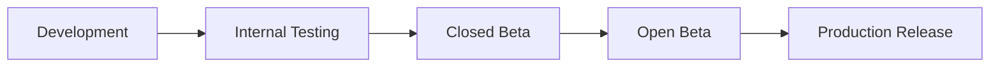

### Stage 1: Development

- Duration: Phase-by-phase (see Roadmap)
- Branch: `develop`
- Build: Debug APK
- Distribution: Local device via `flutter run`

### Stage 2: Internal Testing

- Duration: 1 week per phase
- Branch: `staging`
- Build: Release APK (signed with debug keystore)
- Distribution: Google Play Internal Testing track (up to 100 testers)
- Criteria: All unit tests pass. No P0 bugs. Basic smoke test passes.

### Stage 3: Closed Beta

- Duration: 2 weeks before production
- Branch: `release/x.y.z`
- Build: AAB (signed with upload keystore)
- Distribution: Google Play Closed Testing track (up to 1,000 testers)
- Criteria: All integration tests pass. Performance thresholds met. No P0/P1 bugs.
- Feedback: Google Play beta feedback form + in-app feedback widget.

### Stage 4: Open Beta (Optional)

- Duration: 1–2 weeks
- Distribution: Google Play Open Testing track
- Criteria: Crash-free rate > 99%. All reported P1 bugs fixed.

### Stage 5: Production Release

- Branch: `main`
- Build: AAB (signed with upload keystore)
- Distribution: Google Play Production track (phased rollout: 10% → 25% → 50% → 100%)
- Criteria: Beta crash-free rate > 99.5%. No P0 bugs. Play Store listing complete.

## 21.2 Versioning Strategy

**Semantic Versioning:** `MAJOR.MINOR.PATCH+BUILD`

| Component | Meaning | Example |
|---|---|---|
| MAJOR | Breaking changes, major releases | 1.0.0, 2.0.0 |
| MINOR | New features, non-breaking | 1.1.0, 1.2.0 |
| PATCH | Bug fixes, minor improvements | 1.0.1, 1.0.2 |
| BUILD | Auto-incremented build number | 1.0.0+1, 1.0.0+2 |

**Android:** `versionCode` = build number (monotonically increasing). `versionName` = semantic version.

## 21.3 Play Store Listing

| Field | Content |
|---|---|
| **App Name** | PixelCanvas — Pixel Art Creator |
| **Short Description** | Create beautiful pixel art — simple, fun, and offline-first. |
| **Category** | Art & Design |
| **Content Rating** | Everyone |
| **Target Age** | 8+ |
| **Privacy Policy** | Required — hosted on web |
| **Screenshots** | 5–8 phone screenshots (Editor, Home, Templates, Gallery, Export) |
| **Feature Graphic** | 1024×500 banner |

---

# 22. Risk Analysis

## 22.1 Technical Risks

| Risk | Probability | Impact | Mitigation |
|---|---|---|---|
| **Canvas performance degrades on large grids (128×128+) on low-end devices** | High | High | Tile-based rendering, limit max canvas size per device tier, performance testing on budget hardware |
| **Isar database corruption on crash during write** | Low | Critical | Isar has built-in ACID transactions. Add integrity checks on app startup. Keep sync queue as backup. |
| **Supabase free tier limits exceeded before monetization** | Medium | High | Aggressive client-side caching, compress all data, monitor usage dashboard, have migration plan to paid tier |
| **Memory leaks in canvas editor (long sessions)** | Medium | High | Profile with DevTools in every sprint, strict dispose patterns, LRU caches with hard limits |
| **Platform-specific bugs (Android version fragmentation)** | Medium | Medium | Test on API 26 (min), 31, 33, 34. Use `defaultTargetPlatform` checks. CI matrix with multiple API levels |

## 22.2 UX Risks

| Risk | Probability | Impact | Mitigation |
|---|---|---|---|
| **First-time users don't understand the grid/tools** | Medium | High | Template-first onboarding: first experience is coloring a template, not a blank canvas. Tooltips on first tool use. |
| **Touch target too small for pixel cells on large grids** | High | Medium | Auto-zoom to comfortable cell size. Minimum visible cell size = 16dp. Pinch-to-zoom tutorial on first large canvas. |
| **Users lose work due to unexpected app close** | Low (with auto-save) | Critical | Auto-save every 3s of inactivity + on lifecycle pause. Recovery screen on crash relaunch. |
| **Community gallery overwhelms beginners** | Low | Medium | Default Home tab (not gallery). Gallery is opt-in via bottom nav. Separate "Beginner-Friendly" gallery section. |

## 22.3 Performance Risks

| Risk | Probability | Impact | Mitigation |
|---|---|---|---|
| **60 FPS drops during rapid drawing** | Medium | High | Batch cell updates per frame. Use `ChangeNotifier` with coalesced notifications. Profile and optimize `CustomPainter`. |
| **Export takes too long for large canvases** | Medium | Medium | Show progress indicator. Use isolate for encoding. Pre-composite layers. |
| **App startup > 3s on cold start** | Low | Medium | Lazy-load features. Pre-warm Isar in splash. Defer non-critical initializations. |

## 22.4 Scalability Risks

| Risk | Probability | Impact | Mitigation |
|---|---|---|---|
| **Gallery grows beyond Supabase free tier storage** | High (if successful) | High | Plan migration to Supabase Pro or S3. Image compression and size limits from day 1. Thumbnail-first loading. |
| **Sync queue backlog on returning user** | Medium | Medium | Limit sync queue to 100 items. FIFO processing. Batch API calls. Show sync progress for large backlogs. |
| **Database performance with 100K+ users** | Medium | Medium | Proper indexes from day 1. Pagination on all list queries. Supabase connection pooling. |

## 22.5 Security Risks

| Risk | Probability | Impact | Mitigation |
|---|---|---|---|
| **Unauthorized access to other users' projects** | Low | Critical | RLS policies on every table. No client-side-only authorization. Penetration testing before launch. |
| **Inappropriate content in gallery** | Medium | Medium | Report button → moderation queue. Content policy. Community guidelines. |
| **API abuse (spam, DDoS)** | Low | High | Supabase rate limiting. Client-side debouncing. Publish rate limits. |

---

# 23. Development Roadmap

## Phase 0: Project Setup (Complexity: Low)

| Item | Detail |
|---|---|
| **Objective** | Initialize Flutter project, configure tooling, set up CI/CD foundations |
| **Deliverables** | Flutter project scaffold, folder structure, design system (theme), navigation shell, linting/formatting config, Git repo with branch strategy |
| **Dependencies** | None |
| **Estimated Effort** | 3–5 days |
| **Testable?** | Yes — app launches, theme renders, navigation between empty tab screens works |

## Phase 1: Core Editor — MVP (Complexity: High)

| Item | Detail |
|---|---|
| **Objective** | Build the pixel art editor — canvas rendering, basic tools, color picking, undo/redo |
| **Deliverables** | `EditorScreen`, `CanvasNotifier`, `CustomPainter`, Pencil/Eraser/Fill tools, basic color palette bar, undo/redo (50 steps), pinch-to-zoom, pan, grid toggle |
| **Dependencies** | Phase 0 (project setup, theme, navigation) |
| **Estimated Effort** | 10–15 days |
| **Testable?** | Yes — user can create pixel art on a blank canvas, zoom, pan, undo, and switch tools |

## Phase 2: Local Persistence & Projects (Complexity: Medium)

| Item | Detail |
|---|---|
| **Objective** | Persist projects locally, auto-save, project list with CRUD |
| **Deliverables** | Isar integration, `ProjectRepository`, `ProjectModel`, auto-save service, `HomeScreen` with project grid, create/rename/delete project, project thumbnails |
| **Dependencies** | Phase 1 (editor produces saveable canvas state) |
| **Estimated Effort** | 7–10 days |
| **Testable?** | Yes — create project, edit, close, reopen (data persisted), see project list, delete project |

## Phase 3: Splash, Onboarding & Auth (Complexity: Medium)

| Item | Detail |
|---|---|
| **Objective** | First-launch experience, user authentication, guest mode |
| **Deliverables** | `SplashScreen`, `OnboardingScreen` (3 pages), `AuthScreen` (email/password, Google Sign-In, guest skip), Supabase Auth integration, `AuthNotifier`, `AuthGuard`, secure token storage |
| **Dependencies** | Phase 0 (navigation guards), Supabase project setup |
| **Estimated Effort** | 5–7 days |
| **Testable?** | Yes — full first-launch flow from install to home. Login, register, guest mode all functional. |

## Phase 4: Color Palettes & Picker (Complexity: Medium)

| Item | Detail |
|---|---|
| **Objective** | Full color management — curated palettes, custom palettes, color picker, eyedropper |
| **Deliverables** | 16 bundled palettes, `ColorPickerSheet` (HSL wheel + HEX input), custom palette CRUD, palette persistence (Isar), eyedropper tool, recent colors |
| **Dependencies** | Phase 1 (editor integration), Phase 2 (persistence) |
| **Estimated Effort** | 5–7 days |
| **Testable?** | Yes — switch palettes, create custom palette, pick custom color, eyedropper on canvas |

## Phase 5: Export & Share (Complexity: Medium)

| Item | Detail |
|---|---|
| **Objective** | Export artwork as PNG at configurable scale, share via system share sheet, save to device gallery |
| **Deliverables** | `ExportService`, `ExportBottomSheet`, PNG rendering at 1x/2x/4x/8x/16x, save to device gallery (MediaStore), share sheet integration, transparent background support |
| **Dependencies** | Phase 1 (canvas compositing), Phase 2 (project data) |
| **Estimated Effort** | 4–5 days |
| **Testable?** | Yes — export PNG, verify pixel-perfect output, share to another app |

## Phase 6: Layer System (Complexity: High)

| Item | Detail |
|---|---|
| **Objective** | Multi-layer support (up to 8 layers) with visibility, opacity, reorder |
| **Deliverables** | `LayerNotifier`, `LayerPanel` bottom sheet, add/delete/reorder layers, visibility toggle, opacity slider, layer compositing in `CustomPainter`, per-layer undo/redo |
| **Dependencies** | Phase 1 (canvas engine), Phase 2 (persistence — layers stored within project) |
| **Estimated Effort** | 7–10 days |
| **Testable?** | Yes — create layers, draw on different layers, toggle visibility, adjust opacity, reorder, verify composited output |

## Phase 7: Shape Tools & Symmetry (Complexity: Medium)

| Item | Detail |
|---|---|
| **Objective** | Line, rectangle, circle tools. Mirror/symmetry mode. |
| **Deliverables** | `LineTool`, `RectangleTool`, `CircleTool` (outline + filled variants), `SymmetryMode` (horizontal, vertical, both), tool preview (ghost line while dragging) |
| **Dependencies** | Phase 1 (tool system architecture) |
| **Estimated Effort** | 5–7 days |
| **Testable?** | Yes — draw lines, rectangles, circles. Enable symmetry and verify mirrored output. |

## Phase 8: Templates (Complexity: Medium)

| Item | Detail |
|---|---|
| **Objective** | Browsable template library with categories, preview, and one-tap creation |
| **Deliverables** | 30+ bundled templates (JSON data + thumbnails), `TemplatesScreen`, category chips, template preview bottom sheet, "Use Template" → Editor with pre-filled canvas |
| **Dependencies** | Phase 1 (editor), Phase 2 (project creation from template) |
| **Estimated Effort** | 5–7 days |
| **Testable?** | Yes — browse templates, select one, verify editor opens with pre-filled artwork |

## Phase 9: Cloud Sync (Complexity: High)

| Item | Detail |
|---|---|
| **Objective** | Sync projects and palettes to Supabase, background sync, conflict resolution |
| **Deliverables** | `SyncService`, `SyncQueue`, connectivity listener, background sync with exponential backoff, LWW conflict resolution, sync status indicators, Supabase table setup (projects, palettes), RLS policies |
| **Dependencies** | Phase 2 (local persistence), Phase 3 (auth — user ID for cloud data) |
| **Estimated Effort** | 8–12 days |
| **Testable?** | Yes — create offline, go online, verify sync. Edit on two devices (if auth'd), verify LWW. |

## Phase 10: Community Gallery (Complexity: Medium)

| Item | Detail |
|---|---|
| **Objective** | Browse community artwork, publish own artwork, like artwork |
| **Deliverables** | `CommunityScreen`, `ArtworkDetailScreen`, publish workflow (render + upload), like/unlike, gallery feed (paginated), Supabase tables (published_artworks, likes), Supabase Storage buckets |
| **Dependencies** | Phase 3 (auth required to publish/like), Phase 5 (render artwork for upload), Phase 9 (Supabase setup) |
| **Estimated Effort** | 7–10 days |
| **Testable?** | Yes — publish artwork, view in gallery, like, verify counts |

## Phase 11: Notifications (Complexity: Medium)

| Item | Detail |
|---|---|
| **Objective** | Push notifications (FCM), local notifications, in-app notification center |
| **Deliverables** | FCM integration, notification channels, `NotificationCenterScreen`, notification preferences, daily reminder (local), community notifications (push), Supabase Edge Function for notification triggers |
| **Dependencies** | Phase 3 (auth for FCM token), Phase 10 (community events trigger notifications) |
| **Estimated Effort** | 5–7 days |
| **Testable?** | Yes — receive push notification on like, view in notification center, mark as read |

## Phase 12: Profile & Settings (Complexity: Low)

| Item | Detail |
|---|---|
| **Objective** | Profile screen, edit profile, settings screen, about screen |
| **Deliverables** | `ProfileScreen` (stats, published artworks), `EditProfileScreen` (avatar upload, username), `SettingsScreen` (all preferences), logout, account deletion |
| **Dependencies** | Phase 3 (auth), Phase 10 (published artworks list) |
| **Estimated Effort** | 4–5 days |
| **Testable?** | Yes — view profile, edit username/avatar, change settings, logout, verify persistence |

## Phase 13: Selection Tools (Complexity: Medium)

| Item | Detail |
|---|---|
| **Objective** | Rectangular selection, copy/paste, move selection |
| **Deliverables** | `SelectionTool`, selection rendering (marching ants or highlight), copy/paste within canvas, move selection (drag), clear selection, selection + layer interaction |
| **Dependencies** | Phase 1 (tool architecture), Phase 6 (layer awareness) |
| **Estimated Effort** | 5–7 days |
| **Testable?** | Yes — select region, copy, paste at different position, move selection |

## Phase 14: Polish, Accessibility & Release Prep (Complexity: Medium)

| Item | Detail |
|---|---|
| **Objective** | Bug fixes, performance optimization, accessibility pass, Play Store preparation |
| **Deliverables** | Accessibility audit + fixes, performance profiling + optimization, edge case bug fixes, Play Store listing assets (screenshots, descriptions), signed release build, internal testing deployment |
| **Dependencies** | All previous phases |
| **Estimated Effort** | 7–10 days |
| **Testable?** | Yes — full regression test suite, accessibility scanner, performance benchmarks |

### Total Estimated Effort: ~90–120 days (single developer)

---

# 24. Coding Standards

## 24.1 Flutter Best Practices

| Rule | Detail |
|---|---|
| **Minimum SDK** | Flutter ≥ 3.22, Dart ≥ 3.4 |
| **Null Safety** | 100% sound null safety. No `!` operator unless genuinely impossible to be null (with comment explaining why). |
| **Immutable State** | All state classes are immutable (`@immutable` or `freezed` / `copyWith`). Never mutate state directly. |
| **Widget Decomposition** | No widget build methods > 80 lines. Extract sub-widgets. Prefer `StatelessWidget` over functions returning `Widget`. |
| **Const Constructors** | Use `const` constructors wherever possible. Mark static widgets as `const`. |
| **Keys** | Use `ValueKey` or `ObjectKey` for widgets in lists/grids that reorder. Never use `UniqueKey()` unless intentional rebuild. |
| **Dispose** | Always dispose controllers (`TextEditingController`, `AnimationController`, `ScrollController`). Use `ref.onDispose` in Riverpod. |

## 24.2 Naming Conventions

| Element | Convention | Example |
|---|---|---|
| **Files** | snake_case | `canvas_notifier.dart`, `project_model.dart` |
| **Classes** | PascalCase | `CanvasNotifier`, `ProjectModel` |
| **Variables / Parameters** | camelCase | `gridSize`, `currentColor`, `layerOpacity` |
| **Constants** | camelCase (top-level `const`) | `const maxUndoSteps = 50;` |
| **Enums** | PascalCase (type), camelCase (values) | `enum ToolType { pencil, eraser, fill }` |
| **Providers** | camelCase + `Provider` suffix | `canvasNotifierProvider`, `projectListProvider` |
| **Private members** | `_` prefix | `_currentTool`, `_syncQueue` |
| **Boolean variables** | `is` / `has` / `should` prefix | `isVisible`, `hasUnsavedChanges`, `shouldAutoSave` |
| **Callbacks** | `on` prefix | `onColorSelected`, `onToolChanged` |

## 24.3 Folder Naming

| Rule | Example |
|---|---|
| All lowercase, snake_case | `features/`, `color_picker/`, `sync_service/` |
| Feature folders match module name | `features/editor/`, `features/community/` |
| Avoid abbreviations | `presentation/` not `pres/`, `repositories/` not `repos/` |

## 24.4 File Naming

| Rule | Example |
|---|---|
| One public class per file | `canvas_notifier.dart` contains `CanvasNotifier` |
| Suffix matches role | `*_screen.dart`, `*_notifier.dart`, `*_repository.dart`, `*_service.dart`, `*_model.dart`, `*_widget.dart` |
| Test files mirror source | `canvas_notifier.dart` → `canvas_notifier_test.dart` |

## 24.5 Widget Rules

| Rule | Detail |
|---|---|
| **Prefix reusable widgets** | All shared widgets prefixed with `Pc` → `PcButton`, `PcCard`, `PcTextField` |
| **Feature widgets** | Feature-specific widgets are NOT prefixed. → `ToolBar`, `LayerTile`, `GalleryGrid` |
| **No logic in build** | Build methods only compose widgets. Business logic lives in notifiers/providers. |
| **Prefer composition over inheritance** | Use composition (`child`, `builder`) instead of extending `StatefulWidget`. |
| **Avoid `setState` where possible** | Use `ConsumerWidget` / `ConsumerStatefulWidget` with `ref.watch`. Only use `setState` for purely local UI state (animation, text field focus). |

## 24.6 Architecture Rules

| Rule | Detail |
|---|---|
| **No cross-feature imports in presentation** | `features/editor/presentation/` must NOT import from `features/community/presentation/`. Shared logic goes in `core/` or `shared/`. |
| **Domain layer has zero dependencies** | Entities and repository interfaces import nothing from `data/` or `presentation/`. |
| **Repository pattern is mandatory** | All data access goes through a repository interface. No direct Isar/Supabase calls in notifiers or widgets. |
| **One notifier per concern** | Don't combine canvas state + tool state + zoom state in one notifier. Separate concerns. |
| **Error handling** | All repository methods return `Result<T, AppException>` or throw typed exceptions caught by notifiers. Never silently swallow errors. |

## 24.7 Documentation Rules

| Rule | Detail |
|---|---|
| **Public API docs** | Every public class, method, and property has a `///` doc comment. |
| **Complex logic** | Inline comments for non-obvious algorithms (flood fill, circle drawing, layer compositing). |
| **TODO format** | `// TODO(username): Description [#issue-number]` |
| **File headers** | No file-level comments (file name is self-documenting with naming conventions). |

## 24.8 Git Rules

| Rule | Detail |
|---|---|
| **Branch strategy** | `main` (production), `develop` (integration), `feature/*` (per-feature), `bugfix/*`, `release/*` |
| **Commit messages** | Conventional Commits: `feat: add flood fill tool`, `fix: canvas crash on 128x128`, `docs: update README` |
| **Commit size** | Small, atomic commits. One logical change per commit. |
| **Pull Requests** | Require 1 approval (if team > 1). PR description includes: what, why, how, screenshots (if UI). |
| **No force push on shared branches** | Never force push `main` or `develop`. |
| **`.gitignore`** | Include all generated files, build output, IDE config, `.env`, `*.g.dart`, `*.freezed.dart`, `*.isar`, secrets. |

## 24.9 Linting & Formatting

| Tool | Config |
|---|---|
| **Linter** | `flutter_lints` (official) + custom rules in `analysis_options.yaml` |
| **Formatter** | `dart format` — enforced in CI (line length: 80) |
| **Key lint rules** | `prefer_const_constructors`, `avoid_print` (use logger), `prefer_final_locals`, `always_declare_return_types`, `unawaited_futures` |

---

# 25. Success Metrics

## 25.1 Product KPIs

| Metric | Target (MVP Launch) | Target (6 Months) | Measurement |
|---|---|---|---|
| **Monthly Active Users (MAU)** | 1,000 | 20,000 | Supabase Auth analytics |
| **Daily Active Users (DAU)** | 200 | 5,000 | Supabase Auth analytics |
| **DAU/MAU Ratio** | > 20% | > 25% | Calculated |
| **D1 Retention** | > 40% | > 50% | Firebase Analytics |
| **D7 Retention** | > 25% | > 35% | Firebase Analytics |
| **D30 Retention** | > 10% | > 15% | Firebase Analytics |
| **Artworks Created / Month** | 5,000 | 100,000 | Project creation events |
| **Artworks Published / Month** | 500 | 10,000 | Gallery submissions |
| **Avg. Session Duration** | > 5 min | > 8 min | Firebase Analytics |
| **Sessions per User per Week** | > 2 | > 3 | Firebase Analytics |

## 25.2 Technical KPIs

| Metric | Target | Measurement | Alert Threshold |
|---|---|---|---|
| **Crash-Free Rate** | > 99.5% | Firebase Crashlytics | < 99% triggers P0 |
| **App Startup Time (Cold)** | < 2s | Firebase Performance | > 3s triggers investigation |
| **App Startup Time (Warm)** | < 500ms | Firebase Performance | > 1s triggers investigation |
| **Frame Rate (Editor)** | ≥ 55 FPS | Flutter DevTools / CI perf test | < 45 FPS triggers P1 |
| **Jank Frames** | < 1% of total frames | Flutter DevTools | > 3% triggers P1 |
| **APK Size** | < 20 MB | CI build pipeline | > 25 MB triggers review |
| **Memory Usage (Editor)** | < 150 MB | Flutter DevTools | > 200 MB triggers investigation |
| **Auto-Save Latency** | < 50ms (Isar write) | Custom profiling | > 200ms triggers optimization |
| **Sync Queue Processing** | < 5s per item | Custom logging | > 15s triggers investigation |
| **Export Time (32×32 @ 8x)** | < 200ms | Custom profiling | > 1s triggers optimization |

## 25.3 Quality KPIs

| Metric | Target | Measurement |
|---|---|---|
| **Play Store Rating** | > 4.5 stars | Play Console |
| **Negative Review Rate** | < 5% of total reviews | Play Console |
| **Bug Escape Rate** | < 2 P1 bugs per release | Issue tracker |
| **Unit Test Coverage** | > 80% overall, > 95% for core engine | CI coverage report |
| **Widget Test Coverage** | > 70% for shared widgets | CI coverage report |

## 25.4 Business KPIs (Post-MVP)

| Metric | Target (Year 1) | Measurement |
|---|---|---|
| **Organic Install Rate** | > 70% of total installs | Play Console |
| **User Acquisition Cost (if paid)** | < $0.50 per install | Ad platform analytics |
| **Premium Conversion (when launched)** | 3–5% of MAU | Payment provider |
| **Community Content Growth** | 20% month-over-month | Database queries |
| **Template Usage Rate** | > 40% of new projects start from template | Analytics events |

---

# Appendix A: Package Dependencies (Planned)

| Package | Purpose | Version Strategy |
|---|---|---|
| `flutter_riverpod` | State management | Latest stable |
| `riverpod_annotation` + `riverpod_generator` | Code generation for providers | Latest stable |
| `go_router` | Navigation & routing | Latest stable |
| `isar` + `isar_flutter_libs` | Local NoSQL database | Latest stable |
| `supabase_flutter` | Backend (Auth, DB, Storage, Functions) | Latest stable |
| `google_sign_in` | Google OAuth | Latest stable |
| `flutter_secure_storage` | Secure credential storage | Latest stable |
| `shared_preferences` | Simple key-value preferences | Latest stable |
| `connectivity_plus` | Network connectivity detection | Latest stable |
| `image` | Image encoding/decoding (PNG) | Latest stable |
| `share_plus` | System share sheet | Latest stable |
| `path_provider` | Device file system paths | Latest stable |
| `cached_network_image` | Image caching for gallery | Latest stable |
| `firebase_core` + `firebase_messaging` | Push notifications | Latest stable |
| `firebase_analytics` | Analytics events | Latest stable |
| `firebase_crashlytics` | Crash reporting | Latest stable |
| `firebase_performance` | Performance monitoring | Latest stable |
| `google_fonts` | Inter font family | Latest stable |
| `lottie` | Splash and micro-animations | Latest stable |
| `uuid` | Client-side UUID generation | Latest stable |
| `freezed` + `freezed_annotation` | Immutable data classes | Latest stable |
| `json_annotation` + `json_serializable` | JSON serialization | Latest stable |
| `build_runner` | Code generation runner | Latest stable |
| `mocktail` | Testing — mocks | Latest stable |
| `flutter_lints` | Lint rules | Latest stable |

---

# Appendix B: Supabase Free Tier Checklist

| Resource | Free Tier Limit | MVP Usage Estimate | Headroom |
|---|---|---|---|
| Database | 500 MB | ~50 MB (10K users, avg 5 projects) | ✅ Large |
| Storage | 1 GB | ~300 MB (5K gallery images) | ✅ Moderate |
| Auth | 50K MAU | ~5K MAU at launch | ✅ Large |
| Edge Functions | 500K invocations/month | ~10K (notifications, AI) | ✅ Large |
| API Requests | 500K/month | ~200K (with caching) | ✅ Moderate |
| Realtime | 200 concurrent | Not used in MVP | ✅ N/A |
| Bandwidth | 5 GB/month | ~2 GB (gallery images, sync) | ⚠️ Monitor |

---

> **End of Blueprint**
>
> This document provides the complete architectural foundation for PixelCanvas.
> Every subsequent development phase can be implemented directly from this blueprint without ambiguity.
> No Flutter code, SQL, or UI has been generated — only architecture, planning, and strategy.
